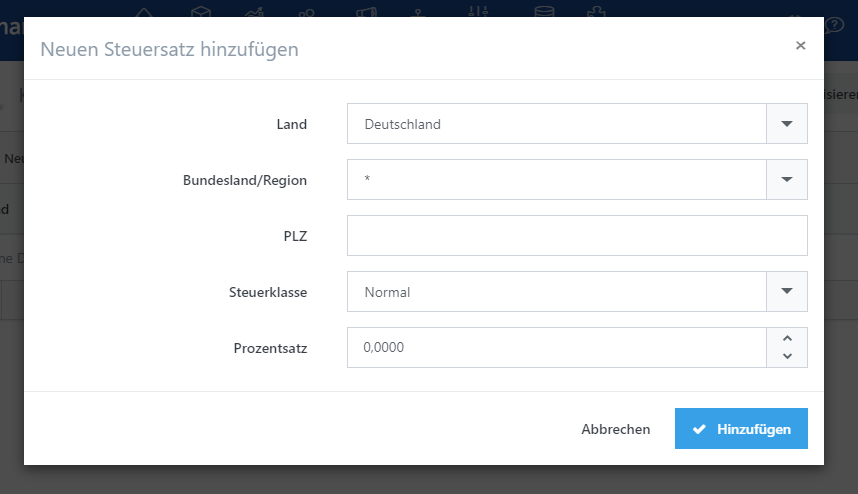

# Steuerberechnung einrichten

Die Berechnung von Steuern ist ein wichtiges Thema für Shopbetreiber. Sie können es sich nicht leisten, dabei Fehler zu machen, da Sie für die Steuereinstellungen in Ihrem Shop verantwortlich sind. Die Ausgestaltung des Steuerrechts ist in jedem Land und bisweilen sogar regional unterschiedlich. Wenn Sie Produkte in verschiedenen Ländern verkaufen, können andere Regularien gelten. Wenn Sie beispielsweise Produkte innerhalb der EU verkaufen, müssen neben den spezifischen Landesgesetzen auch bestimmte EU-Gesetze befolgt werden. Die USA hat ein sehr komplexes Besteuerungssystem (z. B. unterschiedliche Steuerklassen für einzelne Regionen). In Deutschland gibt es drei unterschiedliche **Steuerklassen**, die für alle Produkte und Dienstleistungen, die Sie anbieten, gelten. Der Standardsteuersatz liegt bei 19%. Ein zweiter Steuersatz beträgt 7% und gilt für Bücher, Magazine und Lebensmittel. Unter bestimmten Voraussetzungen können Sie Produkte auch mehrwertsteuerfrei verkaufen. In Smartstore können Sie die Steuereinstellungen für all diese Regularien vornehmen. Wenn Sie sich bei den Steuersätzen für Ihre Produkte nicht sicher sind, kontaktieren Sie Ihren Steuerberater.

## Steuerklassen

Nachdem Sie die **Steuerklassen** eingerichtet haben, werden diese Ihren Produkten zugeordnet und enthalten den ausgewählten Steuersatz, der auf den Produktpreis angewendet wird. Die schlussendliche Steuer wird mit dem Steuersatz für die zugeordnete Steuerklasse in der aktivierten **Steuerart** berechnet. Sie können Steuerklassen einstellen, indem Sie zu **Konfiguration > Regionale Einstellungen > Steuerklassen** gehen. Sie verbinden die **Steuerklasse** mit einem Produkt, indem Sie zur entsprechenden Registerkarte **Allgemein > Steuerklasse** in der Produktkonfiguration wechseln, wo Sie eine Ihrer eingestellten **Steuerklassen** auswählen können und diese somit dem Produkt zuordnen. In Deutschland gibt es drei **Steuerklassen**. Die erste ist der Standardsteuersatz, der für nahezu alle Produkte gilt, der zweite gilt für Bücher, Magazine und Lebensmittel. Der dritte Steuersatz ist für Produkte, die mehrwertsteuerfrei sind.

## Steuerart-Provider (Tax-Providers)

Wie in der Einführung bereits festgestellt, müssen Sie unterschiedliche Steuersätze für Ihre Produkte einrichten, die von der Gesetzgebung Ihres Landes abhängig sind. Steuersätze sind Prozentwerte, die die eigentliche Steuer für einen Preis in Ihrem Shop berechnen. Mit Hilfe von **Steuerart-Provider** (Tax-Providers) legen Sie die Steuersätze für die unterschiedlichen **Steuerklassen** in Ihrem Shop fest. **Steuerart-Provider** werden von Plugins zur Verfügung gestellt und berechnen den endgültigen Steuerbetrag, der für die Preise in Ihrem Shop ausgezeichnet wird. Es gibt drei unterschiedliche **Steuerart-Provider** , die in Smartstore bereits Out-of-the-box vorhanden sind. Abhängig von den Plugins, die Sie selbst installiert haben, können weitere vorhanden sein. Sie können **Steuerart-Provider** konfigurieren, indem Sie zu **Konfiguration > Regionale Einstellungen > Steuern** navigieren.

### Steuerbefreit

Der Provider **Steuerbefreit** wendet den Steuersatz 0 an, ganz gleich welche Steuerklasse einem Produkt zugewiesen wurde. Aktivieren Sie diesen Steuer-Provider, wenn Sie in Ihrem Shop überhaupt keine Steuern berechnen lassen wollen.

### Fester Steuersatz

Der Provider **Fester Steuersatz** erlaubt Ihnen, einen festen Steuersatz für alle angelegten **Steuerklassen** einzurichten.  Der Steuersatz wird für eine  **Steuerklasse** vergeben und wird für Produkte, die mit dieser Steuerklasse verbunden sind, angewendet. Da es nur drei unterschiedliche Steuersätze in Deutschland gibt, die auf alle Produkte anzuwenden sind, wählen Sie am besten **Fester Steuersatz** aus, wenn Ihr Shop den Geschäftssitz in Deutschland hat. Die normale Steuerklasse hat eine Rate von 19%, und die anderen beiden Steuerklassen betragen 7% beziehungsweise 0%.

### Steuer nach Region

Der Provider **Steuer nach Region** erlaubt Ihnen, Steuersätze aufgrund von Adressangaben des Kunden wie **Land, Bundesland oder Postleitzahl** für alle eingestellten **Steuerklassen** festzulegen. Der Steuersatz, der für eine  **Steuerklasse** eingerichtet wurde, wird für Produkte verwendet, die dieser Steuerklasse zugeordnet wurden. Da es in den USA für jeden Bundesstaat unterschiedliche Steuerklassen gibt, sollten Sie **Steuer nach Region** zur Konfiguration von Steuersätzen einstellen, falls Ihr Shop in den USA ansässig ist. 

> [!INFO]
> Wenn Sie **Steuerklassen** für unterschiedliche Regionen anlegen, können Sie eine Postleitzahl als spezifischen Wert oder als Spanne (z. B. 4000 - 4999) angeben. Sie können auch Wildcard-Platzhalter wie \* oder ? eingeben. Wenn das PLZ-Feld leer lassen, gilt der Steuersatz für alle Postleitzahlen des jeweiligen Bundesstaats/ der jeweiligen Provinz. ANMERKUNG: Der geringste Wert und der höchste Wert müssen über die gleiche Anzahl an führenden Null-Stellen verfügen ("0100-0999" ist gültig, während "0010-0999" ungültig ist)

## Steuereinstellungen

Sie können Ihre Steuereinstellungen unter **Konfiguration > Einstellungen > Steuer-Einstellungen** vornehmen.

|     |     |
| --- | --- |
| Preis inkl. Mehrwertsteuer | Preise inklusive Mehrwertsteuer. Aktivieren Sie diese Option, wenn Sie Produktpreise im Backend inklusive Mehrwertsteuer eingeben möchten, und deaktivieren Sie diese Option, wenn Sie die Preise exklusive Mehrwertsteuer eingeben möchten. |
| Mehrwertsteueranzeige | Mehrwertsteueranzeige. Diese Einstellung legt die Anzeige und die Berechnung von Steuern im Frontend fest.  - **Inklusive Mehrwertsteuer** legt fest, dass die Preise im Frontend inklusive Steuern angezeigt werden. - **Exklusive Mehrwertsteuer** legt fest, dass die Preise im Frontend exklusive Steuern angezeigt werden.    > [!INFO] > Wenn Sie nur an Geschäftskunden verkaufen möchten, müssen Sie unter bestimmten Bedingungen die Steuerwerte in Ihrem Shop nicht angeben, weshalb Sie die Option **Mehrwertsteueranzeige** auf **Exkl. Mehrwertsteuer** stellen können. Wenn Sie Preise im Frontend anzeigen, die von der Einstellung der Preiseingabe im Backend abweicht (z. B. **Preise inkl. Mehrwertsteuer** = aktiviert & **Mehrwertsteueranzeige** \= **Exkl. Mehrwertsteuer**) , kann es zu Rundungsfehler kommen. In diesem Fall empfehlen wir die Aktivierung der Option **Konfiguration > Einstellungen > Warenkorb-Einstellungen > Preise bei der Berechnungen runden**. |
| Steuerhinweis anzeigen | Legt fest, ob der Steuerhinweis angezeigt werden soll (inkl. Mwst., zzgl. Mwst.) |
| Steuersätze anzeigen | Legt fest, ob die Steuersätze in einer eigenen Zeile in der Zusammenfassung des Warenkorbs angezeigt werden soll. |
| Null-Steuerbeträge ausblenden | Bestimmt, ob Null-Steuerbeträge in der Auftragszusammenfassung ausgeblendet werden sollen. |
| In Auftragszusammenfassung Steuern verbergen | Die Mehrwertsteuer soll in der Auftragszusammenfassung nicht angezeigt werden, wenn die Preise im Shop inklusive Mehrwertsteuer angezeigt werden. |
| Steuerhinweis in Produktlisten anzeigen | Legt fest, ob ein Steuerhinweis in Produktlisten angezeigt werden soll. |
| Steuerhinweis auf der Produktdetail-Seite anzeigen | Legt fest, ob ein Steuerhinweis auf der Produktdetail-Seite angezeigt werden soll. |
| Steuerhinweis im Footer anzeigen | Legt fest, ob ein Steuerhinweis im Footer angezeigt werden soll. |
| Steuerberechnung nach | Legt fest, nach welcher Basis die Steuerberechnung erfolgen soll. |
| Standard-Steuer-Anschrift | Standard-Steuer-Anschrift. |
| Bundesland / Region | Bundesland wählen |
| PLZ | Postleitzahl eingeben |
| Mehrwertsteuer auf Versandkosten | Legt fest, ob Versandkosten mehrwertsteuerpflichtig sind. |
| Versandkosten enthalten Mehrwertsteuer | Legt fest, ob Versandkosten Mehrwertsteuer enthalten. |
| Mehrwertsteuersatz für Versandkosten | Wählen Sie den Mehrwertsteuersatz für Versandkosten |
| Zahlartgebühr mehrwertsteuerpflichtig | Legt fest, ob Zahlartgebühr mehrwertsteuerpflichtig ist. |
| Zahlartgebühr enthält Mehrwertsteuer | Legt fest, ob die Zahlartgebühr die Mehrwertsteuer enthält |
| Mehrwertsteuersatz für Zahlartgebühr | Legt den Mehrwertsteuersatz für die Zahlartgebühr fest. |
| EU-Konforme Mwst,-Berechnung | Aktivieren Sie die Option, um eine EU-konforme Mehrwertsteuerberechnung durchzuführen |
| Land des Shops | Ursprungsland des Shops für die Mehrwertsteuerberechnung festlegen, |
| Befreiung von Mehrwertsteuer aktivieren | Aktiviert die Befreiung von der Mehrwertsteuer. |
| Webservice benutzen | EU-Web-Service benutzen, um Steuernummern zu überprüfen. **Achtung**: Wenn diese Option aktiviert ist, darf das Formularfeld Land, welches während der Registrierung verfügbar ist, nicht deaktiviert werden. |
| Administrator informieren, wenn eine neue Steuernummer übermittelt wurde | Informiert den Administrator, wenn eine neue Steuernummer übermittelt wurde. |
| Vat Required | Bei der Kundenregistrierung muss eine Steuernummer eingetragen werden. |

## EU-Verordnungen

Wenn Sie Produkte in der EU verkaufen, müssen Sie die Steuern so berechnen, als würden die Umsätze mit den Produkten in Ihrem eigenen Land entstehen und somit den jeweiligen Steuerbehörden Ihres Landes die anfallenden Steuern zahlen, es sei denn, der Kunde hat Ihnen eine valide Umsatz-Steuer-Id übermittelt. In diesem Fall wäre der Kunde selbst dafür verantwortlich, die Steuern für das Produkt in seinem Land zu entrichten und Sie können daher die Preise ohne Mehrwertsteuer berechnen. Um hierfür Einstellungen vorzunehmen, müssen Sie die letzten fünf Felder im Bereich zur Einstellung der Steuern benutzen. Mit der Option **EU-Konforme Mwst.-Berechnung** aktivieren Sie eine Reihe von Funktionen, die die oben erwähnten Verordnungen ermöglichen, dort können Sie auch die Option **Befreiung von Mehrwersteuer aktivieren** auswählen. Wenn die Option **EU-Konforme Mwst.-Berechnung** aktiviert wurde, können Ihre Kunden Ihre Umsatzsteuer-ID in den Unternehmensangaben in ihrem Kundenkonto angeben.

Wenn ein Kunde eine Umsatzsteuer ID eingibt, erhalten Sie eine Benachrichtigung via E-Mail (sofern Sie die Option **Administrator informieren, wenn eine neue Steuernummer übermittelt wurde** aktiviert haben). Dann können Sie überprüfen, ob die Umsatzsteuer-ID korrekt ist. Wenn Sie die Option **Webservice benutzen** eingeschaltet haben, verifiziert Smartstore die eingegebene Umsatzsteuer-ID, indem sie sie bei einem Webserver prüft  ( [http://ec.europa.eu/taxation\_customs/vies/services/checkVatService](http://ec.europa.eu/taxation_customs/vies/services/checkVatService) ). Da dies nur eine formlose Überprüfung ist, wird dadurch nicht garantiert, dass die angegebene Umsatzsteuer ID korrekt ist. Sie können die Umsatzsteuer ID auch manuell als gültig oder ungültig markieren, indem Sie zum Kundenprofil im Backend gehen und die entsprechenden Buttons in der Registerkarte **Benutzerinformation** anklicken. 

Unter **Konfiguration > Regionale Einstellungen > Länder** können Sie festlegen, welche der in Ihrem Shop aktivierten Länder den EU-Vorschriften unterliegen. 

> [!INFO]
> Wenn der Sitz Ihres Shops innerhalb der EU liegt und Sie Produkte in andere Länder der EU verkaufen, empfehlen wir Ihnen die letzten fünf Einstellungen im Konfigurationsbereich der Steuer-Einstellungen zu aktivieren.

## B2B Szenarien

Wenn Sie Produkte an andere Unternehmen verkaufen, müssen Sie die Mehrwertsteuer nicht in Ihrer Preisanzeige aufführen. Daher kann die Option  **Mehrwertsteueranzeige** auf **Exkl. Mehrwertsteuer** gestellt werden. Wenn Sie an Endkunden und Unternehmen verkaufen, können Sie die Einstellung auch im Bereich der Kundengruppen vornehmen. Um dies zu tun, gehen Sie zu **Kunden > Kundengruppen > Steueranzeige** . Diese Einstellung wird die Einstellungen, die Sie unter **Steuer-Einstellungen** vorgenommen haben, überschreiben. Gleiches gilt für die Einstellung **Mehrwertsteuer frei** . Die Einstellung  **Mehrwertsteuer frei**  kann auch im Konfigurationsbereich für einzelne Kunden vorgenommen werden, was wiederum die Einstellungen der Kundengruppen überschreibt.

> [!INFO]
> Wenn Sie Preise im Frontend anzeigen, die von der Einstellung der Preiseingabe im Backend abweicht (z. B. **Preise inkl. Mehrwertsteuer** = aktiviert & **Mehrwertsteueranzeige** \= **Exkl. Mehrwertsteuer**) , kann es zu Rundungsfehler kommen. In diesem Fall empfehlen wir die Aktivierung der Option **Konfiguration > Einstellungen > Warenkorb-Einstellungen > Preise bei der Berechnungen runden**.