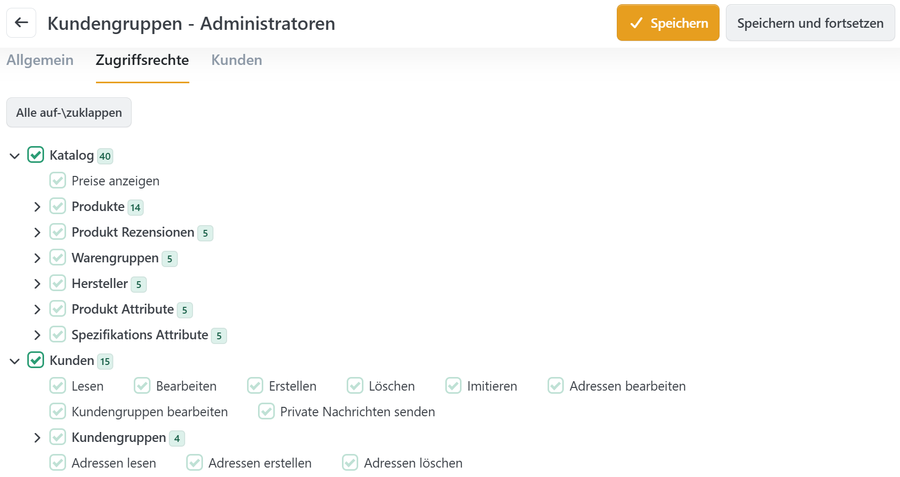

# Zugriffsrechte kontrollieren

Sie können Zugriffsrechte für unterschiedliche Arbeitsbereiche im Administrationsbereich sowie Anzeigeberechtigungen für das Frontend festlegen.

Sie können Zugriffsrechte für Arbeitsbereiche im Administrationsbereich unter **Konfiguration > Zugriffsrechte** verwalten. Um ein bestimmtes Zugriffsrecht einzustellen, müssen Sie die Box neben **Zugriffsrecht** für die **Kundengruppe** aktivieren, der Sie das Zugriffsrecht erteilen möchten.

## Anwendungsszenario

Stellen Sie sich vor, dass Sie ein Unternehmen leiten, das mehrere Mitarbeiter hat, und Sie möchten ihnen nur Zugang zu Arbeitsbereichen geben, die in ihren Verantwortungsbereich fallen. In diesem Fall können Sie Kundengruppen für Ihre Mitarbeiter anlegen und diese Gruppen ihren Verantwortungsbereichen gemäß einordnen. Wenn Sie beispielsweise einen Mitarbeiter haben der für den Bereich Öffentlichkeitsarbeit zuständig ist, dann soll dieser vermutlich Zugang zu den Foren, den News und dem Blog bekommen, allerdings benötigt er keine Zugangsberechtigungen für die Bearbeitung von Produktdaten. Sie würden also eine **Kundengruppe** für diesen Mitarbeiter einrichten und dieser folgende Zugriffsrechte einräumen: _Admin area. Manage Forums_, _Admin area. Manage News_ and _Admin area. Manage Blog_.

## Weitere Anwendungsszenarien

Weitere Anwendungsszenarien wären zum Beispiel die Einrichtung eines Shops, bei dem Preise nur für registrierte Kunden sichtbar sind oder die Einrichtung eines Shops als reinem Produktkatalog, bei dem nicht online bestellt werden kann.
