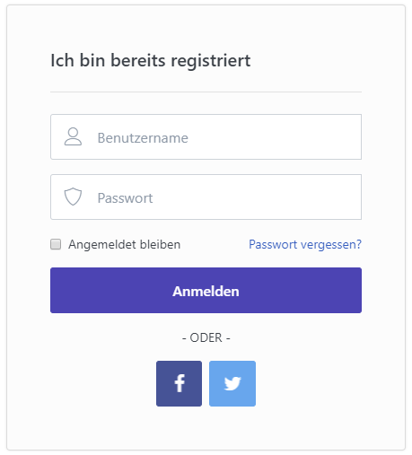

# Externe Authentifikation einrichten

Smartstore stellt Plugins für die externe Authentifikation zur Verfügung. Diese Plugins erlauben es Ihren Kunden, sich in Ihren Shop mit einem Account von Drittanbietern wie Facebook oder Twitter einzuloggen. So müssen Kunden keinen Account in Ihrem Shop eröffnen. Mit einem Klick während des Checkout-Vorgangs geschieht die Authentifizierung in Ihrem Shop automatisch mit den Login-Informationen des Drittanbieters, und Ihr Kunde kann den Kaufvorgang einfach fortsetzen. Sie können die automatische Registrierung von Kunden unter **Kunden-Einstellungen > Externe Authentifikation** ein- und ausschalten . Wenn die Funktion aktiv ist, wird für einen neuen Kunden automatisch ein neuer Account eingerichtet. Sie können bestimmen, welche Arten der externen Authentifikation in Ihrem Shop aktiv sind, indem Sie zu  **Kunden > Externe Authentifizierung**  gehen.

Nachdem Ihr Kunde auf einen der Buttons geklickt hat, wird er um Erlaubnis gebeten, dass seine Daten (Daten die bei dem jeweiligen Drittanbieter gespeichert sind z.B. Facebook) vom Shop genutzt werden dürfen. Dieser Vorgang muss nur einmal durchgeführt werden; sobald Ihre Kunden zugestimmt haben, können sie sich in Ihren Shop immer wieder auf diese Weise einloggen.

## Einstellung der Authentifizierung durch Facebook

- Erstellen Sie innerhalb der Developer Area von Facebook eine Anwendung  mit Facebook-Login-Funktion, um die Facebook-Zugangsdaten zu erhalten.
- Aktivieren Sie die Auto-Registrierung in den Kunden-Einstellungen, wenn extern authentifizierte Besucher automatisch registriert werden sollen.
- Geben Sie Ihre **Client Key Identifier (App ID)** und Ihr **Client Secret (App Secret)** ein.
- Aktivieren Sie die Authentifizierung via Facebook unter **Kunden > Externe Authentifizierung**.

## Einstellung der Authentifizierung durch Twitter

- Geben Sie Ihren **Consumer Key** und **Consumer Secret** ein.
- Aktivieren Sie **Kunden-Einstellungen > Externe Authentifikation > Automatische Registrierung aktiviert** , sonst funktioniert die Authentifizierung durch Twitter nicht.
- Aktivieren Sie die Authentifizierung durch Twitter unter **Kunden > Externe Authentifizierung**.