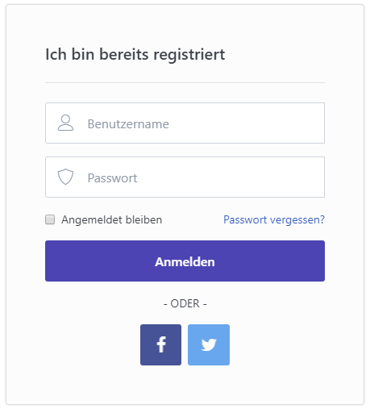

# Externe Authentifikation einrichten

Plugins für die externe Authentifikation ermöglichen Kunden die Anmeldung mit einem Konto eines Drittanbieters, beispielsweise Facebook oder Twitter. Im Checkout können sie sich damit anmelden und den Kauf ohne vorherige manuelle Kontoerstellung fortsetzen. Die automatische Registrierung steuern Sie unter **Kunden-Einstellungen > Externe Authentifikation**. Ist sie aktiviert, legt Smartstore beim ersten externen Login automatisch ein Kundenkonto an. Die verfügbaren Authentifikationsmethoden verwalten Sie unter **Kunden > Externe Authentifizierung**.

Beim ersten Login bittet der Drittanbieter den Kunden um Zustimmung zur Datenübermittlung an den Shop. Nach der Zustimmung kann sich der Kunde künftig direkt über denselben Anbieter anmelden.

## Einstellung der Authentifizierung durch Facebook

* Erstellen Sie in der Developer Area von Facebook eine Anwendung mit Facebook-Login und übernehmen Sie die erzeugten Zugangsdaten.
* Aktivieren Sie die Auto-Registrierung in den Kunden-Einstellungen, wenn extern authentifizierte Besucher automatisch registriert werden sollen.
* Geben Sie Ihre **Client Key Identifier (App ID)** und Ihr **Client Secret (App Secret)** ein.
* Aktivieren Sie die Authentifizierung via Facebook unter **Kunden > Externe Authentifizierung**.

## Einstellung der Authentifizierung durch Twitter

* Geben Sie Ihren **Consumer Key** und **Consumer Secret** ein.
* Aktivieren Sie **Kunden-Einstellungen > Externe Authentifikation > Automatische Registrierung aktiviert** , sonst funktioniert die Authentifizierung durch Twitter nicht.
* Aktivieren Sie die Authentifizierung durch Twitter unter **Kunden > Externe Authentifizierung**.
