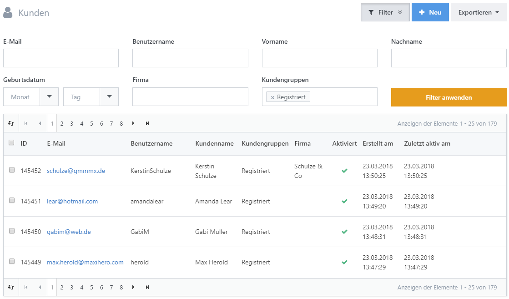
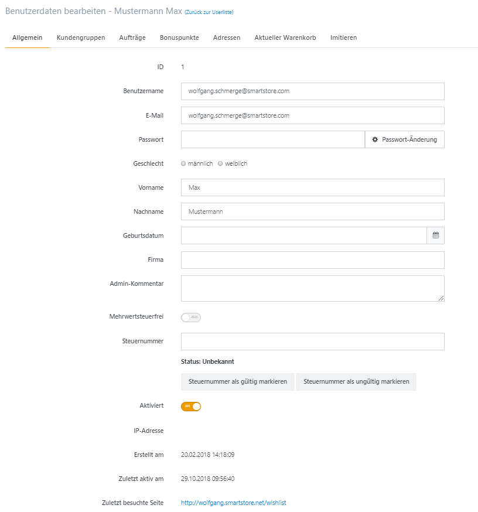
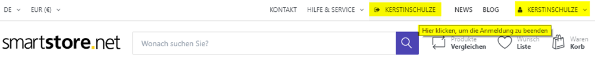

# Kunden verwalten

Smartstore behandelt jedes angelegte Konto als Kundenkonto – auch Konten von Gästen, Administratoren und registrierten Besuchern ohne Bestellung. Unter **Kunden > Kunden** filtern Sie Konten nach Kundengruppe oder suchen nach E-Mail-Adresse, Benutzername, Name, Geburtsdatum beziehungsweise Unternehmen.

## Kunden-Detailansicht

Öffnen Sie die Kunden-Detailansicht über die E-Mail-Adresse oder **Bearbeiten**. Dort können Sie unter anderem Nachrichten senden und das Kundenkonto verwalten oder löschen.

### Registerkarte Benutzerinformation

| **Feld**               | **Beschreibung**                                                                                                                                                                                                                                                                                   |
| ---------------------- | -------------------------------------------------------------------------------------------------------------------------------------------------------------------------------------------------------------------------------------------------------------------------------------------------- |
| Benutzername           | Der Benutzername des Kunden.                                                                                                                                                                                                                                                                       |
| Passwort               | Passwort des Kunden. Das Feld enthält keine Daten, da das Passwort des Kunden vertraulich ist. Der Zweck des Feldes besteht darin, dass Sie das Passwort des Kunden ändern können.                                                                                                                 |
| Admin-Kommentar        | Kommentar für internen Gebrauch. Wird nicht veröffentlicht.                                                                                                                                                                                                                                        |
| Mehrwertsteuerfrei     | Legt fest, ob der Kunde von der Mehrwertsteuer befreit ist. (Nicht relevant in deutschem Recht)                                                                                                                                                                                                    |
| Steuernummer           | Steuernummer mit vorangestelltem Länderkennzeichen (z. B. GB 111 111 11).                                                                                                                                                                                                                          |
| Affiliate              | Wenn der Kunde durch ein Partnerprogramm zu Ihnen kam, wird der verknüpfte Affiliate hier verzeichnet, so dass Sie ihn direkt ansteuern können. Für weitere Informationen zu Partnerprogrammen lesen Sie bitte [Partnerprogramme verwalten](../marketing-promotion/partnerprogramme-verwalten.md). |
| Zuletzt besuchte Seite | Zuletzt vom Kunden besuchte Seite.                                                                                                                                                                                                                                                                 |


Felder wie **Geschlecht, Geburtsdatum, Unternehmen** und viele andere werden nur in der Registerkarte Benutzerinformation angezeigt, wenn sie in den **Kunden-Einstellungen** aktiviert wurden. Für weitere Informationen zu Kunden-Einstellungen lesen Sie bitte [Kunden-Einstellungen](../konfiguration/einstellungen/kunden-einstellungen.md).


### Registerkarte Kundengruppen

Hier ordnen Sie den Kunden einer oder mehreren Kundengruppen zu oder entfernen bestehende Zuordnungen über die jeweiligen Kontrollkästchen.

### Registerkarte Aufträge

Diese Registerkarte zeigt alle Aufträge des Kunden mit **Auftragswert, Auftragsstatus, Zahlungsstatus, Versandstatus**, Shop und Erstellungsdatum. Über **Ansicht** öffnen Sie den jeweiligen Auftrag. Weitere Informationen finden Sie unter [Aufträge verwalten](../../verwalten/verkauf/auftrage-verwalten.md).

### Registerkarte Bonuspunkte

Aktivieren Sie Bonuspunkte zunächst unter **Konfiguration > Einstellungen > Bonuspunkte-Einstellungen**. Die Registerkarte zeigt Punktestand und Buchungshistorie des Kunden. Sie können Punkte manuell gutschreiben oder abziehen und eine Begründung hinterlegen. Weitere Informationen finden Sie unter [Mit Bonuspunkten arbeiten](mit-bonuspunkten-arbeiten.md).

### Registerkarte Adressen

Die Registerkarte listet alle gespeicherten Kundenadressen auf. Über **Bearbeiten** öffnen und ändern Sie eine Adresse; über **Löschen** entfernen Sie sie.

### Registerkarte Aktueller Warenkorb

Diese Registerkarte zeigt die aktuellen Produkte im Warenkorb und auf der Wunschliste des Kunden.

### Registerkarte Imitieren

Mit **Auftragserteilung beginnen** wechseln Sie in die Ansicht des Kunden. Ein zusätzlicher Link mit dessen Benutzername im Header beendet die Imitation und führt zurück zur Kundendetailansicht. In dieser Ansicht können Sie Aufträge im Namen des Kunden ausführen und prüfen, ob ACL- sowie Kundengruppenregeln wie vorgesehen greifen.

## Gastkonten löschen

Da jeder Besucher ein Gastkonto erhält, sollten veraltete Gastkonten regelmäßig entfernt werden. Die geplante Aufgabe **Gastbenutzer löschen** übernimmt dies standardmäßig alle zehn Minuten. Weitere Informationen finden Sie unter [Geplante Aufgaben verwalten](../system-wartung/geplante-aufgaben-verwalten.md).
