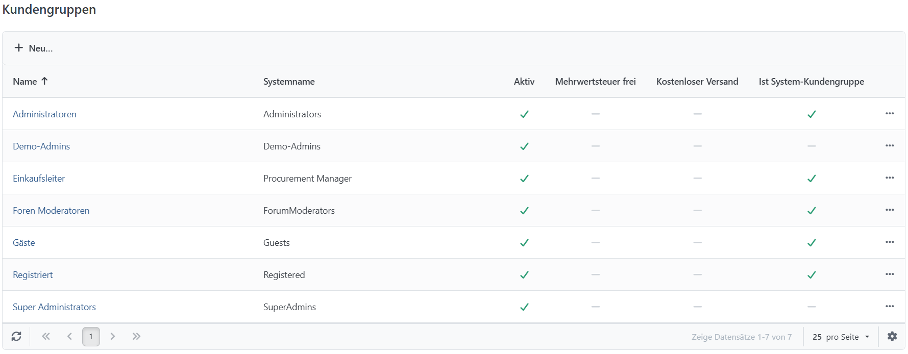

# Kundengruppen verwalten

Mit **Kundengruppen** wenden Sie gemeinsame Regeln auf mehrere Kunden an. Dazu gehören beispielsweise Mehrwertsteuerbefreiung, kostenloser Versand, Rabatte sowie Sichtbarkeitsbeschränkungen für Warengruppen und Produkte. Weitere Informationen zu Sichtbarkeitsregeln finden Sie unter [Zugriffsbeschränkungen (ACL)](../allgemeine-konzepte/zugriffsbeschrankungen-acl.md) und [Zugriffsrechte kontrollieren](../konfiguration/zugriffsrechte-kontrollieren.md).

Ein Kunde kann mehreren Kundengruppen angehören. Unter **Kunden > Kundengruppen** sehen Sie vorhandene Gruppen und legen über **Neu** weitere an.

## Kundengruppen Detailansicht

| **Feld**                | **Beschreibung**                                                                                                                                                                                                                                                                          |
| ----------------------- | ----------------------------------------------------------------------------------------------------------------------------------------------------------------------------------------------------------------------------------------------------------------------------------------- |
| Name                    | Name der Kundengruppe                                                                                                                                                                                                                                                                     |
| Systemname              | Systemname der Kundengruppe. Nur zur internen Verwendung.                                                                                                                                                                                                                                 |
| Kostenloser Versand     | Legt fest, ob der Versand für Benutzer, die dieser Kundengruppe zugeordnet sind, kostenlos ist.                                                                                                                                                                                           |
| Steueranzeige           | Legt fest, welche Steueranzeige für Kunden in dieser Gruppe angezeigt wird. Es gibt zwei Möglichkeiten, zwischen denen ausgewählt werden kann: **Inkl. Mehrwertsteuer** und **Zzgl. Mehrwertsteuer**. Wenn nichts ausgewählt wurde, ist die Standardeinstellung **Inkl. Mehrwertsteuer**. |
| Mehrwertsteuer frei     | Legt fest, ob Einkäufe für Mitglieder dieser Kundengruppe mehrwertsteuerfrei sind. Wenn ein Kunde mehreren Gruppen mit unterschiedlichen Werten für diese Einstellung zugeordnet ist, gilt für ihn **mehrwertsteuerfrei**, wenn sie in einer der ihm zugeordneten Gruppen aktiv ist.      |
| Aktiv                   | Legt fest, ob diese Kundengruppe aktiv ist.                                                                                                                                                                                                                                               |
| Ist System-Kundengruppe | Zeigt an, ob diese Gruppe eine System-Kundengruppe ist. Es gibt unterschiedliche Gruppen in Smartstore, die für die Funktion von Smartstore notwendig sind. Dazu gehört die Gruppe _Gäste_. Diese können nicht gelöscht werden und gelten als **System-Kundengruppe**.                    |
