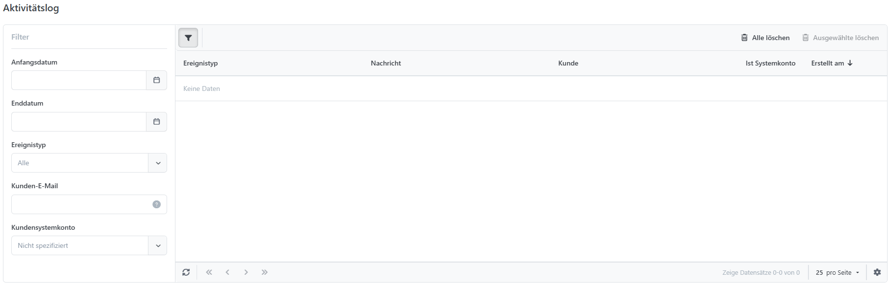
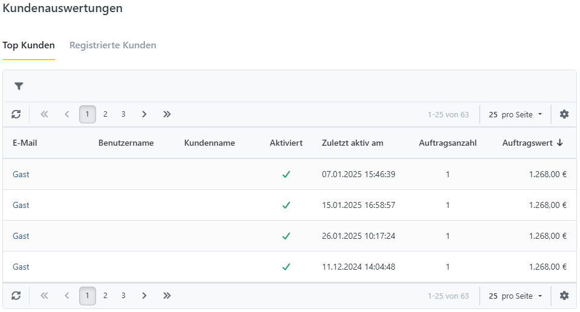
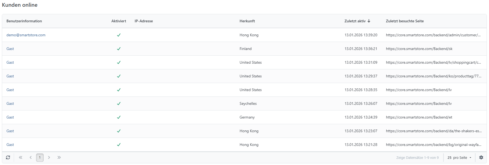

# Kundenverhalten analysieren

Wenn Sie einen Onlineshop betreiben, können Sie diesen optimieren, wenn Sie das Verhalten Ihrer Kunden analysieren.

## Aktivitätslog

Sie können die Aktivitäten Ihrer Kunden analysieren, indem Sie zu **Kunden > Aktivitätslog** navigieren. Dort können Sie alle Aktivitäten, die in Ihrem Shop stattgefunden haben, einsehen. Sie können die Aktivitäten nach Zeitraum, Kunden-E-Mail oder **Ereignistyp** filtern. Die **Ereignistypen** enthalten Aktivitäten, die im Backend (z. B. Bearbeitung eines Produkts oder einer Warengruppe) sowie im Frontend (z. B. ein Kunde hat ein Produkt in den Warenkorb gelegt oder ein Kunde hat eine Bestellung aufgegeben) stattgefunden haben. Wenn Sie auf eine E-Mail-Adresse klicken, werden Sie direkt zu den Kundeninformationen geleitet, für die die Aktivität gespeichert wurde.

## Kunden online

Unter **Kunden > Kunden online** Dort können Sie in Echtzeit analysieren, welche Kunden sich gerade in Ihrem Shop aufhalten, welche URL sie zuletzt aufgerufen haben und woher sie gekommen sind.

## Kundenauswertungen

Unter **Kunden > Kundenauswertungen**, analysieren Sie die Bestellungen, die in Ihrem Shop getätigt wurden. Sie können die Liste nach Zeiträumen, Auftragsstatus, Zahlungsstatus und Versandstatus sortiert anzeigen lassen, indem Sie den jeweiligen Filter wählen und auf **Bericht erstellen** klicken. Die Registerkarte **Top 20 Kunden nach Bestellwert** zeigt die Ergebnisse absteigend nach Bestellsumme geordnet und die Registerkarte **Top 20 Kunden nach Auftragsanzahl** nach Anzahl der Bestellungen geordnet an. Der Reiter **Registrierte Kunden** zeigt Ihnen, wie viele Kunden sich in Ihrem Shop innerhalb eines bestimmten Zeitraums registriert haben.

