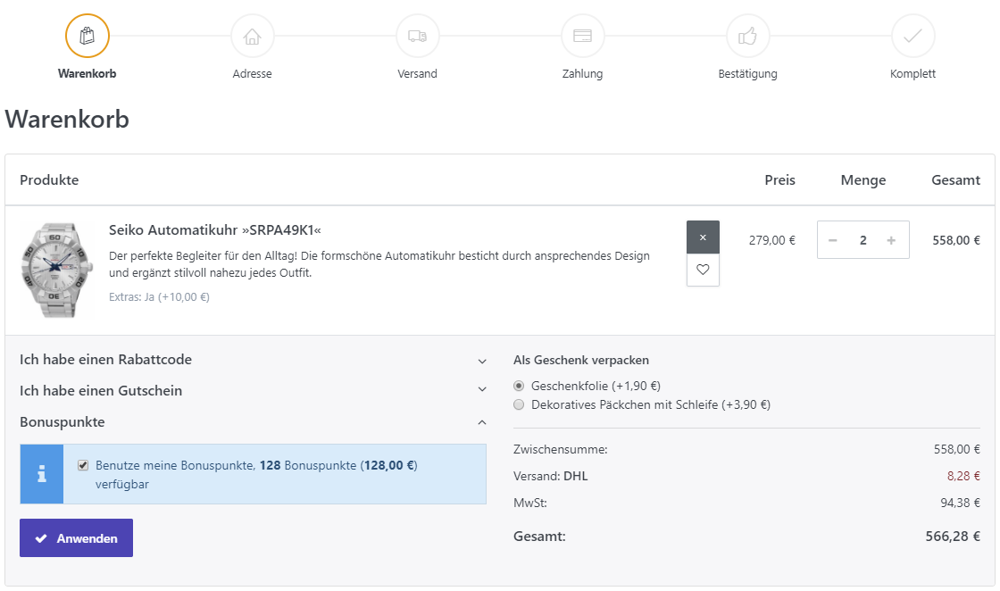
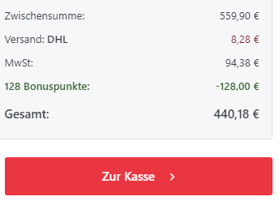

# Mit Bonuspunkten arbeiten

Das **Bonuspunkte-Programm** erlaubt es Kunden, für unterschiedliche Handlungen in Ihrem Shop Bonuspunkte zu erhalten. Bonuspunkte können für das Kaufen von Waren und für Handlungen wie die Registrierung oder das Schreiben einer Produktrezension gegeben werden. Für weitere Informationen über die unterschiedlichen Einstellungen, die für Bonuspunkte angewendet werden können, lesen Sie bitte [Bonuspunkte-Einstellungen](../../benutzer-handbuch/konfiguration/einstellungen/bonuspunkte-einstellungen.md) .

Kunden können ihre Bonuspunkte beim Checkout-Vorgang nutzen, indem Sie das entsprechende Kästchen auf der Zahlart-Auswahlseite anklicken. Wenn sie sich dazu entschließen, ihre Bonuspunkte zu verwenden, wird der entsprechende Geldwert der gesammelten Bonuspunkte vom Gesamtbetrag auf der Auftragsbestätigung abgezogen.

## 

  

Anwendungsszenario

Stellen Sie sich vor, Sie haben gerade die Funktion Produktrezension in Smartstore aktiviert und möchten nun so schnell wie möglich so viele Produktrezensionen wie möglich erhalten. In einem solchen Fall könnten Sie Ihren Kunden Anreize für das Schreiben von Produktrezensionen bieten, indem Sie ihnen dafür Bonuspunkte gutschreiben.