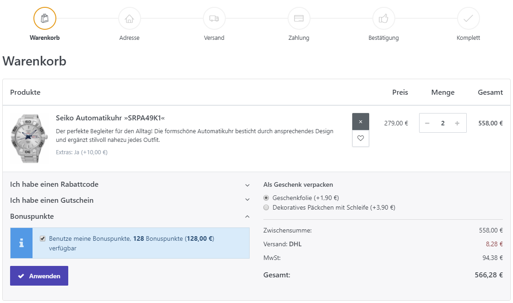
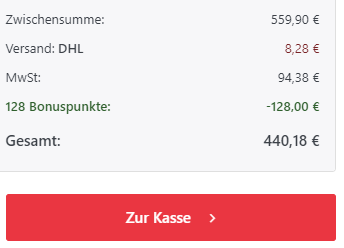

# Mit Bonuspunkten arbeiten

Das **Bonuspunkte-Programm** belohnt Kunden mit Punkten für Einkäufe und weitere Aktionen, beispielsweise Registrierung oder Produktrezensionen. Die verfügbaren Regeln und Werte konfigurieren Sie unter [Bonuspunkte-Einstellungen](../konfiguration/einstellungen/bonuspunkte-einstellungen.md).

Im Checkout aktivieren Kunden die Verwendung ihrer Bonuspunkte auf der Seite zur Auswahl der Zahlart. Der entsprechende Geldwert wird anschließend vom Gesamtbetrag des Auftrags abgezogen.

## Anwendungsszenario

Wenn Sie nach der Aktivierung von Produktrezensionen schnell mehr Rückmeldungen erhalten möchten, können Sie das Schreiben einer Rezension mit Bonuspunkten belohnen.
