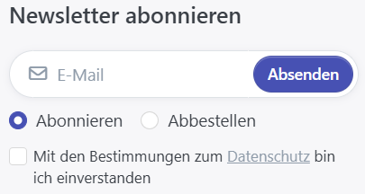
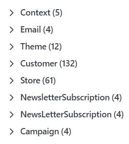
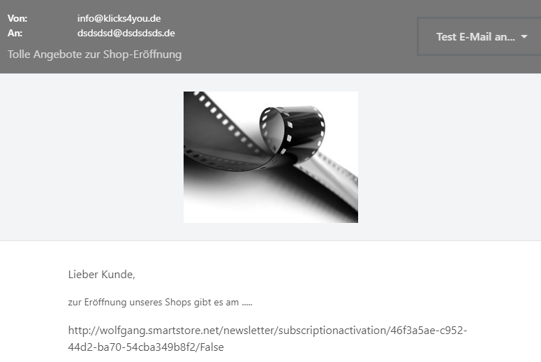

# Newsletter-Kampagnen verwalten

## Newsletter-Kampagnen verwalten

Newsletter-Marketing ist ein wirkungsvolles Instrument, um bestehende Kunden erneut zu erreichen und sie über neue Produkte, Aktionen oder Rabatte zu informieren. Wenn Kunden gute Erfahrungen beim Einkauf in Ihrem Shop gemacht haben, ist die Wahrscheinlichkeit höher, dass sie wieder bei Ihnen einkaufen. Mit Newsletter-Kampagnen erinnern Sie Ihre Kunden gezielt an Ihr Sortiment und machen sie auf aktuelle Angebote aufmerksam.

Mit der Einstellung **Konfiguration > Einstellungen > Kunden-Einstellungen > Verberge Newsletter-Anmeldeformular** aktivieren oder deaktivieren Sie das Anmeldeformular für den Newsletter im Fußbereich Ihres Shops. Dort können sich Shopbesucher für Ihren Newsletter anmelden oder ihn abbestellen.

### Kampagnen verwalten

Sie verwalten Ihre Kampagnen unter **Admin > Marketing > Kampagnen**. Um eine neue Kampagne zu erstellen, klicken Sie auf **Neu**. Anschließend erfassen Sie eine **Bezeichnung** für die interne Verwendung, den **Betreff** der E-Mail und den Inhalt der **HTML-Nachricht**.

#### Platzhalter für Nachrichten

Platzhalter für Nachrichten, intern auch MessageTokens genannt, werden zur Laufzeit durch die passenden Werte ersetzt. Diese Werte stammen entweder aus Ihrer Shopkonfiguration oder aus den Daten, die im jeweiligen Kontext verfügbar sind.

Die verfügbaren Platzhalter werden angezeigt, sobald Sie auf **+ Platzhalter auswählen** klicken.

Die folgende Tabelle zeigt Beispiele für Platzhalter, die Sie in Newsletter-Kampagnen verwenden können.

| **Token**                                | **Beschreibung**                                                                                                                                                                                                                                                                         |
| ---------------------------------------- | ---------------------------------------------------------------------------------------------------------------------------------------------------------------------------------------------------------------------------------------------------------------------------------------- |
| %Store.Name%                             | Name des Shops, für den die Kampagne verschickt wird.                                                                                                                                                                                                                                    |
| %Store.URL%                              | URL des Shops, für den die Kampagne verschickt wird.                                                                                                                                                                                                                                     |
| %Store.Email%                            | E-Mail-Adresse des Shops, für den die Kampagne verschickt wird.                                                                                                                                                                                                                          |
| %NewsLetterSubscription.Email%           | E-Mail-Adresse des Kunden, an den die Kampagne verschickt wird.                                                                                                                                                                                                                          |
| %NewsLetterSubscription.ActivationUrl%   | Link, mit dem die E-Mail-Adresse aktiviert werden kann, um Newsletter von Ihrem Shop zu erhalten.                                                                                                                                                                                        |
| %NewsLetterSubscription.DeactivationUrl% | Link, mit dem E-Mail-Adressen deaktiviert werden können, an die keine Newsletter Ihres Shops mehr gesendet werden sollen.                                                                                                                                                                |
| %Store.SupplierIdentification%           | Die Supplier Identification ist eine HTML-Tabelle, die aus unterschiedlichen Daten gespeist wird, die Sie in den Einstellungen konfiguriert haben. Sie enthält Informationen über Ihr Unternehmen, zum Beispiel Unternehmensname, Unternehmensadresse sowie Kontakt- und Rechnungsdaten. |

Auf der Registerkarte **Shops** können Sie die Kampagne auf bestimmte Shops einschränken. Sobald Sie die Kampagne gespeichert haben, können Sie sie an alle Abonnenten verschicken, indem Sie auf **Senden** klicken. Über **Vorschau** können Sie außerdem eine Test-E-Mail senden. Es öffnet sich ein Vorschaufenster, in dem Sie unter **Test-E-Mail an ...** den Empfänger des Test-Newsletters eintragen können. Wir empfehlen dringend, vor dem Versand eine Test-E-Mail zu senden. So prüfen Sie den Newsletter, bevor er an Ihre Kunden verschickt wird.

### Abonnenten verwalten

Um Ihre Newsletter-Abonnenten zu verwalten, gehen Sie zu **Admin > Marketing > Newsletter-Abonnenten**. Dort sehen Sie eine Liste aller Kunden, die sich für Ihren Newsletter angemeldet haben. Sie können die Liste durchsuchen und einzelne Abonnenten manuell aktivieren oder deaktivieren.

Wenn Sie Ihre Newsletter-Kampagnen bisher mit einem anderen Tool verwaltet haben, können Sie Ihre Abonnentenliste per CSV-Datei in Smartstore importieren. Die erste Spalte muss die E-Mail-Adresse des Abonnenten enthalten. Optional kann die Datei zwei weitere Spalten enthalten: In der zweiten Spalte kann angegeben werden, ob der Abonnent aktiv ist; in der dritten Spalte kann ein bestimmter Shop angegeben werden, zum Beispiel über die jeweilige Shop-ID. Spaltenüberschriften sind nicht erforderlich.

Erstellen Sie ein [Importprofil](../datenaustausch/import/importprofile-verwalten.md), um Newsletter-Abonnenten zu importieren. Erstellen Sie ein [Exportprofil](../datenaustausch/export/exportprofile-verwalten.md), wenn Sie Newsletter-Abonnenten exportieren möchten.
