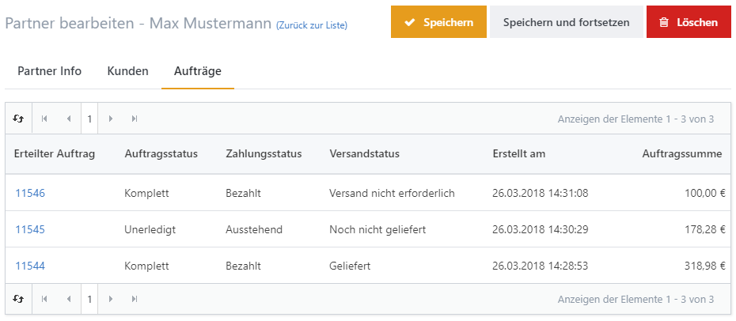

# Partnerprogramme verwalten

Beim Affiliate-Marketing vergüten Sie Partner für vermittelte Besucher, Kunden oder Bestellungen. Smartstore speichert für Sie alle weitergeleiteten Kunden und hält fest, welche Bestellungen über die Partner-URL generiert werden. Um Partnerprogramme zu verwalten, gehen Sie zu **Marketing > Partnerprogramme**. Nachdem Sie einen Affiliate eingerichtet haben, indem Sie alle relevanten Informationen wie Namen, Adresse und E-Mail-Adresse angeben, generiert Smartstore eine Partner-URL, die Sie Ihrem Marketingpartner übermitteln können. Die Partner-URL ist nach folgendem Schema aufgebaut: [http://www.my-store.com/?affiliateid=1](http://localhost:63343/?affiliateid=1), **1** steht für die Partner-ID. Wenn nun Kunden Ihren Shop über diese URL besuchen, werden sie dem jeweiligen Partner zugeordnet. Die vermittelten Kunden und ihre jeweiligen Bestellungen können Sie in der Registerkarte **Kunden** und **Aufträge** des jeweiligen Partners einsehen.

