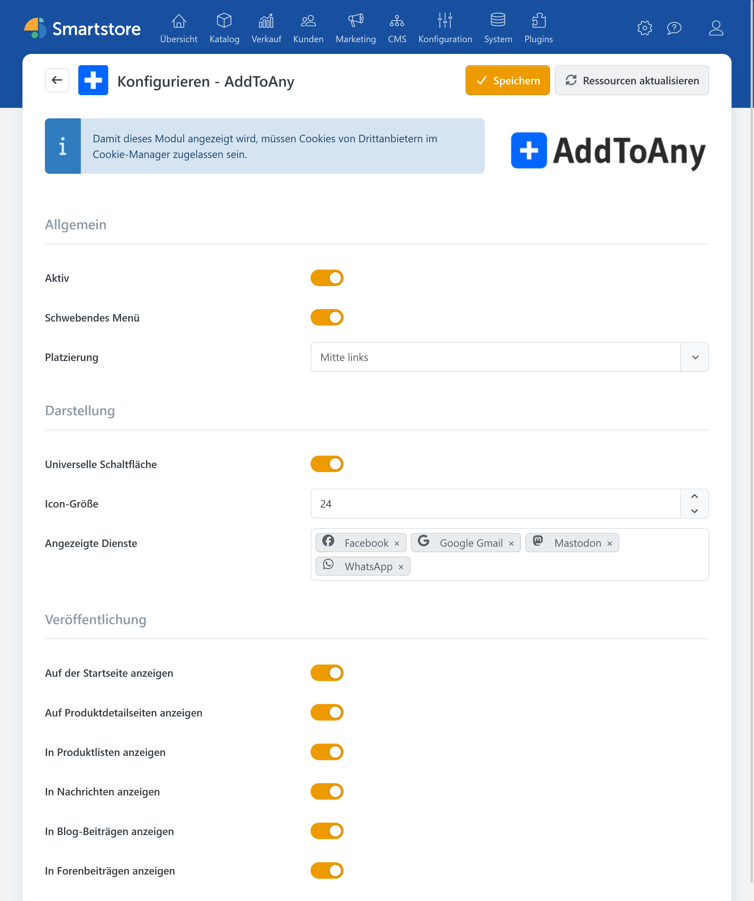
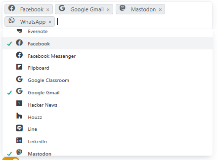

# AddToAny

Das Plugin des Dienstes [AddToAny](https://www.addtoany.com/) fügt ein Widget zu festgelegten Seiten hinzu, damit Besucher Inhalte über verschiedene Social-Media- und Kommunikationsdienste teilen können.

## Voraussetzung

Für die Anzeige des Widgets müssen folgende Voraussetzungen erfüllt sein:

- **Cookies von Drittanbietern** müssen im **Cookie-Manager** zugelassen sein.

## Einstellungen

Die Konfiguration erfolgt über die Plugin-Einstellungen (Plugins &rarr; AddToAny). Unter anderem kann die **Art der Platzierung**, **Design des Widgets**, **angebotene Dienste** und **verwendete Seiten** festgelegt werden.

Die im Widget verfügbaren Dienste können über das Dropdown-Menü ausgewählt und hinzugefügt werden.

