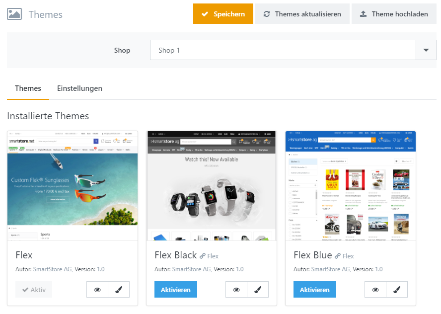

# Mit Themes arbeiten

Themes legen in Smartstore das Design Ihres Shops fest. Um das Standard-Theme Ihres Shops zu wählen, klicken Sie einfach auf **Aktivieren**. Um das Theme für Ihren Shop zu konfigurieren, gehen Sie zu **Konfiguration > Themes**. 

## Wie man ein Theme konfiguriert

Themes erlauben es, Feineinstellungen vorzunehmen und so das Aussehen Ihres Shops zu verändern. Um ein Theme zu konfigurieren, klicken Sie auf das kleine Pinselsymbol in der Theme Box. Sie können unterschiedliche Einstellungen für jeden Ihrer Shops auswählen, die Sie mit Smartstore konfiguriert haben. Nutzen Sie dafür das Shopauswahl-Element oberhalb des Konfigurationsbereichs. Sie können unterschiedliche Farben, Schriften,  Abstände und Layouteinstellungen vornehmen. Die Einstellungsmöglichkeiten sind im dem Theme selbst festgelegt und daher nicht für alle Themes gleich. Die Anzahl der Einstellungsmöglichkeiten hängt also von dem Theme ab, das Sie benutzen. Sie können Ihre Theme-Einstellungen im (xml-Format) **Exportieren** & **Importieren**. So können Sie Ihre Einstellungen sicher bearbeiten und immer zur vorhergehenden Version zurückkehren. Sie können auch die ursprünglichen Einstellungen wiederherstellen, indem Sie auf **Auf Standardwerte zurücksetzen** drücken.

## Vorschaumodus des Themes

Um die Vorschau für ein Theme zu erhalten, klicken Sie bitte auf das kleine Augensymbol in der Theme Box. Ihr Shop öffnet sich dann im **Vorschaumodus**, was durch das Augensymbol auf der linken Seite des Browsers gekennzeichnet wird. Wenn Sie darauf klicken, erscheint eine Widget Sidebar (siehe unten), aus der Sie eines Ihrer Themes und den gewünschten Shop auswählen können, den Sie in der  Vorschau sehen möchten. Sie verlassen den Vorschaumodus, indem Sie auf **Vorschaumodus beenden** klicken.

| **Collapsed** | **Enhanced** |
| --- | --- |
|  |  |

## Einstellungen

| **Option** | **Bschreibung** |
| --- | --- |
| Kunden können eigenes Theme auswählen | Erlaubt es Kunden, ein eigenes Theme auszuwählen. Wenn diese Option aktiviert ist, können Ihre Kunden ein Theme aus allen Themes, die in Ihrem Shop installiert sind im Footer auswählen. |
| Benutzer Theme in Cookie speichern | Wenn nicht gewählt, wird das Benutzer Theme mit dem Kundenkonto verknüpft, was unter Umständen unerwünscht sein kann, wenn sich bspw. mehrere User einen Gastzugang teilen. |
| Asset Bundling aktivieren | Legt fest, ob JS- und CSS-Dateien in Gruppen zusammengefasst werden sollen, um den Seitenaufbau zu beschleunigen. Wählen Sie Automatisch, wenn das Bundling von der Debug-Einstellung in der web.config abhängig sein soll.  > [!INFO] > ### Developer Tip > Deaktivieren Sie Ressourcen-Bundling und -Caching, um Theme-Änderungen optimal testen und debuggen zu können. |
| Asset Caching aktivieren | Legt fest, ob kompilierte JS- und CSS-Dateien wie bspw. 'Sass' im Dateisystem zwischengespeichert werden sollen, um den Programmstart zu beschleunigen. Wählen Sie 'Automatisch', wenn das Caching von der Debug-Einstellung in der web.config abhängig sein soll. |