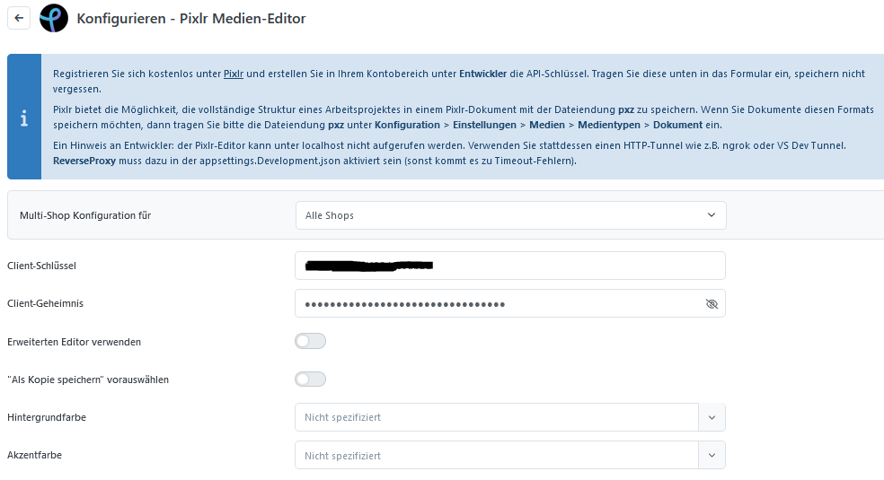
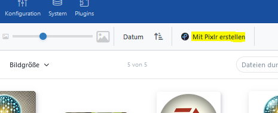
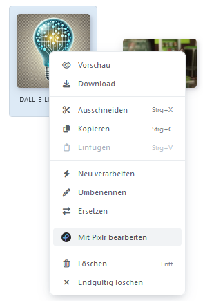
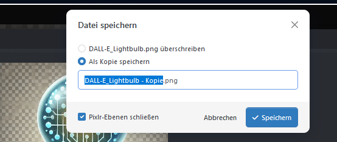

# Pixlr

Bietet die Möglichkeit Bilder direkt im MedienManager zu Erstellen und Bearbeiten.

## Konfiguration des Pixlr Plugins

| **Option**                         | **Beschreibung** |
| ---------------------------------- | ---------------- |
| Client-Schlüssel                   |                  |
| Client-Geheimnis                   |                  |
| Erweiterten Editor verwenden       |                  |
| "Als Kopie speichern" vorauswählen |                  |
| Hintergrundfarbe                   |                  |
| Akzentfarbe                        |                  |

## Benutzung im MedienManager

Die Pixlr Funktionalität ist ab Smartstore v6 im MedienManager integriert. Dazu navigieren Sie im Backend zu **CMS** → **Medien**. Wir bieten zwei Möglichkeiten an, Pixlr zu benutzen:

* Zur Erstellung von neuen Inhalten
* Zur Modifizierung vorhandener Inhalte

Beide Varianten öffnen den Pixlr-Editor, der eine Vielzahl von Editierungsmöglichkeiten zulässt.


Da der Editor von Pixlr selbst angeboten wird, können wir nicht alle Funktionen auflisten oder Fragen dazu beantworten. Informieren Sie sich bitte auf der [Pixlr-Webpage](https://pixlr.com/de/) und kontaktieren Sie den [Pixlr-Support](https://pixlr.com/support/) bei Fragen.


Nachdem Sie das Bild in Pixlr gespeichert haben, erscheint ein Smartstore-Dialog. Dieser bietet die Möglichkeit die alte Datei zu überschreiben, oder eine neue Datei unter neuem Namen anzulegen. Nachdem Sie eine Auswahl getroffen haben, befindet sich das bearbeitete Bild im MedienManager und kann überall verwendet werden.

