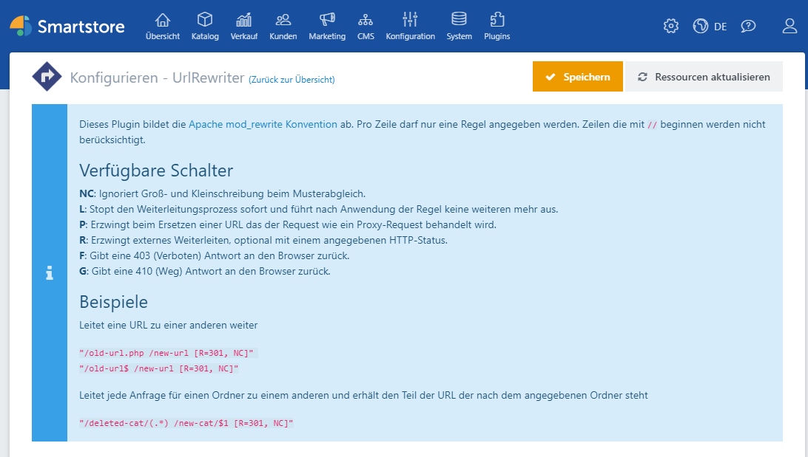

# UrlRewriter

Mit dem UrlRewriter Plugin können im Shop Backend URL Weiterleitungs-Regeln definiert werden.

## Konfiguration des UrlRewriter Plugins

| **Eingabefeld / Option** | **Beschreibung**                               |
| ------------------------ | ---------------------------------------------- |
| Ist aktiv                | Legt fest, ob die Umleitungsregeln aktiv sind. |
| Rewrite-Regeln           | Geben Sie pro Zeile eine Rewrite-Regel an.     |
