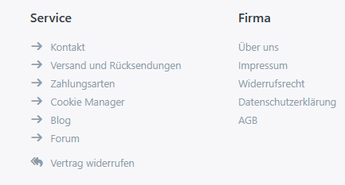
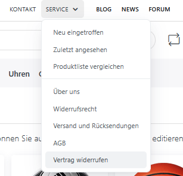
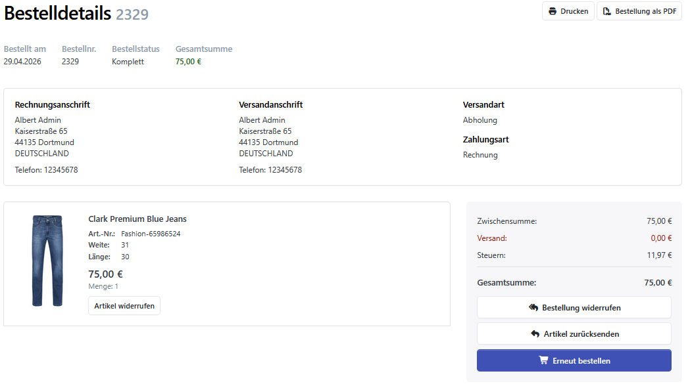
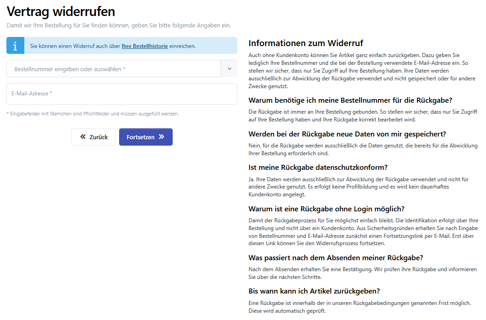
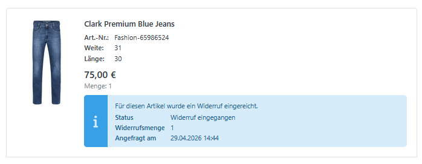
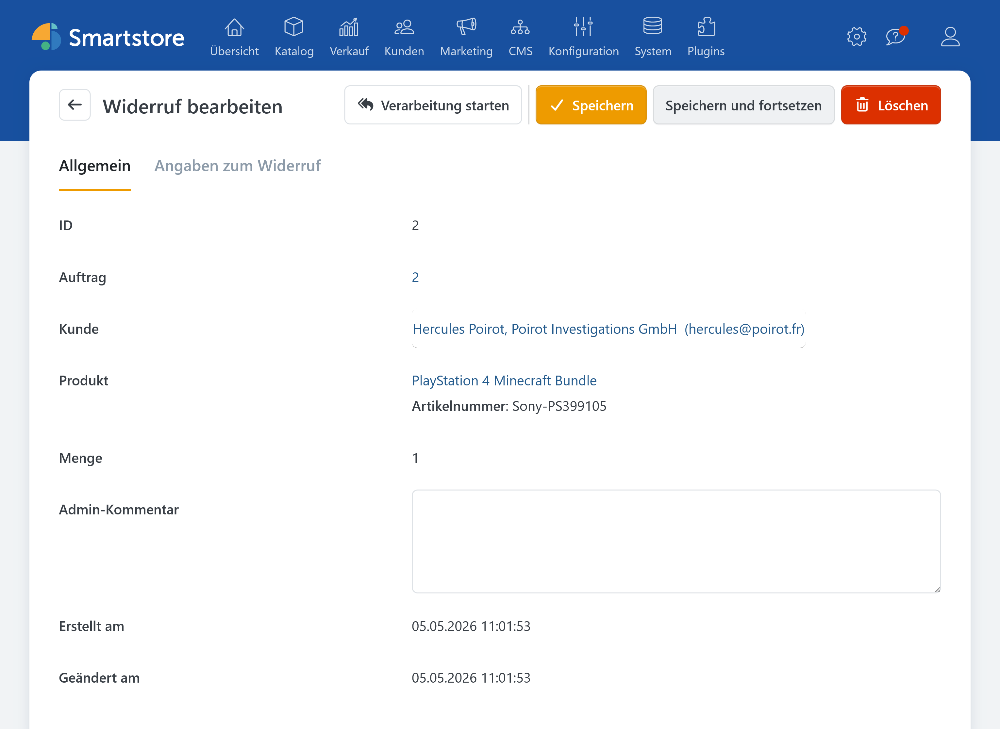
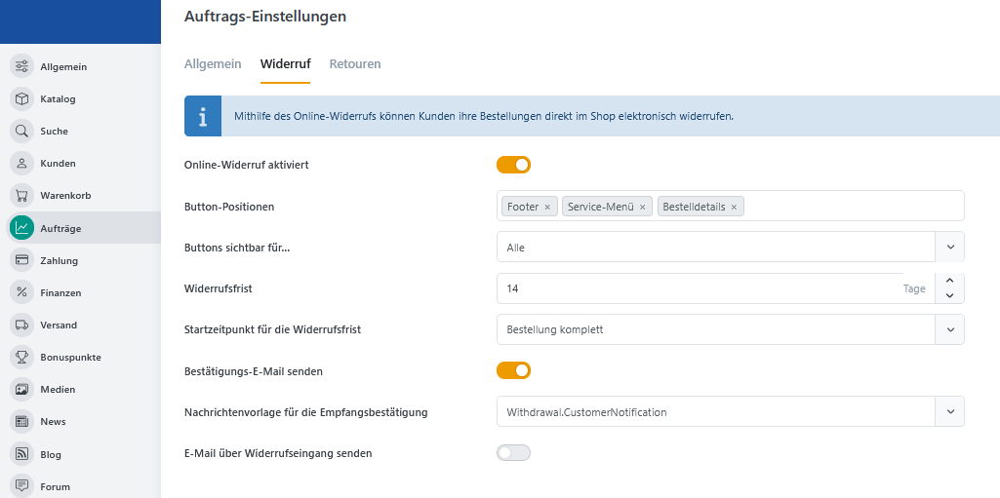

# Widerruf

Das Plugin „Withdrawal“ (Widerruf) unterstützt bei jedem Schritt des Online-Bestellwiderrufs: von der Anfrage über die Überprüfung und Bestätigung bis hin zur Nachverfolgung.

## Widerruf vs. Retoure

Die Option „Artikel zurücksenden“ steht im Rahmen der Retoure weiterhin zur Verfügung, wurde jedoch überarbeitet. So wurde beispielsweise die Funktion „Rücksendewunsch“ in „Retoure“/„Retourenantrag“ umbenannt.

Standardablauf:

1. Ein Kunde/Gast sendet einen Widerruf.
2. Der Shopbetreiber wird benachrichtigt.
3. Der Shopbetreiber wandelt den Widerruf in eine Retoure um.
4. Die Abwicklung der Retoure bleibt wie bisher.

## Der Weg zum Widerruf

### Allgemein

Sowohl im Service-Footer als auch im Service-Menü ist der Widerruf unter der Bezeichnung „Vertrag widerrufen” zu finden. Diese Schaltfläche ist für alle Nutzer, also auch für Gäste, sichtbar.

|Widerruf im Footer|Widerruf im Menü|
|---|---|
|||


Registrierte Kunden können den Kauf auf der Bestelldetailseite im Bereich „Mein Konto“ widerrufen.
 



Als Nächstes erscheint eine Informationsseite zum Widerruf, auf der die entsprechende Bestellung ausgewählt wird. Um eine Bestellung zu widerrufen, müssen Gäste ihre Bestellnummer und E-Mail-Adresse angeben. Angemeldete Kunden können die Bestellung außerdem über ein Dropdown-Menü auswählen.

Nachdem die Bestellung zum Widerruf ausgewählt wurde, kann entweder die gesamte Bestellung oder nur einzelne Produkte bzw. Positionen widerrufen werden.

Zur Verifizierung ihres E-Mail-Kontos erhalten Gäste eine E-Mail mit einem Fortschrittslink. Erst nach dessen Bestätigung ist der Widerruf abgeschlossen.


Die E-Mails mit dem Fortschrittslink werden direkt verschickt und tauchen nicht in der E-Mail-Verwaltung auf.


Sobald der Widerruf abgeschlossen ist, wird der Kunde per E-Mail benachrichtigt, ebenso optional der Shopbetreiber (siehe Konfiguration).

Der Widerrufstatus kann in den Bestelldetails im „Mein Konto“-Bereich eingesehen werden.

## Backend

### Auflistung

Eine Liste aller Widerrufe kann zusammen mit den Retourenanträgen unter **Verkauf** &rarr; **Widerrufe und Retouren** eingesehen werden.

Mit Klick auf die ID des Widerrufs wird der Widerruf angezeigt und kann bearbeitet werden. Im Reiter "Angaben zum Widerruf" können die vom Käufer weitergegebenen Daten zum Widerruf eingesehen werden.

#### Auftragsdetails

Der Widerrufstatus wird in den Auftragsdetails im Reiter „Produkte” unterhalb der Produktauflistung angezeigt.

### Konfiguration

Die Konfiguration erfolgt in den Auftragseinstellungen (**Konfiguration** &rarr; **Einstellungen** &rarr; **Auftr&auml;ge**) im Reiter „Widerruf”.

Hier können die Positionierung und Sichtbarkeit der Schaltflächen sowie die Widerrufsfrist, deren Beginn und das Versenden von E-Mails an Kunden und Shopbetreiber festgelegt werden.

Standardmäßig sind die Widerrufs- und Retourenfunktion nach der Installation des Plugins gleichzeitig aktiviert.


Optional können Retouren in den Auftragseinstellungen (**Konfiguration** &rarr; **Einstellungen** &rarr; **Aufträge**) deaktiviert werden. Dies ist sinnvoll, wenn der Retouren-Button nicht zusammen mit dem Widerrufs-Button in den Bestelldetails des „Mein Konto“-Bereichs angezeigt werden soll.


## Anpassung

Der Widerrufs-Button und die zugehörigen Benachrichtigungen lassen sich individuell an das Design des Shops anpassen.

### Nachrichtenvorlagen

Über die folgenden Nachrichtenvorlagen können die Texte angepasst werden, die im Zusammenhang mit dem Widerrufsprozess versendet werden.

|Nachrichtenvorlage|Bedeutung|
|---|---|
|Withdrawal.CustomerNotification|Benachrichtigung, die Kunden nach einem erfolgreichen Widerruf erhalten.|
|Withdrawal.MerchantNotification|Benachrichtigung, die der Shopbetreiber nach einem erfolgreichen Widerruf erhält.|
|Withdrawal.ProceedLink|Sicherheitsabfrage, die der Kunde vor dem Abschluss des Widerrufs erhält.|

### Link-Optik ändern

Für die individuelle Gestaltung des Widerrufslinks können in der Datei „_user.scss” eigene CSS-Anweisungen hinterlegt werden. Der Selektor `a[href='/withdrawal/']` ermöglicht dabei eine gezielte Anpassung der Darstellung dieses Links.

Die Ressource für den Text des Widerrufslinks kann [in den Spracheinstellungen](../konfiguration/sprachen-verwalten.md#wie-sie-eine-einzelne-ressource-hinzufugen-oder-bearbeiten) unter `Plugins.Smartstore.Withdrawal.WithdrawContract` geändert werden.

### Link manuell hinzufügen

Der Widerruflink wird standardmäßig automatisch eingebunden. Soll er an einer zusätzlichen oder individuellen Position angezeigt werden, kann er auch manuell eingefügt werden. Damit der Link korrekt funktioniert, muss er:

- auf `/withdrawal/` verweisen
- das **rel**-Attribut `nofollow` enthalten

Beispiel: `<a href="/withdrawal/" rel="nofollow">Vertrag widerrufen</a>`