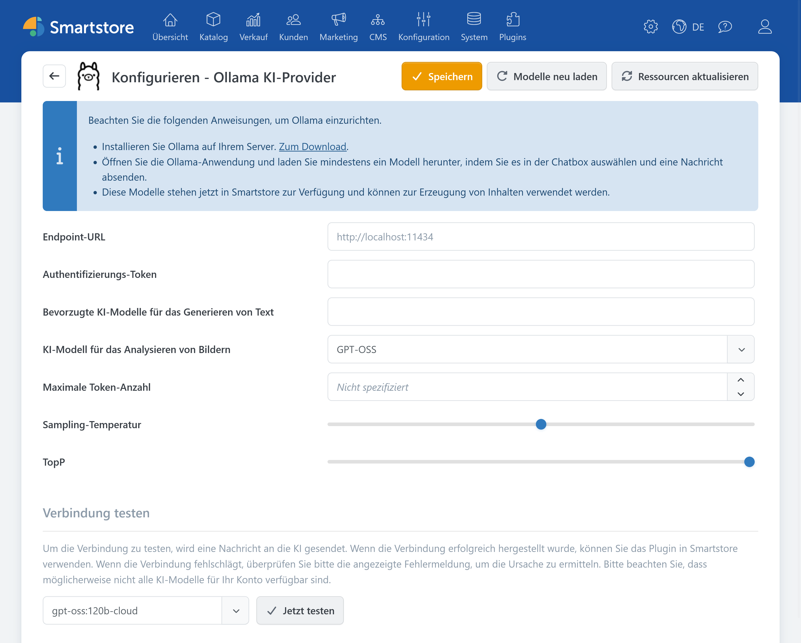

# Ollama

Mit dem Ollama-Plugin verbindet Smartstore seine KI-Funktionen mit einer erreichbaren Ollama-Instanz. Welche Funktionen zur Verfügung stehen, hängt von den dort installierten Modellen ab.


Das Ollama-Plugin stellt die Verbindung zu Ollama her. Die eigentlichen Funktionen zum Erstellen und Bearbeiten von Inhalten werden vom [AI-Plugin](../ai.md) bereitgestellt.


Informationen zu Installation und Betrieb finden Sie in der [offiziellen Ollama-Dokumentation](https://docs.ollama.com/).

## Konfiguration

Vor der Konfiguration muss die Ollama-Instanz aus Sicht des Smartstore-Servers erreichbar sein. In Ollama muss mindestens ein geeignetes Modell installiert sein.

| **Option** | **Beschreibung** |
| --- | --- |
| Endpoint-URL | Basisadresse der Ollama HTTP API. Läuft Ollama auf demselben Server wie Smartstore, kann in der Regel die angezeigte Standardadresse verwendet werden. Bei einer anderen Installation muss eine aus Sicht des Smartstore-Servers erreichbare absolute URL eingetragen werden. |
| Authentifizierungs-Token | Optionaler Bearer-Token für eine Ollama-Instanz, die beispielsweise über einen abgesicherten Reverse-Proxy bereitgestellt wird. Bei lokalem Zugriff ohne vorgeschaltete Authentifizierung bleibt das Feld leer. |
| Bevorzugte KI-Modelle für das Generieren von Text | Legt fest, welche der in Ollama verfügbaren Textmodelle in den Smartstore-KI-Dialogen angeboten werden. Bleibt das Feld leer, verwendet Smartstore die bevorzugten verfügbaren Modelle. |
| KI-Modell für das Analysieren von Bildern | Legt ein in Ollama installiertes, zur Bildanalyse geeignetes Modell fest. Das Feld steht nur zur Verfügung, wenn Smartstore entsprechende Modellinformationen ermitteln kann. |
| Maximale Token-Anzahl | Begrenzt den Umfang einer Antwort. Ein zu niedriger Wert kann dazu führen, dass längere Ausgaben unvollständig bleiben. Die mögliche Obergrenze hängt vom installierten Modell ab. |
| Sampling-Temperatur | Steuert die Variation der Antworten. Niedrigere Werte erzeugen meist vorhersehbarere, höhere Werte abwechslungsreichere Ergebnisse. |
| TopP | Alternative Methode zur Steuerung der Antwortvariation. In der Regel sollte entweder TopP oder die Sampling-Temperatur angepasst werden, nicht beides. |

### Prüfen

1. Speichern Sie die Einstellungen.
2. Klicken Sie auf **Modelle neu laden**, um die verfügbaren Modelle aus der Ollama-Instanz nachzuladen.
3. Wählen Sie unter **Verbindung testen** ein Textmodell aus und klicken Sie auf **Jetzt testen**.

Werden keine Modelle angezeigt, prüfen Sie, ob Ollama läuft, mindestens ein Modell installiert ist und die Endpoint-URL vom Smartstore-Server aus erreichbar ist. Bei einer entfernten Instanz müssen außerdem Netzwerk, Firewall, Reverse-Proxy und gegebenenfalls der Authentifizierungs-Token korrekt konfiguriert sein.


Stellen Sie eine Ollama-Instanz nicht ungeschützt im öffentlichen Netzwerk bereit. Welche Daten lokal verarbeitet oder an externe Dienste übertragen werden, hängt auch vom verwendeten Modell und der Konfiguration der Ollama-Instanz ab.

