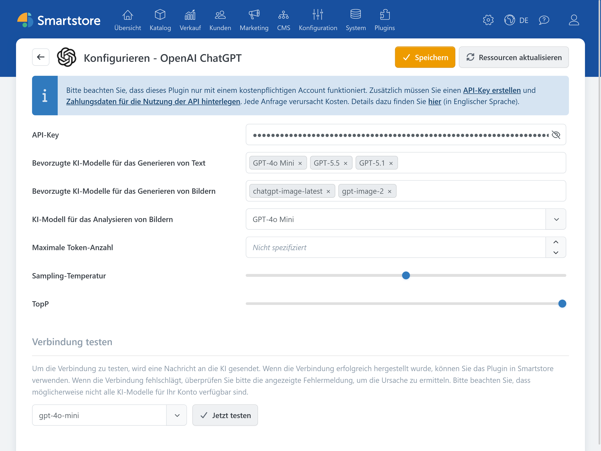

# OpenAI ChatGPT

Mit dem OpenAI-ChatGPT-Plugin können die KI-Funktionen von Smartstore Texte und Bilder erzeugen sowie Bilder analysieren.


Das OpenAI-ChatGPT-Plugin stellt die Verbindung zu OpenAI her. Die eigentlichen Funktionen zum Erstellen und Bearbeiten von Inhalten werden vom [AI-Plugin](../ai.md) bereitgestellt.


Informationen zum API-Zugang finden Sie in der [offiziellen OpenAI-Dokumentation](https://developers.openai.com/api/docs/overview).

## Konfiguration

| **Option** | **Beschreibung** |
| --- | --- |
| API-Key | Authentifiziert Smartstore gegenüber OpenAI. Ein ChatGPT-Abonnement umfasst nicht automatisch die Nutzung der OpenAI API. |
| Bevorzugte KI-Modelle für das Generieren von Text | Legt fest, welche der verfügbaren Textmodelle in den Smartstore-KI-Dialogen angeboten werden. Bleibt das Feld leer, verwendet Smartstore die bevorzugten Standardmodelle des Providers. |
| Bevorzugte KI-Modelle für das Generieren von Bildern | Legt fest, welche der verfügbaren Bildmodelle in den Smartstore-KI-Dialogen angeboten werden. |
| KI-Modell für das Analysieren von Bildern | Legt fest, welches Modell Bildinhalte analysiert und daraus beispielsweise Titel, Alt-Texte und Tags erzeugt. |
| Maximale Token-Anzahl | Begrenzt den Umfang einer Antwort. Ein zu niedriger Wert kann dazu führen, dass längere Ausgaben unvollständig bleiben. Die mögliche Obergrenze hängt vom gewählten Modell ab. |
| Sampling-Temperatur | Steuert die Variation der Antworten. Niedrigere Werte erzeugen meist vorhersehbarere, höhere Werte abwechslungsreichere Ergebnisse. |
| TopP | Alternative Methode zur Steuerung der Antwortvariation. In der Regel sollte entweder TopP oder die Sampling-Temperatur angepasst werden, nicht beides. |

### Prüfen

1. Speichern Sie die Einstellungen.
2. Klicken Sie auf **Modelle neu laden**, um die verfügbaren Modelle nachzuladen.
3. Wählen Sie unter **Verbindung testen** ein Textmodell aus und klicken Sie auf **Jetzt testen**.

Wenn die Verbindung nicht hergestellt werden kann, prüfen Sie den API-Key, die API-Abrechnung und die Berechtigung Ihres API-Kontos für das ausgewählte Modell.


API-Anfragen können nutzungsabhängige Kosten verursachen.

