# AI

Das AI Plugin  arbeitet mit einem AI Provider (z.B. [OpenAI ChatGPT](openai-chatgpt.md)) zusammen und bietet viele Möglichkeiten, Inhalte neu zu erstellen oder umzugestalten.


**Hinweise:**

1. Mit diesem Plugin können keine Produktbilder erstellt werden.
2. Es wird keine Gewähr für die Richtigkeit der Inhalte übernommen.
3. Die Massenbearbeitung von Inhalten wird aus folgenden Gründen nicht unterstützt:
   * Der Inhalt muss immer vom Benutzer überprüft werden.
   * Die Leistung würde stark reduziert werden.


## Überblick der verschiedenen Dialoge

Das AI Plugin bietet je nach Kontext unterschiedliche Dialoge für die Text- und Bildgenerierung.

### SimpleText

Für einfache Texte ohne Formatierungen (Titel, Kurzbeschreibung, …) wird der SimpleText-Dialog verwendet.

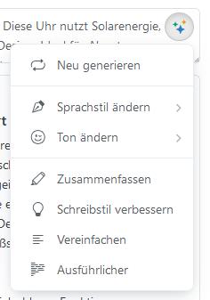

Ein Klick auf das AI-Symbol  öffnet ein Kontextmenü mit verschiedenen Befehlen, um Texte neu zu generieren, zusammenzufassen, Sprachstil und Tonfall zu ändern, den Schreibstil zu verbessern, den Text zu vereinfachen oder weiter auszuführen. Mit einem Klick auf Senden , wird ihr Prompt an die KI geschickt.

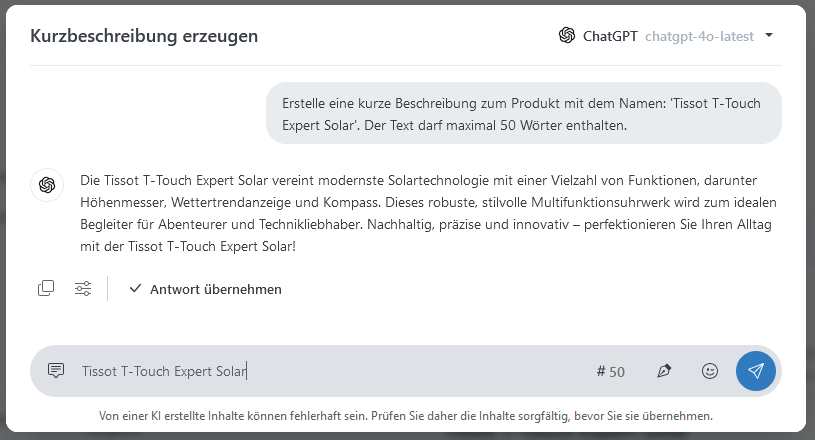

Der Dialog bietet eine Vielzahl an Möglichkeiten, den Text zu generieren und bearbeiten. Durch die Eingabe eines Prompts in der Promptleiste können Sie beschreiben, welche Inhalte erstellt werden. Einen tieferen Einblick in die Dialoge finden Sie im Abschnitt [Allgemeiner Dialog](ai.md#allgemeiner-dialog).

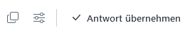

Durch Klicken auf **Antwort übernehmen** wird der ausgewählte Text in das Feld übertragen. Außerdem kann die Antwort in die Zwischenablage kopiert  und die Stilistik geändert werden .

### RichText

Für Texte mit Formatierungen, HTML und Rich-Content, wie z.B. Links, Bilder, Listen und Tabellen, wird der RichText-Dialog verwendet. Bei Klick auf das AI-Symbol  wird dasselbe Kontextmenü wie von SimpleText benutzt. Der Dialog hat zusätzlich eine Sidebar (links) bekommen.

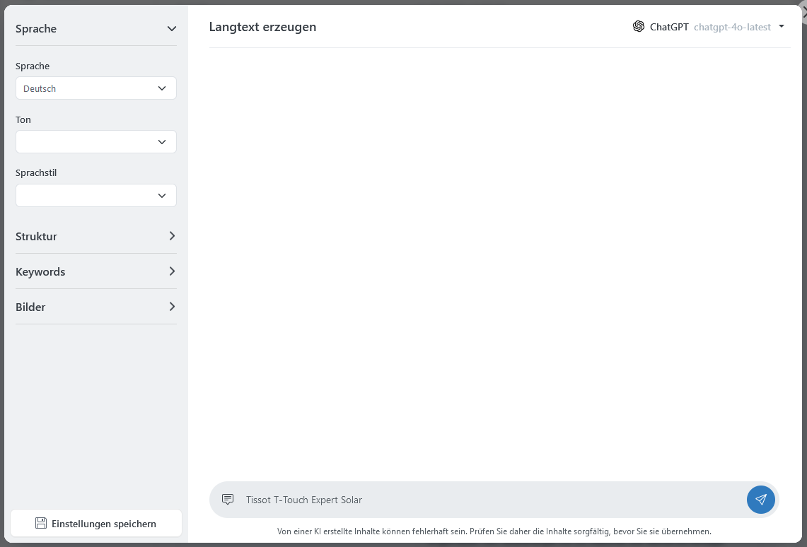

#### Sidebar

Die Sidebar stellt erweiterte Einstellungsmöglichkeiten zum Erstellen von Inhalten bereit. Je nachdem welche Entität (Produkt, Blog, News, …) bearbeitet wird, werden andere Optionen angezeigt.

*   **Sprache** bietet Optionen für Ton und Stil.

    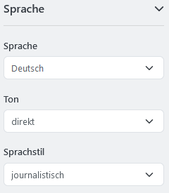
*   **Struktur** bietet Optionen für Überschriften und Absätze.

    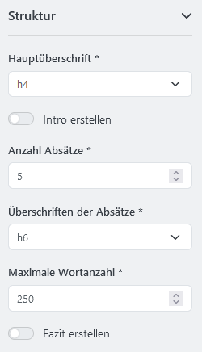
*   **Keywords** bietet Optionen für Schlüsselwörter.

    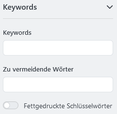
*   **Bilder** bietet Optionen um Bilder einzufügen.

    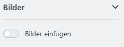
*   **Links** bietet Optionen für Verweise und Schaltflächen.

    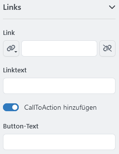
*   **Zusätzliche Inhalte** bietet weitere Einstellungsmöglichkeiten.

    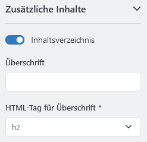


Mit dem Button **Einstellungen speichern** können die verwendeten Sidebar-Einstellungen für die aktuell verwendete Entität als Standard gespeichert werden. Dies gewährleistet ein einheitliches Design in Ihrem Shop.


#### Bilder generieren

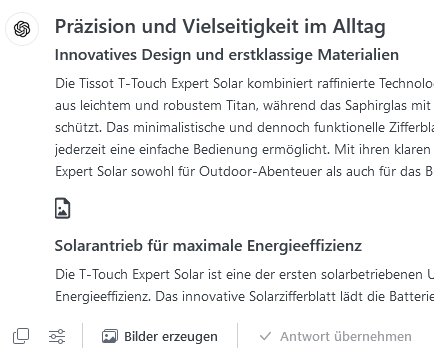

Wenn in der Sidebar die Option **Bilder einfügen** aktiviert ist, werden im generierten Text zunächst nur Platzhalter  angezeigt. Dies dient dazu, die Anzahl der Generierungen gering zu halten und erst dann zu starten, wenn der Text nicht mehr verändert wird. Neben dem Button **Antwort übernehmen** erscheint der Button **Bilder erzeugen**. Wird dieser angeklickt, werden die Bilder nacheinander erzeugt und mit einem Klick auf **Antwort übernehmen** in den MedienManager übertragen und mit dem Text verknüpft.

#### HTML-Editor Einbindung

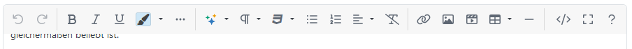

Wenn Sie im HTML-Editor AI nutzen wollen, klicken Sie einfach auf das Icon  in der Toolbar und es öffnet sich der gewohnte Dialog.

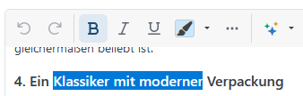

Soll nur ein bestimmter Text überarbeitet werden, markieren Sie im Editor den gewünschten Textabschnitt und klicken wieder auf das Icon  in der Toolbar. Die Option Neu generieren ist jetzt deaktiviert, alle anderen Optionen beziehen sich jetzt auf den selektierten Text.

### Suggestions

Bei neuen Blog und News Beiträgen, können Sie sich zu Themen oder Stichwörtern Titel vorschlagen lassen. Dazu gehen Sie einfach auf das AI-Icon  im leeren Titel-Feld und schon öffnet sich der Suggestions-Dialog. Nachdem Sie in der Promptleiste ihr Thema bzw. Stichwörter eingegeben haben, werden Titel generiert. Diese können Sie mit einem Klick auf **Übernehmen** übertragen.

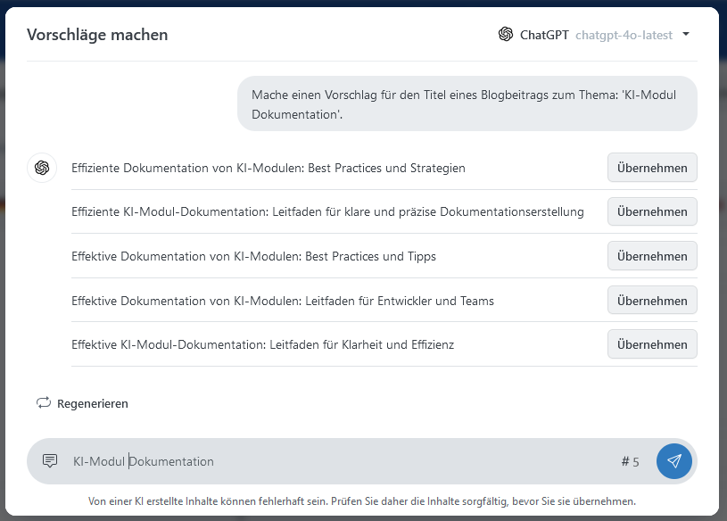


Bitte vergessen Sie nicht, direkt danach den Beitrag zu **speichern**, da die weitere Bearbeitung sonst nicht möglich ist!


### Translations

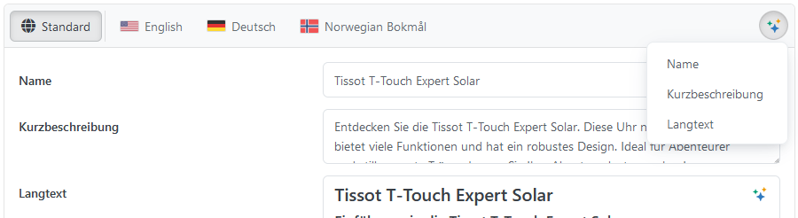

Im Editor mit Sprachauswahl können die enthaltenen Felder automatisch per AI übersetzt werden. Klicken Sie dazu auf das AI-Icon  und wählen Sie das zu übersetzende Feld aus.

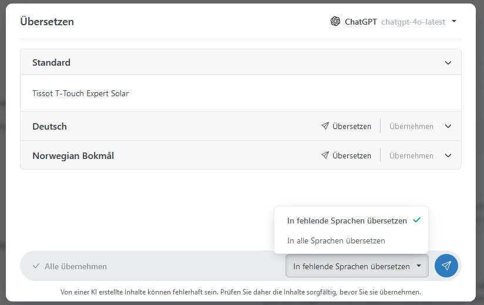

Der Translations-Dialog zeigt Ihnen alle Spracheinträge und bietet Ihnen die Möglichkeit, fehlende Sprachen zu übersetzen oder alle Sprachen neu zu übersetzen. Mit **Übernehmen** und **Alle übernehmen** können Sie Ihre Entität internationalisieren.

1. Wählen Sie zuerst aus, ob alle Sprachen neu übersetzt werden sollen, oder nur die fehlenden Sprachen.
2. Klicken Sie dann auf Senden  , um die Übersetzung des Textes zu starten.

Wenn Sie einzelne Übersetzungen übernehmen wollen, klicken Sie in dem Reiter der jeweiligen Sprache auf **Übernehmen**. Sollen alle Übersetzungen übernommen werden, klicken Sie in der Promptleiste auf **Alle übernehmen**.

### Images

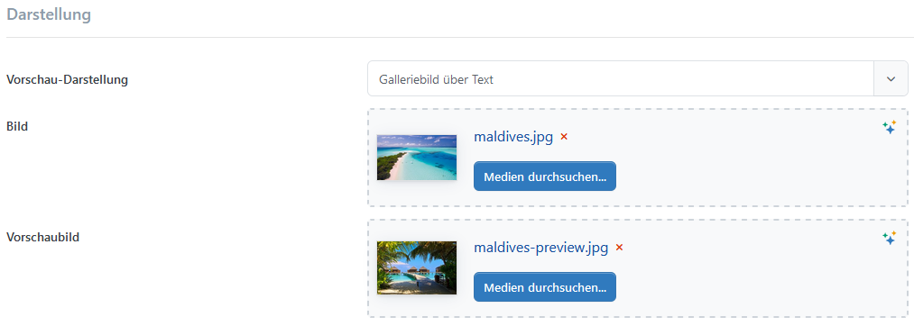

In Blog- und Newsbeiträgen bietet das AI-Tool die Möglichkeit zu erstellten Inhalten ein passendes Bild und eine Vorschau zu generieren.

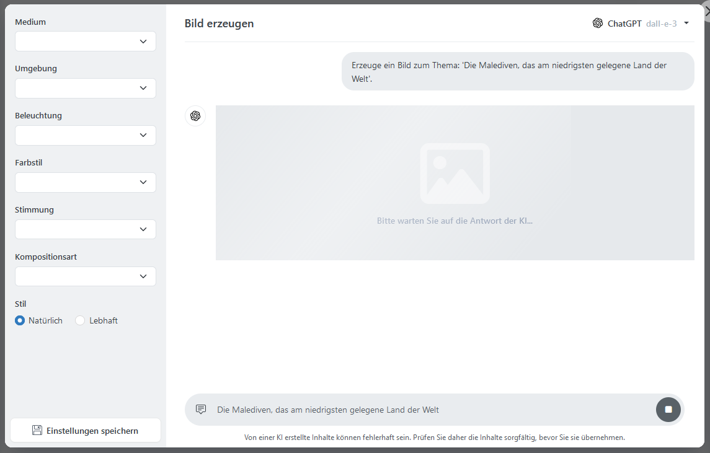

Bei der Generierung von Bildern wird die Sidebar mit optionalen Einstellungsmöglichkeiten gefüllt.

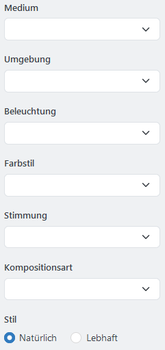

### Allgemeiner Dialog

#### Model-Auswahl

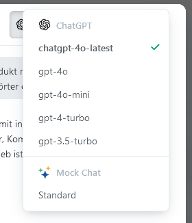

Wenn Sie auf die Modelauswahl klicken (oben rechts), wird eine Auflistung aller AI-Modelle angezeigt, die für den aktuellen Dialog verwendet werden können. Diese können Sie in der Konfiguration des Providers (z.B. [ChatGPT](openai-chatgpt.md)) bearbeiten.

#### Promptleiste

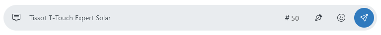

Die Promptleiste bietet mehr als nur ein Eingabefeld für den einfachen Prompt. Sie können den erweiterten Prompt bearbeiten , die Wortgrenzen-, den Sprachstil-  und den Ton  des Textes ändern.

**RawPrompt**

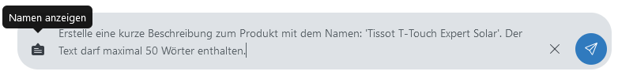

Durch Klicken auf das Prompt-Icon  gelangt man zum RawPrompt  (erweiterter Prompt). Dieser enthält die Anweisungen, die tatsächlich an die KI weitergegeben werden. Hier können detaillierte Änderungen vorgenommen werden, um den Prompt an die eigenen Bedürfnisse anzupassen.

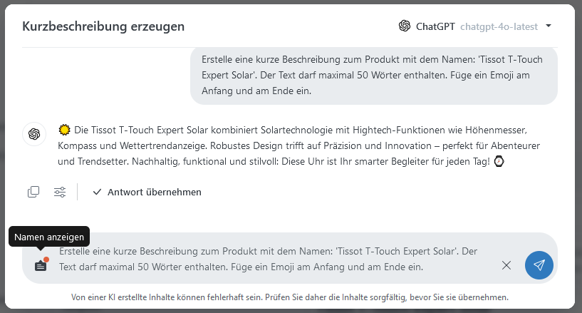


Anwendungsbeispiel: - Hinzufügen einer Tabelle mit wichtigen Merkmalen - Personalisierte Formatierung


## Konfiguration

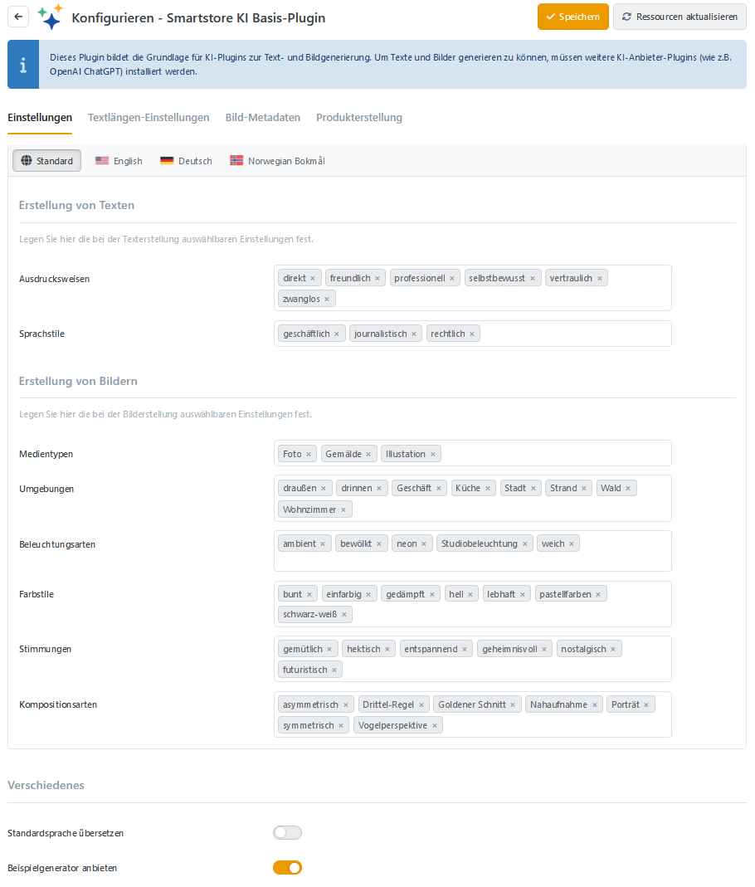

| **Option**                 | **Beschreibung**                                                                                                                                                                                                 |
| -------------------------- | ---------------------------------------------------------------------------------------------------------------------------------------------------------------------------------------------------------------- |
| Ausdrucksweisen            | Beschreibt, wie die KI Emotionen oder Absichten sichtbar macht (z. B. freundlich, fordernd, dramatisch).                                                                                                         |
| Sprachstile                | Legt fest, wie formuliert wird (z. B. sachlich, rechtlich, geschäftlich). So klingt der Output konsistent in Tonalität und Satzbau.                                                                              |
| Medientypen                | Bestimmt das „Format“, das die KI nachbilden soll (z. B. Poster / Storyboard / Foto-Look).                                                                                                                       |
| Umgebungen                 | Definiert den Ort bzw. den Kontext des Bildes (z. B. Büro, Wohnzimmer, Küche).                                                                                                                                   |
| Beleuchtungsarten          | Legt fest, wie Licht wirkt (z. B. warmes Glühen, kaltes Neon, weich, Softbox).                                                                                                                                   |
| Farbstile                  | Gibt vor, welche Farbwelt dominieren soll (z. B. pastellig, monochrom, Cinemascope, High-Saturation).                                                                                                            |
| Stimmungen                 | Steuert die emotionale Gesamtrichtung (z. B. ruhig, gespannt, melancholisch, energiegeladen).                                                                                                                    |
| Kopositionsarten           | Regelt die Anordnung im Bild bzw. die Gliederung im Text (z. b. Portrait, zentriert, Weitwinkel).                                                                                                                |
| Standardsprache übersetzen | Die Standardsprache ist die erste aktive Sprache eines Stores. Ist kein Wert für sie hinterlegt, wird der Wert aus dem Reiter "Standard" genutzt. Daher wird empfohlen, die Standardsprache nicht zu übersetzen. |
| Beispielgenerator anbieten | Stellt einen Chat-Generator zur Verfügung steht, der Beispieldaten erzeugt.                                                                                                                                      |

### Textlängen

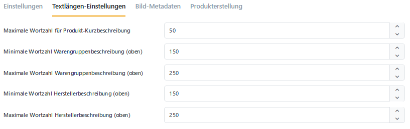

| **Option**                                        | **Beschreibung**                                                                                         |
| ------------------------------------------------- | -------------------------------------------------------------------------------------------------------- |
| Maximale Wortzahl für Produkt-Kurzbeschreibung    | Legt die maximale Anzahl von Wörtern fest, die für die Kurzbeschreibung eines Produkts generiert werden. |
| Minimale Wortzahl Warengruppenbeschreibung (oben) | Legt die minimale Anzahl von Wörtern fest, die für die obere Warengruppenbeschreibung generiert werden.  |
| Maximale Wortzahl Warengruppenbeschreibung (oben) | Legt die maximale Anzahl von Wörtern fest, die für die obere Warengruppenbeschreibung generiert werden.  |
| Minimale Wortzahl Herstellerbeschreibung (oben)   | Legt die minimale Anzahl von Wörtern fest, die für die obere Herstellerbeschreibung generiert werden.    |
| Maximale Wortzahl Herstellerbeschreibung (oben)   | Legt die maximale Anzahl von Wörtern fest, die für die obere Herstellerbeschreibung generiert werden.    |

### Bild-Metadaten

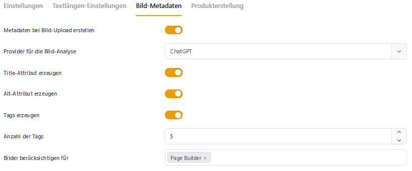

| **Option**                          | **Beschreibung**                                                                        |
| ----------------------------------- | --------------------------------------------------------------------------------------- |
| Metadaten bei Bild-Upload erstellen | Legt fest, ob beim Hochladen eines Bildes automatisch Metadaten erzeugt werden.         |
| Provider für die Bild-Analyse       | Definiert den Provider, der für die Erstellung von Metadaten für Bilder verwendet wird. |
| Title-Attribut erzeugen             |                                                                                         |
| Alt-Attribut erzeugen               |                                                                                         |
| Tags erzeugen                       | Bestimmt, ob Tags zur besseren Auffindbarkeit im Medien-Manager erzeugen werden sollen. |
| Anzahl der Tags                     |                                                                                         |
| Bilder berücksichtigen für          | Bestimmt die Typen, für die Bilder beim Upload verarbeitet werden.                      |


Wenn die Option ‘Metadaten bei Bild-Upload erstellen’ aktiviert ist, wird das Bild beim Upload durch die KI analysiert.


### Produkterstellung

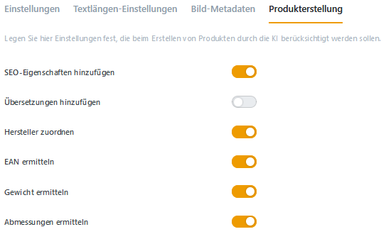

| **Option**                   | **Beschreibung**                                                                                                                                 |
| ---------------------------- | ------------------------------------------------------------------------------------------------------------------------------------------------ |
| SEO-Eigenschaften hinzufügen | Bestimmt, ob bei der Erstellung von Produkten mit Hilfe von KI auch die SEO-Eigenschaften des Produkts erzeugt werden sollen.                    |
| Übersetzungen hinzufügen     | Bestimmt, ob bei der Erstellung von Produkten mit Hilfe von KI auch Übersetzungen für das Produkt erzeugt werden sollen.                         |
| Hersteller zuordnen          | Bestimmt, ob bei der Erstellung von Produkten mit Hilfe von KI eine automatische Zuordnung zu einem vorhandenen Hersteller versucht werden soll. |
| EAN ermitteln                | Bestimmt, ob bei der Erstellung von Produkten mit Hilfe von KI auch die EAN für das Produkt ermittelt werden soll.                               |
| Gewicht ermitteln            | Bestimmt, ob bei der Erstellung von Produkten mit Hilfe von KI auch das Gewicht für das Produkt ermittelt werden soll.                           |
| Abmessungen ermitteln        | Bestimmt, ob bei der Erstellung von Produkten mit Hilfe von KI auch die Abmessungen für das Produkt ermittelt werden sollen.                     |
