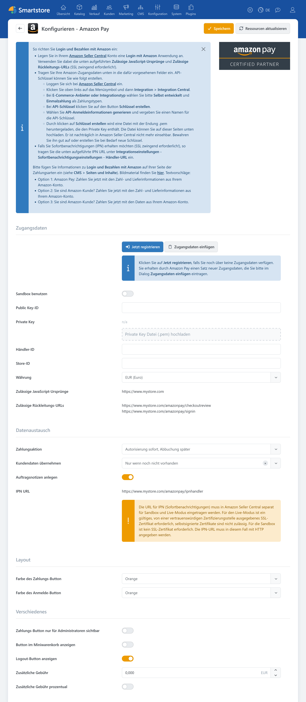

# Amazon Pay

Das Plugin **Amazon Pay** bindet den Zahlungsdienstleister Amazon Pay in Smartstore ein. Kunden können eine Bestellung mit den in ihrem Amazon-Konto hinterlegten Zahlungs- und Adressdaten bezahlen. Optional stellt das Plugin außerdem **Anmelden mit Amazon** als [externe Authentifizierungsmethode](external-auth.md) bereit.

Amazon Pay wird als Express-Zahlungsart direkt aus dem Warenkorb gestartet. Nach der Auswahl von Zahlungsart und Adresse bei Amazon kehrt der Kunde zur Bestellprüfung in den Shop zurück. Das Plugin unterstützt die sofortige Abbuchung oder eine zunächst nur autorisierte Zahlung, vollständige und teilweise Rückerstattungen sowie die Aktualisierung des Zahlungsstatus über IPN-Benachrichtigungen.


Amazon Pay und **Anmelden mit Amazon** können unabhängig voneinander aktiviert werden. Einen Vergleich mit weiteren Zahlungsplugins finden Sie unter [Zahlungsanbieter und Zahlungsarten](paymentproviders.md).


Für den Betrieb benötigen Sie:

- ein freigeschaltetes Amazon-Pay-Händlerkonto
- eine in Amazon Seller Central eingerichtete Anwendung
- Händler-ID, Store-ID und Public Key-ID
- den zugehörigen Private Key als `.pem`-Datei
- eine öffentlich erreichbare Shopdomain
- HTTPS mit einem gültigen SSL-Zertifikat.


Das Plugin unterstützt die primären Shopwährungen EUR, GBP, USD und JPY. Bei einer anderen primären Shopwährung werden die Amazon-Pay-Schaltflächen nicht angezeigt.


Aktivieren Sie Amazon Pay nach der Konfiguration unter **Konfiguration > Zahlungsarten**. Weitere Informationen zur Aktivierung, Sortierung und Einschränkung von Zahlungsarten finden Sie unter [Zahlungsarten einrichten](../konfiguration/zahlungsarten-einrichten.md).

## Konfiguration

Die Konfiguration verbindet Smartstore mit Ihrem Amazon-Pay-Händlerkonto und legt das Verhalten des Zahlungs- und Anmeldevorgangs fest.

| Einstellung | Beschreibung |
|---|---|
| **Sandbox benutzen** | Verwendet die Amazon-Pay-Testumgebung. Sandbox und Livebetrieb benötigen jeweils passende Zugangsdaten und eine eigene IPN-Konfiguration. |
| **Public Key-ID** | Identifiziert den öffentlichen API-Schlüssel für die Kommunikation mit Amazon Pay. |
| **Private Key** | Privater Schlüssel aus der von Amazon bereitgestellten `.pem`-Datei. Der gespeicherte Schlüssel wird nicht im Klartext angezeigt. |
| **Händler-ID** | Eindeutige Kennung des Amazon-Pay-Händlerkontos. |
| **Store-ID** | Kennzeichnet die in Amazon Seller Central eingerichtete Shopkonfiguration. |
| **Währung** | Bestimmt die verwendete Amazon-Region und die Sprache der eingebundenen Amazon-Pay-Oberfläche. Die Auswahl muss zur primären Shopwährung passen. |
| **Zahlungsaktion** | Legt fest, ob der Betrag während der Bestellung sofort abgebucht oder zunächst nur autorisiert wird. |
| **Kundendaten übernehmen** | Bestimmt, ob E-Mail-Adresse und Telefonnummer aus Amazon Pay in das Kundenkonto übernommen werden. |
| **Auftragsnotiz anlegen** | Erstellt bei relevanten IPN-Benachrichtigungen interne Auftragsnotizen mit Informationen zur Statusänderung. |
| **Farbe des Zahlungsbuttons** | Bestimmt die Farbe des Amazon-Pay-Zahlungsbuttons. |
| **Farbe des Anmeldebuttons** | Bestimmt die Farbe der Schaltfläche **Anmelden mit Amazon**. |
| **Zahlungsbutton nur für Administratoren sichtbar** | Zeigt den Amazon-Pay-Button ausschließlich angemeldeten Administratoren. Damit kann die Integration im laufenden Shop getestet werden. |
| **Button im Miniwarenkorb anzeigen** | Zeigt den Amazon-Pay-Button zusätzlich im ausklappbaren Miniwarenkorb. |
| **Logout-Button anzeigen** | Zeigt nach Abschluss der Bestellung die Schaltfläche **Bei Amazon abmelden**. |
| **Zusätzliche Gebühren** | Legt einen Zuschlag für Zahlungen mit Amazon Pay fest. |
| **Zusätzliche Gebühren prozentual berechnen** | Berechnet den eingetragenen Gebührenwert prozentual. Ohne Aktivierung wird der Wert als Festbetrag in der primären Shopwährung verwendet. |


Zahlungsaufschläge können abhängig von Land, Kundengruppe und Zahlungsmittel rechtlich eingeschränkt oder unzulässig sein. Prüfen Sie die für Ihren Shop geltenden Anforderungen, bevor Sie eine zusätzliche Gebühr aktivieren.


### Amazon Seller Central vorbereiten

In Amazon Seller Central muss eine Anwendung für Amazon Pay und **Login mit Amazon** eingerichtet werden. Die Smartstore-Konfiguration zeigt die dafür benötigten Werte an:

- zulässige JavaScript-Ursprünge
- zulässige Rückleitungs-URLs
- IPN-URL.

Übernehmen Sie diese Werte unverändert in Amazon Seller Central. Protokoll, Domain, Port und Pfad müssen mit der im Shop angezeigten URL übereinstimmen.

Bei einem Multi-Shop-System müssen die verwendeten Shopdomains und Rückleitungs-URLs einzeln berücksichtigt werden. Wählen Sie vor der Konfiguration den gewünschten Shop-Geltungsbereich aus. Weitere Informationen finden Sie unter [Multi-Shop Konfiguration](../konfiguration/einstellungen/den-einstellungsbereich-festlegen.md).

Die Amazon-Zugangsdaten können manuell eingetragen oder über die von Amazon bereitgestellten Registrierungsdaten übernommen werden. Der Private Key muss separat als `.pem`-Datei hochgeladen werden.


Bewahren Sie die von Amazon bereitgestellte `.pem`-Datei sicher auf. Der darin enthaltene Private Key kann in Amazon Seller Central später möglicherweise nicht erneut angezeigt werden.


### Autorisierung und Abbuchung

Bei der Zahlungsaktion **Autorisierung sofort, Abbuchung später** reserviert Amazon Pay den Betrag zunächst. Der Händler kann die Zahlung anschließend in der Smartstore-Auftragsverwaltung einziehen.

Diese Variante eignet sich beispielsweise, wenn die Bestellung oder die Warenverfügbarkeit vor der Abbuchung geprüft werden soll.

Bei **Sofort abbuchen** werden Autorisierung und Abbuchung während des Bestellvorgangs gemeinsam ausgeführt. Diese Einstellung sollte nur verwendet werden, wenn die betrieblichen Voraussetzungen und die Vorgaben von Amazon Pay erfüllt sind.

Weitere allgemeine Einstellungen zum automatischen Einzug finden Sie unter [Zahlung](../konfiguration/einstellungen/zahlung.md).

### Kundendaten übernehmen

Das Plugin kann E-Mail-Adresse und Telefonnummer aus Amazon Pay in das Kundenkonto übernehmen:

- **Nicht angegeben:** Es werden keine bestehenden Kundendaten ergänzt oder ersetzt.
- **Nur wenn noch nicht vorhanden:** Vorhandene Kundendaten bleiben unverändert.
- **Immer:** Vorhandene Werte können durch die von Amazon übermittelten Daten ersetzt werden.

Die E-Mail-Adresse wird nur bei registrierten Kunden in das Kundenkonto übernommen. Die Telefonnummer wird als Kundenattribut gespeichert. Rechnungs- und Lieferadressen werden unabhängig von dieser Einstellung für die Bestellung verarbeitet.

## Amazon Pay im Warenkorb und Checkout

Der Amazon-Pay-Button wird im normalen Warenkorb und optional im Miniwarenkorb angezeigt. Nach einem Klick auf den Button öffnet sich die Amazon-Pay-Oberfläche. Dort wählt der Kunde die gewünschte Zahlungsart und gegebenenfalls eine Lieferadresse.

Smartstore übernimmt die von Amazon bereitgestellten Rechnungs- und Lieferadressen in den Checkout. Dabei gelten folgende Bedingungen:

- Das Land muss in Smartstore vorhanden sein.
- Das Land muss für Rechnungs- beziehungsweise Lieferadressen freigegeben sein.
- Bereits vorhandene, übereinstimmende Kundenadressen werden wiederverwendet.
- Neue Adressen können dem Kundenkonto zugeordnet werden.
- Bei aktiviertem Quick Checkout können sie als Standardadresse gespeichert werden.
- Bei einer fehlenden oder unzulässigen Adresse muss der Kunde eine andere Amazon-Adresse auswählen.

Nach Auswahl von Amazon Pay überspringt Smartstore die normale Zahlungsartenauswahl. Abhängig von der Bestellung kann im Shop noch die Auswahl einer Versandart erforderlich sein.


Die Amazon-Pay-Schaltflächen werden als Widgets in den Shop eingebunden. Prüfen Sie bei einer fehlenden Schaltfläche, ob das zugehörige Widget aktiviert ist. Weitere Informationen finden Sie unter [Widgets anordnen](../content-management/widgets-anordnen.md).


## IPN und Zahlungsstatus

Amazon Pay informiert Smartstore über Instant Payment Notifications, kurz IPN, über nachträgliche Änderungen am Zahlungsstatus. Die in der Plugin-Konfiguration angezeigte **IPN-URL** muss in Amazon Seller Central als Händler-URL hinterlegt werden.

Für Sandbox und Livebetrieb sind getrennte IPN-Einstellungen erforderlich. Im Livebetrieb muss die URL per HTTPS erreichbar sein und ein gültiges Zertifikat einer vertrauenswürdigen Zertifizierungsstelle verwenden.

IPN-Benachrichtigungen können insbesondere folgende Vorgänge betreffen:

- erfolgreiche oder abgelehnte Autorisierung
- erfolgreiche Abbuchung
- Stornierung einer Zahlung
- vollständige oder teilweise Rückerstattung
- Rückbuchung beziehungsweise Chargeback.

Ist **Bestellnotizen hinzufügen** aktiviert, dokumentiert Smartstore relevante Benachrichtigungen als interne Auftragsnotizen. Diese können unter anderem die Amazon-Nachrichten-ID, den Benachrichtigungstyp, die Transaktions-ID sowie den bisherigen und den neuen Zahlungsstatus enthalten.

Chargebacks werden ebenfalls als interne Auftragsnotiz erfasst. Die weitere Bearbeitung erfolgt in Amazon Seller Central.


Eine Autorisierung kann von Amazon zunächst zur weiteren Prüfung angenommen werden. Smartstore zeigt dem Kunden in diesem Fall einen entsprechenden Hinweis. Der endgültige Zahlungsstatus wird anschließend über IPN aktualisiert.


## Zahlungen bearbeiten

Das Amazon-Pay-Plugin unterstützt die weitere Bearbeitung einer Zahlung in der Smartstore-Auftragsverwaltung. Abhängig vom aktuellen Zahlungsstatus stehen folgende Aktionen zur Verfügung:

- Einzug einer zuvor autorisierten Zahlung
- vollständige Rückerstattung
- teilweise Rückerstattung
- Stornierung beziehungsweise Aufhebung einer offenen Autorisierung.

Amazon Pay ordnet die Vorgänge anhand der Charge-ID und der Charge-Permission-ID dem Auftrag zu. Rückerstattungs-IDs werden gespeichert, damit dieselbe Erstattung nicht mehrfach verarbeitet wird.

Weitere Informationen zur Auftragsansicht finden Sie unter [Aufträge verwalten](../../verwalten/verkauf/auftrage-verwalten.md). Eine Übersicht der von Zahlungsplugins bereitgestellten Verwaltungsfunktionen enthält der Abschnitt [Funktionen von Zahlart-Plugins](../konfiguration/zahlungsarten-einrichten.md#funktionen-von-zahlart-plugins).

## Anmelden mit Amazon

Neben der Zahlungsart stellt das Plugin eine externe Authentifizierungsmethode bereit. Kunden können sich damit über ihr Amazon-Konto im Shop anmelden oder registrieren. Aktivieren Sie die Methode nach der Konfiguration unter **Kunden > Externe Authentifizierungsmethoden**.

Amazon übermittelt beim Anmeldevorgang:

- den Namen
- die E-Mail-Adresse
- eine eindeutige Amazon-Käufer-ID.

Smartstore verwendet diese Daten zur Anmeldung oder Registrierung des Kunden. Rechnungsadressen, Lieferadressen und Telefonnummern werden beim reinen Anmeldevorgang nicht angefordert.

Ob beim ersten Login automatisch ein neues Kundenkonto erstellt werden kann, hängt von den Kunden- und Registrierungseinstellungen des Shops ab. Weitere Informationen finden Sie unter [Externe Authentifikation einrichten](external-auth.md) und [Kunden-Einstellungen](../konfiguration/einstellungen/kunden-einstellungen.md).

## Cookies und Datenschutz

Wenn Amazon Pay als Zahlungsart oder **Anmelden mit Amazon** aktiviert ist, stellt das Plugin die zugehörigen Cookies als technisch erforderlich dar. Sie werden für die Anzeige und Abwicklung des Zahlungs- beziehungsweise Anmeldevorgangs benötigt.

Das Plugin verarbeitet keine sichtbaren Kreditkarten- oder Kontodaten. Die Auswahl der Zahlungsart erfolgt in der von Amazon bereitgestellten Oberfläche.

Berücksichtigen Sie Amazon Pay in der Datenschutzerklärung und in den Informationen zu den angebotenen Zahlungsarten. Weitere Informationen zur Verwaltung von Cookie-Hinweisen finden Sie unter [Cookie-Manager](../konfiguration/cookie-manager.md).

## Weiterführende Informationen

- [Zahlungsanbieter und Zahlungsarten](paymentproviders.md)
- [Zahlungsarten einrichten](../konfiguration/zahlungsarten-einrichten.md)
- [Zahlungseinstellungen](../konfiguration/einstellungen/zahlung.md)
- [Aufträge verwalten](../../verwalten/verkauf/auftrage-verwalten.md)
- [Externe Authentifikation einrichten](../kunden/externe-authentifikation-einrichten.md)
- [Multi-Shop Konfiguration](../konfiguration/einstellungen/den-einstellungsbereich-festlegen.md)
- [Widgets anordnen](../content-management/widgets-anordnen.md)
- [Cookie-Manager](../konfiguration/cookie-manager.md)
