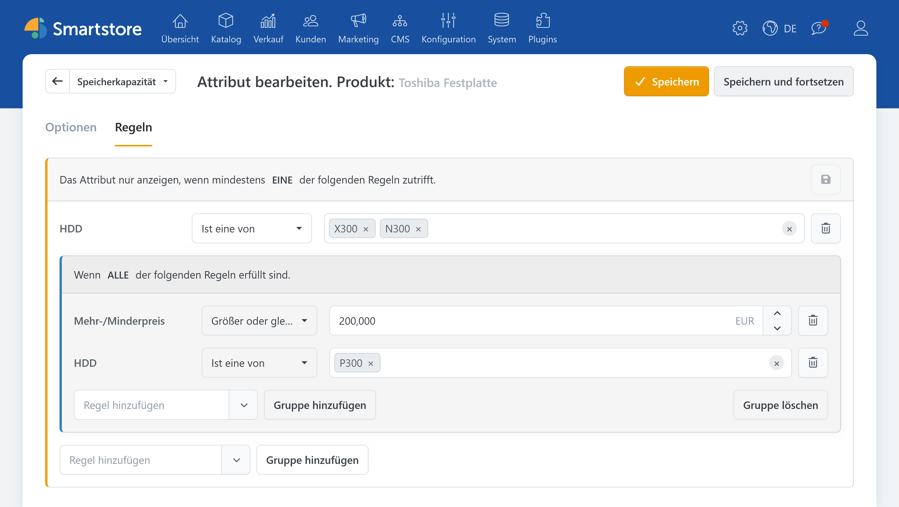
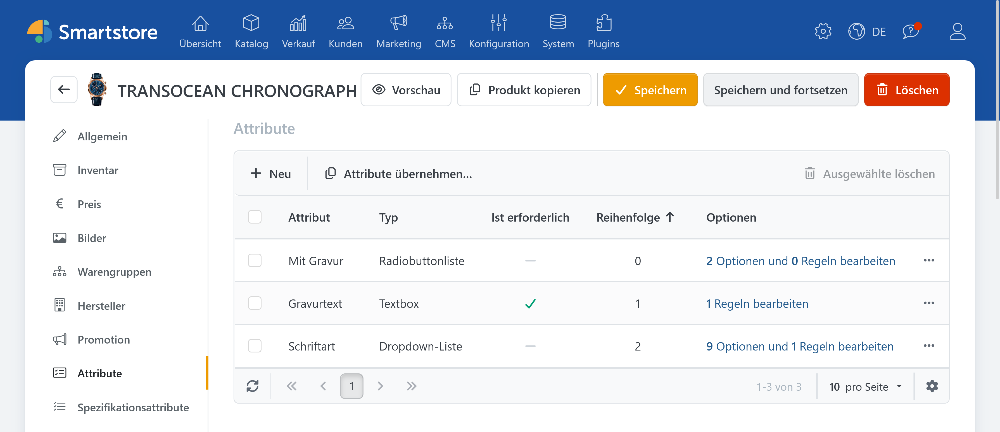
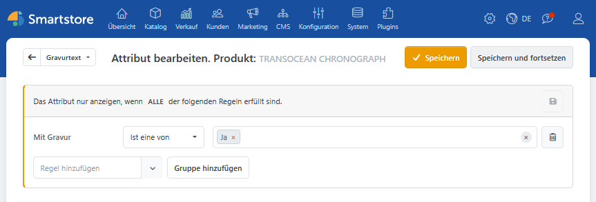
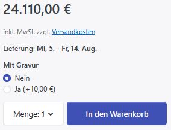
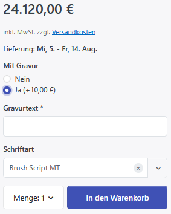
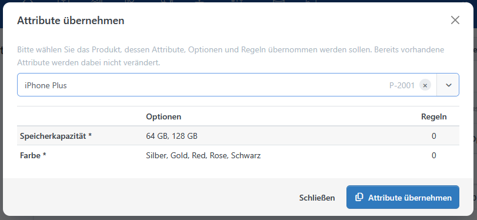

# AttributeRules (Regeln für Produktattribute)

Mit **AttributeRules** steuern Sie, welche Produktattribute abhängig von der aktuellen Produktauswahl angezeigt werden. So bauen Sie umfangreiche Produktkonfigurationen übersichtlich auf: Zusätzliche Eingaben erscheinen erst, wenn sie benötigt werden.

Typische Anwendungsfälle sind optionale Gravuren, Aufdrucke, Zubehörpakete oder weitere Auswahlmöglichkeiten für eine bestimmte Produktvariante.


Produktattributregeln werden direkt am jeweiligen Attribut eines Produkts eingerichtet. Sie gehören nicht zu den Regelsätzen unter **System** → **Regeln** und müssen keiner separaten Aktion zugeordnet werden. Allgemeine Informationen zum Aufbau einer Bedingung und zu Vergleichsoperatoren finden Sie unter [Regeln](../konfiguration/regeln.md).


## Praxisbeispiel: Optionale Gravur

Eine Uhr soll wahlweise mit einer Gravur bestellt werden können. Entscheidet sich der Kunde gegen die Gravur, bleiben die dafür vorgesehenen Eingabefelder verborgen. Bei Auswahl einer Gravur werden ein Pflichtfeld für den Gravurtext und eine Auswahl der Schriftart eingeblendet.

Für diese Konfiguration werden dem Produkt folgende Attribute zugewiesen:

| Attribut       | Steuerelement und Werte                       | Einstellung                                                                 |
| -------------- | --------------------------------------------- | --------------------------------------------------------------------------- |
| **Mit Gravur** | Radiobuttonliste mit **Nein** und **Ja**      | Für **Ja** kann beispielsweise ein Mehrpreis von 10 Euro hinterlegt werden. |
| **Gravurtext** | Textfeld                                      | Als Pflichtfeld kennzeichnen.                                               |
| **Schriftart** | Auswahlliste mit den angebotenen Schriftarten | Gewünschte Schriftarten als Werte anlegen.                                  |

### Regel für den Gravurtext einrichten

1. Öffnen Sie unter **Katalog** → **Produkte** die Bearbeitungsansicht der Uhr.
2. Wechseln Sie zur Registerkarte **Attribute**.
3. Öffnen Sie die Bearbeitungsansicht für die Optionen und Regeln des Attributs **Gravurtext**.
4. Wechseln Sie zur Registerkarte **Regeln**.
5. Fügen Sie die Bedingung **Mit Gravur** hinzu.
6. Wählen Sie den Vergleich **ist eine von** und den Wert **Ja**.
7. Speichern Sie die Änderungen.

Richten Sie dieselbe Bedingung anschließend für das Attribut **Schriftart** ein. Beide Attribute werden nun nur angezeigt, wenn der Kunde bei **Mit Gravur** den Wert **Ja** auswählt.

| Ohne Gravur                                                                          | Mit Gravur                                                                        |
| ------------------------------------------------------------------------------------ | --------------------------------------------------------------------------------- |
|  |  |

Der Mehrpreis wird nicht in der Regel festgelegt, sondern am Attributwert **Ja** hinterlegt. Die Regel bestimmt ausschließlich, ob die abhängigen Attribute angezeigt werden.

## Verhalten in der Produktansicht

Smartstore wertet die Produktattributregeln bei jeder Änderung der Produktauswahl erneut aus. Ein Attribut ohne Regel ist grundsätzlich sichtbar. Sobald Sie einem Attribut eine oder mehrere Regeln zuweisen, wird es nur noch angezeigt, wenn die festgelegten Bedingungen erfüllt sind.

Ausgeblendete Attribute werden nicht nur optisch verborgen:

* Bereits ausgewählte Werte eines inaktiven Attributs werden bei der weiteren Verarbeitung nicht berücksichtigt.
* Mehr- oder Minderpreise ausgeblendeter Attributwerte fließen nicht in die Preisberechnung ein.
* Ein ausgeblendetes Pflichtattribut verhindert nicht, dass das Produkt in den Warenkorb gelegt wird.

Auch mehrstufige Abhängigkeiten sind möglich. Beispielsweise kann die Auswahl **Bundle hinzufügen** zunächst das Attribut **Größe** einblenden. Eine bestimmte Größe kann anschließend weitere Optionen wie **Displayschutz** sichtbar machen. Wird eine übergeordnete Auswahl wieder deaktiviert, berücksichtigt Smartstore dies auch bei den davon abhängigen Attributen.

## Attributspezifische Bedingungen

Als Bedingung können Sie andere listenbasierte Attribute desselben Produkts verwenden. Dazu gehören insbesondere Auswahllisten, Optionsfelder und Kontrollkästchen. Freie Eingaben wie Textfelder, Datumsfelder oder Dateiuploads können abhängig angezeigt werden, stehen aber nicht selbst als auslösende Bedingung zur Verfügung.

Neben den Attributwerten bietet AttributeRules zwei weitere Bedingungsarten:

* **Mehr-/Minderpreis:** Prüft die Summe der Preisanpassungen der aktuell ausgewählten Attributwerte.
* **Gewicht:** Prüft das Produktgewicht einschließlich der Gewichtsanpassungen der aktuell ausgewählten Attributwerte.

Mehrere Bedingungen können so verknüpft werden, dass entweder alle Bedingungen oder mindestens eine Bedingung erfüllt sein muss. Mit zusätzlichen Gruppen lassen sich auch umfangreichere Kombinationen aufbauen. Die verfügbaren Vergleiche hängen von der jeweiligen Bedingung ab. Kontrollkästchen und andere Mehrfachauswahlen bieten beispielsweise zusätzliche Möglichkeiten, mehrere ausgewählte Werte miteinander zu vergleichen.

## Attribute übernehmen

Mit **Attribute übernehmen** können Sie die Produktattribute eines bereits konfigurierten Produkts als Ausgangspunkt für ein anderes Produkt verwenden. Dabei werden die Attribute einschließlich ihrer Optionen und Regeln kopiert.

1. Öffnen Sie unter **Katalog** → **Produkte** das Zielprodukt.
2. Wechseln Sie zur Registerkarte **Attribute**.
3. Klicken Sie auf **Attribute übernehmen…**.
4. Wählen Sie das Produkt aus, dessen Attribute übernommen werden sollen.
5. Prüfen Sie in der Vorschau die verfügbaren Attribute, Werte und Regeln.
6. Klicken Sie auf **Attribute übernehmen**.

Attribute, die beim Zielprodukt bereits vorhanden sind, werden weder überschrieben noch verändert. Überprüfen Sie deshalb nach dem Kopieren insbesondere Regeln, die von weiteren Attributen abhängig sind.

## Sie interessieren sich für dieses Plugin?

Gerne beraten wir Sie persönlich zu Funktionen, Einsatzmöglichkeiten und Lizenzoptionen. Gemeinsam klären wir, ob das Plugin zu Ihren Anforderungen passt, und begleiten Sie auf dem Weg zur passenden Kaufentscheidung.

<a href="https://smartstore.com/de/persoenliche-beratung/" class="button primary">Persönliche Beratung anfragen</a>
