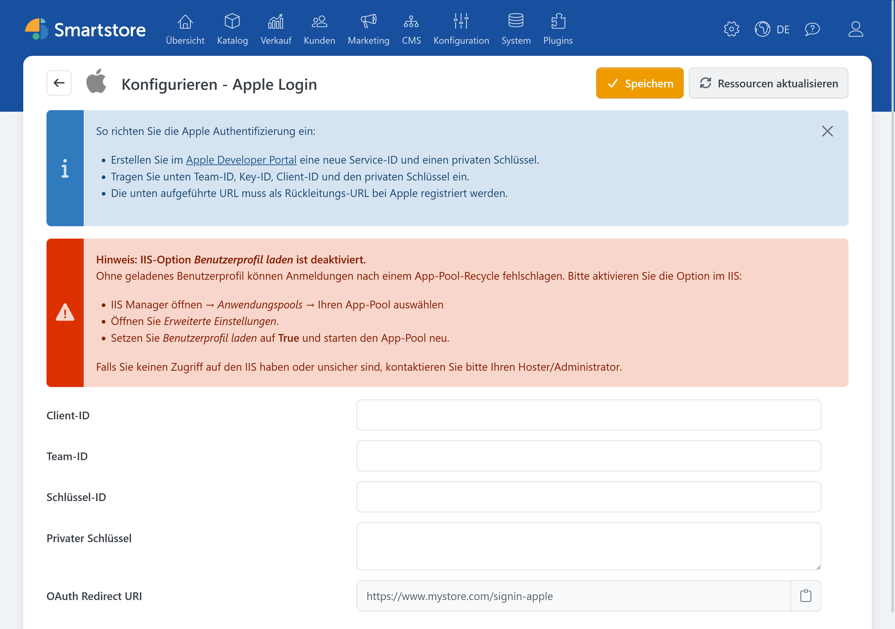

# Apple Auth

> Anmelden mit der Apple-ID

Mit dem Plugin **Apple Auth** können sich Kunden über ihre Apple-ID im Shop anmelden.

## Benötigte Angaben

Für die Konfiguration benötigen Sie:

- Client-ID beziehungsweise Apple Services-ID,
- Team-ID,
- Schlüssel-ID,
- privaten Schlüssel.

Informationen zum Anlegen und Konfigurieren der benötigten Kennungen und Schlüssel finden Sie in der offiziellen Apple-Dokumentation:

- [Configuring your environment for Sign in with Apple](https://developer.apple.com/documentation/signinwithapple/configuring-your-environment-for-sign-in-with-apple)
- [Configure Sign in with Apple for the web](https://developer.apple.com/help/account/capabilities/configure-sign-in-with-apple-for-the-web)

## Apple Auth in Smartstore konfigurieren

1. Öffnen Sie **Kunden > Externe Authentifizierungsmethoden**.
2. Klicken Sie bei **Apple Login** auf **Konfigurieren**.
3. Wählen Sie bei Bedarf den gewünschten Shop-Geltungsbereich.
4. Tragen Sie Client-ID, Team-ID und Schlüssel-ID ein.
5. Fügen Sie den privaten Schlüssel ein.
6. Kopieren Sie die angezeigte Weiterleitungs-URL und hinterlegen Sie sie bei Apple.
7. Klicken Sie auf **Speichern**.
8. Kehren Sie zur Anbieterübersicht zurück und aktivieren Sie **Apple Login**.

Die Weiterleitungs-URL hat folgenden Aufbau:

`https://shop.example.com/signin-apple`

## Format des privaten Schlüssels

Smartstore erwartet einen privaten Schlüssel im PKCS#8-Format. Sie können ihn in einer der folgenden Formen einfügen:

- vollständiges PEM-Format mit `BEGIN PRIVATE KEY` und `END PRIVATE KEY`,
- reiner Base64-Inhalt des Schlüssels.

Als Zeichenfolge gespeicherte `\n`-Zeilenumbrüche werden ebenfalls verarbeitet.

Smartstore erzeugt aus dem Schlüssel intern ein Apple-Client-Secret mit einer Gültigkeit von 30 Tagen. Kann der private Schlüssel nicht verarbeitet werden, wird ein Fehler protokolliert und die Apple-Anmeldeschaltfläche erscheint nicht.


Behandeln Sie den privaten Schlüssel wie ein Passwort. Veröffentlichen Sie ihn nicht und senden Sie ihn nicht per unverschlüsselter E-Mail.


## Hinweis für IIS

Unter Windows kann die Konfigurationsseite darauf hinweisen, dass für den IIS-Anwendungspool kein Benutzerprofil geladen wird.

Gehen Sie in diesem Fall wie folgt vor:

1. Öffnen Sie den IIS-Manager.
2. Wählen Sie den Anwendungspool des Shops aus.
3. Öffnen Sie **Erweiterte Einstellungen**.
4. Setzen Sie **Benutzerprofil laden** auf `True`.
5. Starten Sie den Anwendungspool neu.

Ohne geladenes Benutzerprofil können Apple-Anmeldungen nach einem Neustart oder Recycling des Anwendungspools fehlschlagen.

## Funktion testen

Öffnen Sie die Anmeldeseite des Shops in einem privaten Browserfenster und klicken Sie auf **Mit Apple anmelden**. Kontrollieren Sie, ob Sie nach der Anmeldung zum Shop zurückgeleitet und angemeldet werden.

Bei Problemen beachten Sie die [allgemeine Fehlerbehebung](../external-auth.md#fehlerbehebung).
