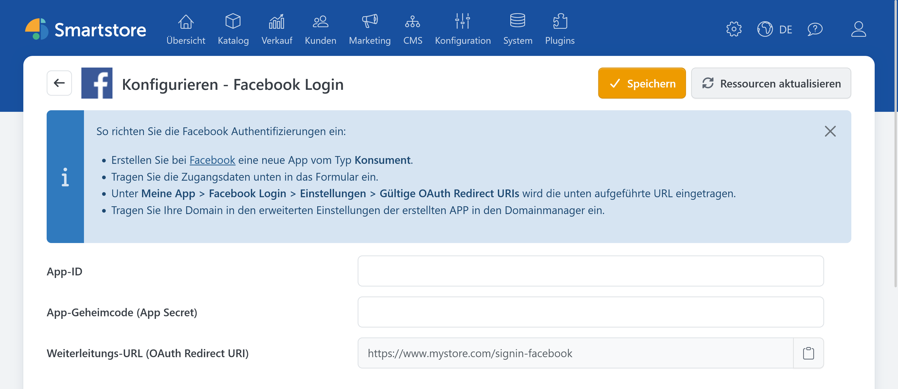

# Facebook Auth

> Anmelden mit dem Facebook-Konto

Mit dem Plugin **Facebook Auth** können sich Kunden über ihr Facebook-Konto im Shop anmelden.

## Benötigte Angaben

Für die Konfiguration benötigen Sie:

- App-ID,
- App-Geheimcode beziehungsweise App Secret.

Die Anwendung für die Anmeldung richten Sie über [Meta for Developers](https://developers.facebook.com/apps/) ein. Beachten Sie dabei die jeweils aktuelle Dokumentation zu Facebook Login und zu gültigen OAuth-Weiterleitungs-URIs.

## Facebook Auth in Smartstore konfigurieren

1. Öffnen Sie **Kunden > Externe Authentifizierungsmethoden**.
2. Klicken Sie bei **Facebook Login** auf **Konfigurieren**.
3. Wählen Sie bei Bedarf den gewünschten Shop-Geltungsbereich.
4. Tragen Sie App-ID und App-Geheimcode ein.
5. Kopieren Sie die angezeigte Weiterleitungs-URL und hinterlegen Sie sie bei Meta.
6. Klicken Sie auf **Speichern**.
7. Kehren Sie zur Anbieterübersicht zurück und aktivieren Sie **Facebook Login**.

Die Weiterleitungs-URL hat folgenden Aufbau:

`https://shop.example.com/signin-facebook`

## Funktion testen

Öffnen Sie die Anmeldeseite des Shops in einem privaten Browserfenster und klicken Sie auf **Mit Facebook anmelden**. Kontrollieren Sie, ob Sie nach der Anmeldung zum Shop zurückgeleitet und angemeldet werden.

Bei Problemen beachten Sie die [allgemeine Fehlerbehebung](../external-auth.md#fehlerbehebung).