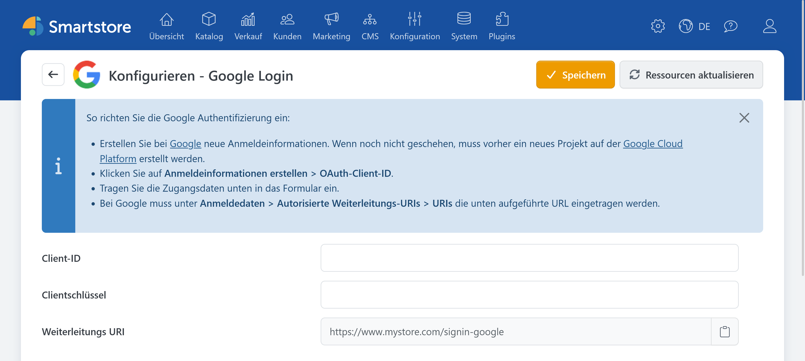

# Google Auth

> Anmelden mit dem Google-Konto

Mit dem Plugin **Google Auth** können sich Kunden über ihr Google-Konto im Shop anmelden.

## Benötigte Angaben

Für die Konfiguration benötigen Sie:

- Client-ID,
- Clientschlüssel beziehungsweise Client Secret.

Informationen zum Anlegen und Konfigurieren eines OAuth-Clients für eine Webanwendung finden Sie in der offiziellen Dokumentation [Using OAuth 2.0 for Web Server Applications](https://developers.google.com/identity/protocols/oauth2/web-server).

## Google Auth in Smartstore konfigurieren

1. Öffnen Sie **Kunden > Externe Authentifizierungsmethoden**.
2. Klicken Sie bei **Google Login** auf **Konfigurieren**.
3. Wählen Sie bei Bedarf den gewünschten Shop-Geltungsbereich.
4. Tragen Sie Client-ID und Clientschlüssel ein.
5. Kopieren Sie die angezeigte Weiterleitungs-URL und hinterlegen Sie sie bei Google.
6. Klicken Sie auf **Speichern**.
7. Kehren Sie zur Anbieterübersicht zurück und aktivieren Sie **Google Login**.

Die Weiterleitungs-URL hat folgenden Aufbau:

`https://shop.example.com/signin-google`


Die bei Google eingetragene Weiterleitungs-URI muss vollständig mit der in Smartstore angezeigten URL übereinstimmen.


## Funktion testen

Öffnen Sie die Anmeldeseite des Shops in einem privaten Browserfenster und klicken Sie auf **Mit Google anmelden**. Kontrollieren Sie, ob Sie nach der Anmeldung zum Shop zurückgeleitet und angemeldet werden.

Bei Problemen beachten Sie die [allgemeine Fehlerbehebung](../external-auth.md#fehlerbehebung).
