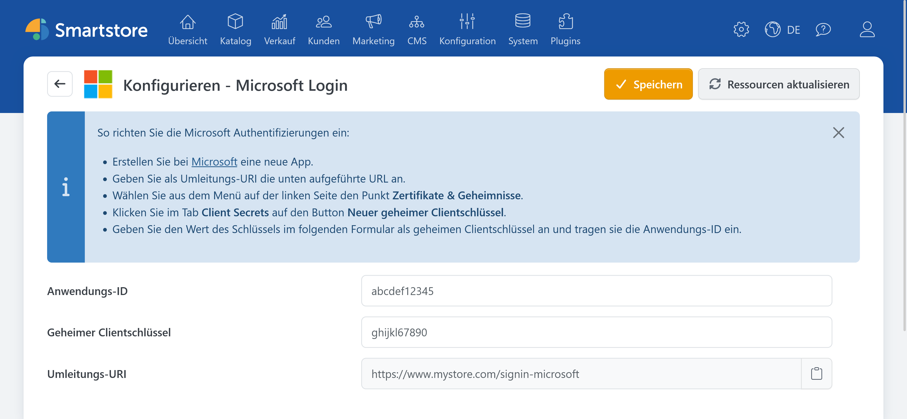

# Microsoft Auth

> Anmelden mit dem Microsoft-Konto

Mit dem Plugin **Microsoft Auth** können sich Kunden über ein Microsoft-Konto im Shop anmelden.

## Benötigte Angaben

Für die Konfiguration benötigen Sie:

- Anwendungs-ID beziehungsweise Client-ID,
- geheimen Clientschlüssel.

Informationen zur App-Registrierung, zu den unterstützten Kontotypen, zu Weiterleitungs-URIs und zu Anmeldeinformationen finden Sie in der offiziellen Microsoft-Dokumentation [Register an application in Microsoft Entra ID](https://learn.microsoft.com/en-us/entra/identity-platform/quickstart-register-app).

## Microsoft Auth in Smartstore konfigurieren

1. Öffnen Sie **Kunden > Externe Authentifizierungsmethoden**.
2. Klicken Sie bei **Microsoft Login** auf **Konfigurieren**.
3. Wählen Sie bei Bedarf den gewünschten Shop-Geltungsbereich.
4. Tragen Sie die Anwendungs-ID ein.
5. Tragen Sie den Wert des geheimen Clientschlüssels ein.
6. Kopieren Sie die angezeigte Weiterleitungs-URL und hinterlegen Sie sie bei Microsoft.
7. Klicken Sie auf **Speichern**.
8. Kehren Sie zur Anbieterübersicht zurück und aktivieren Sie **Microsoft Login**.

Die Weiterleitungs-URL hat folgenden Aufbau:

`https://shop.example.com/signin-microsoft`


Übertragen Sie den Wert des geheimen Clientschlüssels nach Smartstore, nicht dessen interne Geheimnis-ID. Beachten Sie außerdem die beim Anbieter angezeigte Gültigkeitsdauer.


## Funktion testen

Öffnen Sie die Anmeldeseite des Shops in einem privaten Browserfenster und klicken Sie auf **Mit Microsoft anmelden**. Verwenden Sie für den Test einen Kontotyp, der durch die App-Registrierung zugelassen ist.

Bei Problemen beachten Sie die [allgemeine Fehlerbehebung](../external-auth.md#fehlerbehebung).
