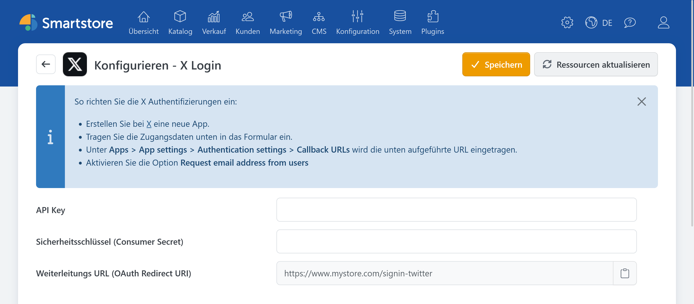

# X Auth

> Anmelden mit dem X-Konto

Mit dem Plugin **X Auth** können sich Kunden über ihr X-Konto im Shop anmelden. Die Weiterleitungs-URL enthält aus Kompatibilitätsgründen weiterhin die Bezeichnung `twitter`.

## Benötigte Angaben

Für die Konfiguration benötigen Sie:

- API Key beziehungsweise Consumer Key,
- Consumer Secret beziehungsweise API Key Secret.

Informationen zum Einrichten der Anwendung, zur benutzerbezogenen Authentifizierung und zu Callback-URLs finden Sie in der offiziellen X-Dokumentation:

- [Implementing Sign in with X](https://docs.x.com/x-for-websites/log-in-with-x/guides/implementing-sign-in-with-x)
- [OAuth 1.0a](https://docs.x.com/fundamentals/authentication/oauth-1-0a/overview)

Die Anwendung muss Smartstore die für die Registrierung benötigte E-Mail-Adresse bereitstellen können. Prüfen Sie die dafür aktuell erforderlichen Einstellungen und Berechtigungen in der Dokumentation von X.

## X Auth in Smartstore konfigurieren

1. Öffnen Sie **Kunden > Externe Authentifizierungsmethoden**.
2. Klicken Sie bei **X Login** auf **Konfigurieren**.
3. Wählen Sie bei Bedarf den gewünschten Shop-Geltungsbereich.
4. Tragen Sie API Key und Consumer Secret ein.
5. Kopieren Sie die angezeigte Weiterleitungs-URL und hinterlegen Sie sie bei X.
6. Klicken Sie auf **Speichern**.
7. Kehren Sie zur Anbieterübersicht zurück und aktivieren Sie **X Login**.

Die Weiterleitungs-URL hat folgenden Aufbau:

`https://shop.example.com/signin-twitter`

## Funktion testen

Öffnen Sie die Anmeldeseite des Shops in einem privaten Browserfenster und klicken Sie auf **Mit X anmelden**. Kontrollieren Sie, ob Sie nach der Anmeldung zum Shop zurückgeleitet und angemeldet werden.

Wird kein Kundenkonto angelegt, prüfen Sie insbesondere, ob X eine verwendbare E-Mail-Adresse übermittelt.

Bei Problemen beachten Sie die [allgemeine Fehlerbehebung](../external-auth.md#fehlerbehebung).
