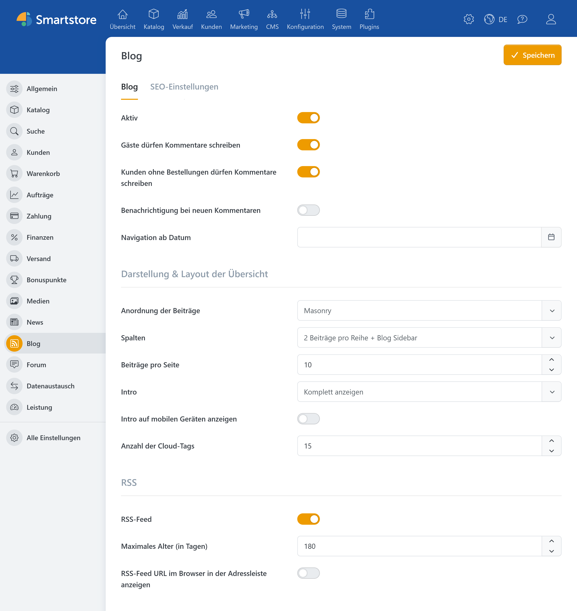
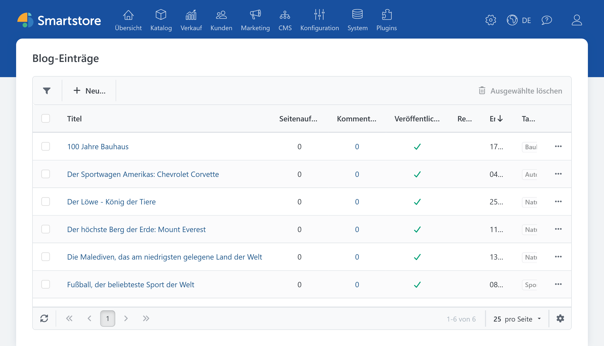
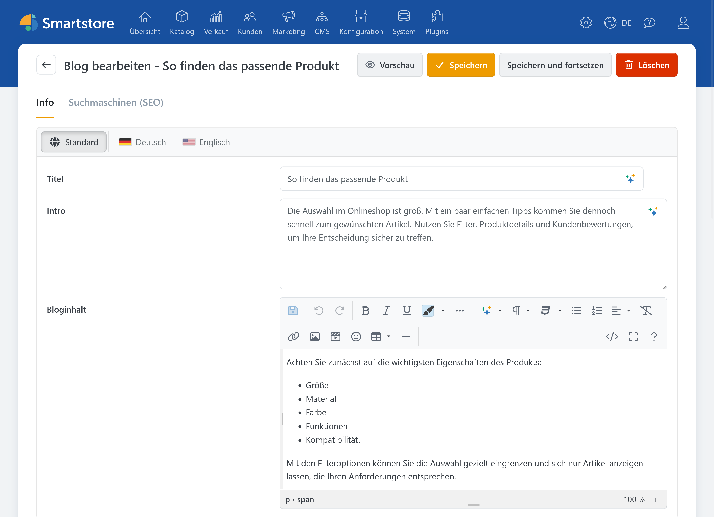
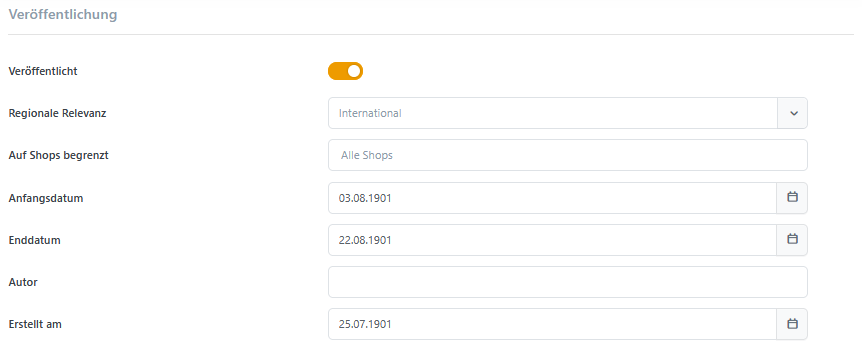
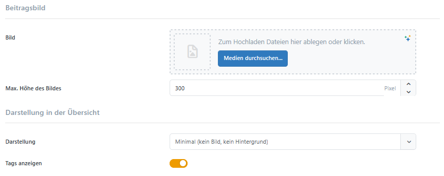
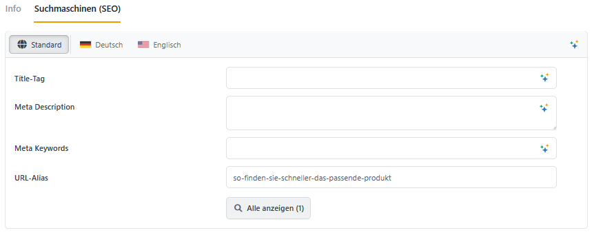
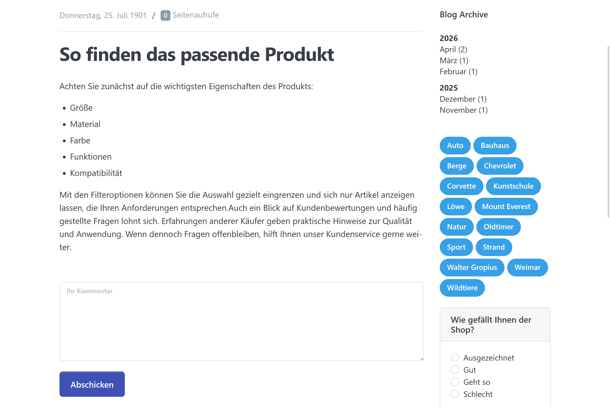
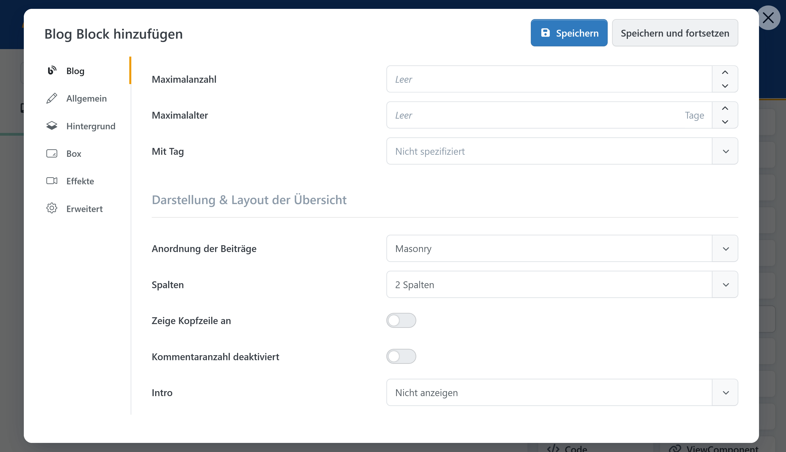

# Blog

> Bloggen, veröffentlichen, diskutieren.

Mit dem **Smartstore Blog** veröffentlichen Sie Neuigkeiten, Ratgeber, Produktinformationen und andere redaktionelle Inhalte direkt in Ihrem Shop. Beiträge können zeitgesteuert veröffentlicht, bestimmten Shops oder Sprachen zugeordnet und für Suchmaschinen optimiert werden.

Besucher können den Blog nach Monaten oder Schlagwörtern durchsuchen und Kommentare hinterlassen, sofern dies erlaubt wurde. Ausgewählte Beiträge lassen sich außerdem mit dem Page Builder auf der Startseite oder anderen Shopseiten präsentieren.


Welche Blogbereiche und Aktionen im Administrationsbereich verfügbar sind, wird über die Zugriffsrechte des angemeldeten Administrators gesteuert. Weitere Informationen finden Sie unter [Zugriffsrechte kontrollieren](../konfiguration/zugriffsrechte-kontrollieren.md).


## Blog konfigurieren

Öffnen Sie im Administrationsbereich **Konfiguration > Einstellungen > Blog**.

In einer Multi-Shop-Installation wählen Sie im oberen Bereich zunächst den Shop aus, für den die Einstellungen gelten sollen. Einstellungen können je Shop überschrieben werden. Weitere Informationen finden Sie unter [Multi-Shop-Konfiguration](../konfiguration/einstellungen/den-einstellungsbereich-festlegen.md).

### Allgemeine Einstellungen

| Einstellung | Beschreibung |
| --- | --- |
| **Aktiv** | Schaltet den Blog im öffentlichen Shop ein oder aus. Ist der Blog aktiviert, wird im Hauptmenü des Shops ein Link zum Blog ergänzt. |
| **Gäste dürfen Kommentare schreiben** | Erlaubt auch Besuchern ohne Kundenkonto, Blogbeiträge zu kommentieren. |
| **Kunden ohne Bestellungen dürfen Kommentare schreiben** | Legt fest, ob angemeldete Kunden ohne vorherige Bestellung kommentieren dürfen. Ist die Option deaktiviert, können nur Kunden kommentieren, die im aktuellen Shop bereits eine Bestellung aufgegeben haben. |
| **Benachrichtigung bei neuen Kommentaren** | Informiert den Shopbetreiber, wenn ein neuer Kommentar eingegangen ist. |
| **Navigation ab Datum** | Bestimmt, ab welchem Datum Beiträge in der Monatsnavigation berücksichtigt werden. Ältere Beiträge werden dadurch weder gelöscht noch unveröffentlicht. |

### Darstellung der Blogübersicht

Mit den Darstellungseinstellungen legen Sie fest, wie Beiträge auf der öffentlichen Blogübersicht angeordnet werden.

| Einstellung | Beschreibung |
| --- | --- |
| **Anordnung der Beiträge** | Legt fest, ob die Beiträge als regelmäßiges Raster oder als Masonry-Layout mit unterschiedlich hohen Beitragskacheln dargestellt werden. |
| **Spalten** | Legt fest, ob zwei Beiträge pro Reihe mit Blog-Sidebar oder drei Beiträge pro Reihe ohne Blog-Sidebar angezeigt werden. Die Sidebar enthält die Monats- und Tag-Navigation. |
| **Beiträge pro Seite** | Bestimmt, wie viele Beiträge auf einer Seite angezeigt werden. Der Wert muss größer als `0` sein. |
| **Bildproportionen** | Bestimmt das Seitenverhältnis der Vorschaubilder, zum Beispiel `1:1`, `4:3`, `16:9`, `16:10` oder `21:9`. Nur für Grid-Anordnung auswählbar. |
| **Kachel-Ansicht** | Stellt Beiträge im Raster als abgegrenzte Kacheln dar. Nur für Grid-Anordnung auswählbar. In der Masonry-Darstellung werden Beiträge grundsätzlich als Kacheln ausgegeben.|
| **Intro** | Legt fest, ob der Einführungstext ausgeblendet, auf zwei oder drei Zeilen begrenzt oder vollständig angezeigt wird. |
| **Intro auf mobilen Geräten anzeigen** | Zeigt den Einführungstext auch auf kleinen Bildschirmen an. |
| **Anzahl der Cloud-Tags** | Bestimmt, wie viele der am häufigsten verwendeten Tags in der Tag-Navigation erscheinen. Mit dem Wert `0` wird keine Tag-Navigation ausgegeben. |
| **Autor anzeigen** | Zeigt die öffentlichen Autoreninformationen am Beitrag an, sofern für den Beitrag ein öffentlicher Autor ausgewählt wurde und die Autorenfunktion im System verfügbar ist. |

### RSS-Feed bereitstellen

Ein RSS-Feed ermöglicht es Besuchern und Feedreadern, neue Blogbeiträge automatisch abzurufen.

| Einstellung | Beschreibung |
| --- | --- |
| **RSS-Feed** | Aktiviert den RSS-Feed des Blogs. |
| **Maximales Alter (in Tagen)** | Legt fest, wie alt Beiträge im RSS-Feed höchstens sein dürfen. Der Wert wird in Tagen angegeben und muss größer als `0` sein. |
| **RSS-Feed URL im Browser in der Adressleiste anzeigen** | Fügt dem HTML-Seitenkopf einen Hinweis auf den Feed hinzu. Browser und Feedreader können ihn dadurch automatisch erkennen. |

### SEO-Daten der Blogübersicht

Im Register **SEO** hinterlegen Sie die allgemeinen Suchmaschineninformationen der Blogübersicht.

| Einstellung | Beschreibung |
| --- | --- |
| **Meta-Titel** | Legt den Titel fest, der von Suchmaschinen für die Blogübersicht verwendet werden kann. |
| **Meta-Beschreibung** | Fasst den Inhalt des Blogs für Suchmaschinen und potenzielle Besucher zusammen. |
| **Meta-Keywords** | Enthält optionale thematische Schlüsselbegriffe. |

In einem mehrsprachigen Shop können Sie diese Angaben für jede Sprache separat pflegen. Grundlegende Hinweise finden Sie unter [SEO](../allgemeine-konzepte/seo.md).

Speichern Sie anschließend die Konfiguration.

## Einen Blogbeitrag erstellen

Öffnen Sie **CMS > Blogs > Blog-Einträge** und klicken Sie auf **Neu**.

### Titel, Intro und Inhalt eingeben

| Feld | Beschreibung |
| --- | --- |
| **Titel** | Der Titel des Beitrags. Das Feld ist erforderlich und darf höchstens 450 Zeichen enthalten. |
| **Intro** | Eine kurze Einführung, die in der Blogübersicht als Vorschautext verwendet werden kann. |
| **Bloginhalt** | Der vollständige Beitrag. Das Feld ist erforderlich und unterstützt formatierte Inhalte wie Überschriften, Listen, Links, Tabellen und Bilder. |

Wenn Smartstore AI eingerichtet wurde, können an diesen Feldern zusätzliche Funktionen zum Erzeugen, Übersetzen und Überarbeiten von Inhalten zur Verfügung stehen. Einzelheiten finden Sie unter [AI](ai.md).

### Mehrsprachige Inhalte pflegen

In einem mehrsprachigen Shop können Titel, Intro, Bloginhalt und SEO-Angaben für jede Sprache separat hinterlegt werden.

Verwenden Sie dazu die Sprachauswahl am jeweiligen Eingabebereich. Der Inhalt im Bereich **Standard** dient als Rückfallwert, wenn für eine Sprache kein eigener Text vorhanden ist.

Weitere Informationen finden Sie unter [Mit mehreren Sprachen arbeiten](../allgemeine-konzepte/mit-mehreren-sprachen-arbeiten.md).

### Tags und Kommentare festlegen

| Einstellung | Beschreibung |
| --- | --- |
| **Tags** | Ordnet dem Beitrag vorhandene oder neu eingegebene Schlagwörter zu. Tags gruppieren thematisch verwandte Beiträge und können in der öffentlichen Tag-Navigation verwendet werden. |
| **Kommentare erlauben** | Aktiviert das Kommentarformular für diesen Beitrag. Die globalen Blogeinstellungen bestimmen zusätzlich, welche Besucher kommentieren dürfen. |

Verwenden Sie möglichst einheitliche Tags. Die Begriffe „Versand“, „Versandkosten“ und „Lieferung“ würden beispielsweise drei getrennte Themengruppen erzeugen.

### Veröffentlichung steuern

| Einstellung | Beschreibung |
| --- | --- |
| **Veröffentlicht** | Legt fest, ob der Beitrag grundsätzlich öffentlich angezeigt werden kann. |
| **Regionale Relevanz** | Beschränkt den Beitrag auf eine bestimmte Sprache. Ohne Auswahl gilt der Beitrag international. Das Feld wird nur angezeigt, wenn mehrere Sprachen vorhanden sind. |
| **Auf Shops begrenzt** | Legt fest, in welchen Shops der Beitrag sichtbar ist. Ohne Einschränkung gilt er für alle Shops. |
| **Anfangsdatum** | Bestimmt den Zeitpunkt, ab dem der Beitrag öffentlich angezeigt wird. |
| **Enddatum** | Bestimmt den Zeitpunkt, nach dem der Beitrag nicht mehr öffentlich angezeigt wird. |
| **Erstellt am** | Bestimmt das am Beitrag ausgegebene Datum. Es beeinflusst außerdem die Sortierung und die Zuordnung zur Monatsnavigation. |


**Erstellt am** ist nicht das Veröffentlichungsdatum. Für eine zeitgesteuerte Veröffentlichung verwenden Sie **Anfangsdatum** und **Enddatum** zusammen mit der Option **Veröffentlicht**.


Administratoren mit den entsprechenden Berechtigungen können unveröffentlichte oder zeitlich noch nicht freigegebene Beiträge zur Kontrolle aufrufen.

### Autor festlegen

Beim Erstellen eines Beitrags wird der Name des angemeldeten Administrators als Autor vorbelegt. Diese interne Angabe ist im öffentlichen Beitrag nicht automatisch als öffentliches Autorenprofil sichtbar.

Je nach Systemkonfiguration kann zusätzlich ein Kunde als öffentlicher Autor ausgewählt werden. In diesem Fall können Informationen wie Avatar, Berufsbezeichnung und Autorenbeschreibung am Beitrag erscheinen. Die Autorenanzeige muss zusätzlich in den Blogeinstellungen aktiviert sein.

### Beitragsbild auswählen und die Vorschau gestalten

Im Bereich **Beitragsbild** wählen Sie das Bild für die Detailseite des Beitrags aus.

| Einstellung | Beschreibung |
| --- | --- |
| **Bild** | Legt das Bild fest, das auf der Detailseite des Beitrags verwendet wird. Abhängig von der gewählten Vorschauart kann es auch in der Blogübersicht erscheinen. |
| **Max. Höhe des Bildes** | Begrenzt die Darstellungshöhe des Bildes auf größeren Bildschirmen. Bleibt das Feld leer, wird die Höhe automatisch bestimmt. |

Bilder werden über den Medien-Manager ausgewählt. Hinweise zum Hochladen, Organisieren und Wiederverwenden von Bildern finden Sie unter [Medien-Manager](mediamanager.md).

Achten Sie auf eine ausreichende Bildqualität und aussagekräftige ALT-Texte. Gleichzeitig sollten die Dateien nicht unnötig groß sein, da dies die Ladezeit der Blogseiten beeinflusst.

Unter **Darstellung in der Übersicht** wählen Sie, wie der Beitrag in Listen und Blog-Blöcken dargestellt wird.

| Einstellung | Beschreibung |
| --- | --- |
| **Darstellung** | Legt die grundlegende Vorschauart des Beitrags fest. Die verfügbaren Varianten werden in der folgenden Tabelle beschrieben. |
| **Bild** | Legt ein separates Bild für Vorschauarten fest, die nicht das Beitragsbild verwenden. |
| **Bildproportionen** | Legt für Bilder über dem Text eigene Proportionen fest. Ohne Auswahl verwendet Smartstore die ursprünglichen Proportionen beziehungsweise die globalen Blogeinstellungen. |
| **Tags anzeigen** | Legt fest, ob die zugeordneten Tags bereits in der Beitragsvorschau erscheinen. |

| Vorschauart | Darstellung |
| --- | --- |
| **Minimal** | Zeigt den Beitrag ohne Bild und ohne Hintergrund an. |
| **Bild über Text** | Zeigt das Beitragsbild oberhalb des Textes an. |
| **Vorschaubild über Text** | Zeigt ein separates Vorschaubild oberhalb des Textes an. |
| **Bild hinter Text** | Verwendet das Beitragsbild als Hintergrund. |
| **Vorschaubild hinter Text** | Verwendet ein separates Vorschaubild als Hintergrund. |
| **Hintergrundfarbe** | Verwendet eine ausgewählte Theme-Farbe als Hintergrund. |

Bei einer Darstellung mit Beitragsbild muss ein Beitragsbild vorhanden sein. Varianten mit einem separaten Vorschaubild benötigen ein zusätzlich ausgewähltes Vorschaubild.

### SEO-Daten des Beitrags pflegen

Wechseln Sie in das Register **SEO**.

| Einstellung | Beschreibung |
| --- | --- |
| **Meta-Titel** | Bestimmt den Titel für Suchmaschinen. Ohne eigenen Meta-Titel verwendet die Detailseite den Beitragstitel. |
| **Meta-Beschreibung** | Fasst den Inhalt des Beitrags für Suchmaschinen und potenzielle Besucher zusammen. |
| **Meta-Keywords** | Enthält optionale thematische Schlüsselbegriffe. |
| **Suchmaschinenfreundlicher Seitenname** | Bestimmt den URL-Bestandteil des Beitrags. Bleibt das Feld leer, erzeugt Smartstore ihn aus dem Titel. |

Verwenden Sie kurze und dauerhaft verständliche URLs. Ändern Sie die Adresse eines bereits veröffentlichten und verlinkten Beitrags nur, wenn dies wirklich erforderlich ist. Weitere Empfehlungen finden Sie unter [SEO](../allgemeine-konzepte/seo.md).

### Speichern und Vorschau prüfen

Klicken Sie auf **Speichern**, um zur Beitragsübersicht zurückzukehren. Mit **Speichern und weiter bearbeiten** bleiben Sie auf der Bearbeitungsseite.

Die Schaltfläche **Vorschau** steht nach dem erstmaligen Speichern zur Verfügung.

Prüfen Sie vor der Veröffentlichung:

* Ist **Veröffentlicht** aktiviert?
* Stimmen Anfangsdatum und Enddatum?
* Ist der richtige Shop ausgewählt?
* Sind alle benötigten Sprachversionen gepflegt?
* Ist das für die Darstellungsart benötigte Bild vorhanden?
* Wird das Vorschaubild sinnvoll zugeschnitten?
* Sind URL, Meta-Titel und Meta-Beschreibung ausgefüllt?
* Funktionieren die enthaltenen Links?
* Ist die mobile Darstellung gut lesbar?

## Blogbeiträge im Shop einbinden

### Regulärer Blogbereich

Bei aktiviertem Blog stellt Smartstore automatisch eine Blogübersicht und eigene Detailseiten für die Beiträge bereit. Der Blog kann über einen Eintrag im Hauptmenü aufgerufen werden.

Die Blogübersicht unterstützt:

* Seitennavigation
* Filterung nach Monaten
* Filterung nach Tags
* verschiedene Listenlayouts
* Verlinkung der Detailseiten
* Anzeige der Kommentaranzahl
* RSS, sofern aktiviert

### Blogbeiträge mit dem Page Builder anzeigen

Mit dem Page-Builder-Block **Blog** können Sie eine Auswahl aktueller Beiträge in einer Story darstellen.

Öffnen Sie dazu eine Story im Page Builder, ziehen Sie den Block **Blog** in das Raster und öffnen Sie seine Einstellungen.

| Einstellung | Beschreibung |
| --- | --- |
| **Maximalanzahl** | Begrenzt die Anzahl der angezeigten Beiträge. |
| **Maximalalter** | Berücksichtigt nur Beiträge, die nicht älter als die angegebene Anzahl von Tagen sind. |
| **Mit Tag** | Beschränkt die Auswahl auf Beiträge mit einem bestimmten Tag. |
| **Anordnung der Beiträge** | Legt fest, ob die Beiträge als Raster oder Masonry-Layout dargestellt werden. |
| **Spalten** | Legt fest, ob zwei oder drei Beiträge pro Reihe angezeigt werden. |
| **Zeige Kopfzeile an** | Blendet die Überschrift des Blog-Blocks ein oder aus. Wird sie angezeigt, enthält sie eine Schaltfläche zum vollständigen Blog. |
| **Kommentaranzahl deaktivieren** | Legt fest, ob die Anzahl der Kommentare in den Beitragsvorschauen angezeigt wird. |
| **Kachel-Ansicht** | Zeigt die Beiträge als abgegrenzte Kacheln an. |
| **Intro** | Bestimmt, in welchem Umfang der Einführungstext angezeigt wird. |
| **Autor anzeigen** | Zeigt den öffentlichen Autor an, sofern die Autorenfunktion verfügbar ist und dem Beitrag ein öffentlicher Autor zugeordnet wurde. |

Eine allgemeine Einführung finden Sie unter [Page Builder](pagebuilder.md). Die Bedienung und Besonderheiten der verschiedenen Blocktypen beschreibt der Beitrag [Blöcke verwenden](pagebuilder/blocks.md).

### Blogbeiträge auf bestimmten Seiten positionieren

Die mit dem Page Builder erstellte Story kann einer oder mehreren Zielseiten und Widget-Zonen zugewiesen werden. So lassen sich Blogbeiträge beispielsweise auf der Startseite, auf Landingpages, auf Warengruppenseiten oder in anderen durch Widget-Zonen unterstützten Bereichen präsentieren.

Damit die Story sichtbar wird, müssen eine Zielseite und eine Widget-Zone ausgewählt und die Story veröffentlicht sein. Weitere Informationen finden Sie unter [Widget-Zonen](../content-management/widget-zonen.md).

### Einzelne Blogbeiträge verlinken

Einzelne Beiträge können im zentralen Smartstore-Linkdialog als Linkziel ausgewählt werden. Dies ist beispielsweise bei Schaltflächen, Menüpunkten, verlinkten Bildern, Page-Builder-Inhalten und Textlinks im Inhaltseditor möglich.

Wählen Sie im Linkdialog den Zieltyp **Blogbeitrag** und anschließend den gewünschten Beitrag aus. Smartstore kann erkennen, wenn ein verknüpfter Beitrag später unveröffentlicht oder gelöscht wurde.

## Beiträge verwalten

Die Blogbeitragsübersicht kann nach folgenden Kriterien gefiltert werden:

* Titel
* Intro
* Bloginhalt
* Tags
* Erstellungszeitraum
* Shop
* Sprache
* Veröffentlichungsstatus

Einige Werte, beispielsweise der Veröffentlichungsstatus, lassen sich direkt in der Tabelle ändern. Über die Zeilenaktionen können Sie Beiträge öffnen oder löschen. Mehrere ausgewählte Beiträge lassen sich gemeinsam löschen.

Die Übersicht zeigt außerdem die Anzahl der Seitenaufrufe und Kommentare eines Beitrags. Aufrufe durch Administratoren werden nicht mitgezählt.

## Kommentare verwalten

Öffnen Sie **CMS > Blogs > Kommentare**. Alternativ klicken Sie in der Beitragsübersicht auf die Kommentaranzahl eines Beitrags.

Die Kommentarliste enthält:

* zugehöriger Blogbeitrag
* Kunde
* Kommentartext
* IP-Adresse
* Erstellungsdatum

Neue Kommentare werden unmittelbar gespeichert. Eine gesonderte Freigabe oder Bearbeitung ist in der aktuellen Oberfläche nicht vorgesehen.

Einzelne oder mehrere Kommentare können im Administrationsbereich gelöscht werden.

## Fehlerbehebung

### Der Blog wird im Shop nicht angezeigt

Prüfen Sie:

* Ist das Blog-Plugin aktiviert?
* Ist **Blog aktiviert** eingeschaltet?
* Wird die Einstellung möglicherweise für einen anderen Shop bearbeitet?
* Besitzt der verwendete Shop ein angepasstes Menü oder Theme?

### Ein Beitrag wird nicht angezeigt

Prüfen Sie:

* Ist **Veröffentlicht** aktiviert?
* Liegt das aktuelle Datum innerhalb des Anfangsdatums und Enddatums?
* Ist der Beitrag dem richtigen Shop zugeordnet?
* Passt die regionale Relevanz zur aktuellen Sprache?
* Wurde der Beitrag gespeichert?

### Der Blog-Block des Page Builders bleibt leer

Prüfen Sie:

* Gibt es veröffentlichte Beiträge?
* Schließt das eingestellte Maximalalter alle Beiträge aus?
* Ist ein Tag ausgewählt, dem kein veröffentlichter Beitrag zugeordnet ist?
* Sind Story, Zielseite und Widget-Zone veröffentlicht und korrekt zugeordnet?

### Besucher können keine Kommentare schreiben

Prüfen Sie:

* Sind Kommentare am betreffenden Beitrag erlaubt?
* Dürfen Gastkunden kommentieren?
* Dürfen Kunden ohne Bestellung kommentieren?
* Ist der Besucher angemeldet, falls dies erforderlich ist?

## Weiterführende Dokumentation

* [AI](ai.md)
* [Medien-Manager](mediamanager.md)
* [Page Builder](pagebuilder.md)
* [Blöcke verwenden](pagebuilder/blocks.md)
* [Widget-Zonen](../content-management/widget-zonen.md)
* [SEO](../allgemeine-konzepte/seo.md)
* [Mit mehreren Sprachen arbeiten](../allgemeine-konzepte/mit-mehreren-sprachen-arbeiten.md)
* [Mit mehreren Shops arbeiten](../allgemeine-konzepte/mit-mehreren-shops-arbeiten.md)
* [Zugriffsrechte kontrollieren](../konfiguration/zugriffsrechte-kontrollieren.md)
