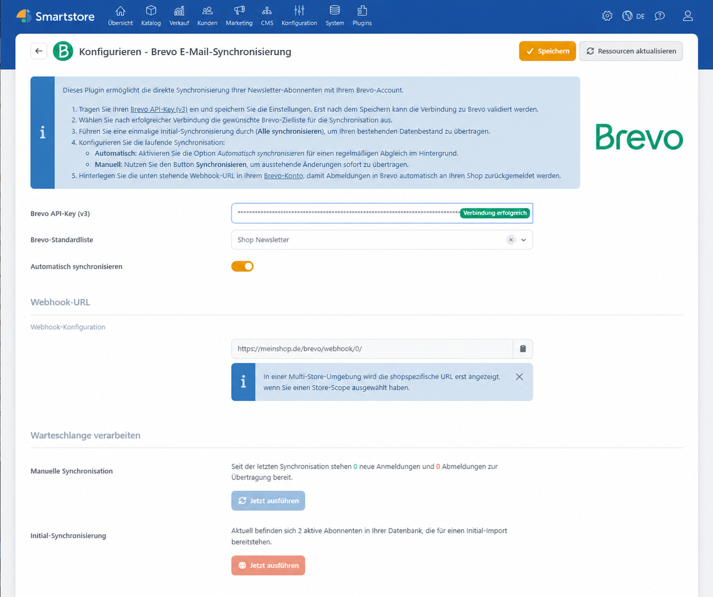
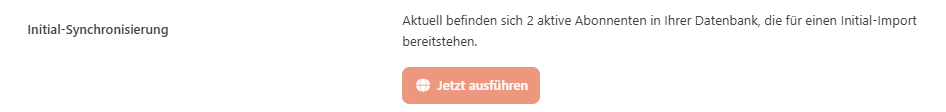
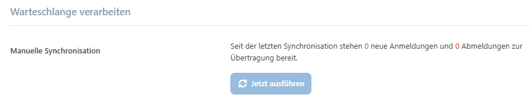

# Brevo

Das Plugin **Brevo E-Mail-Synchronisierung** verbindet die Smartstore-Newsletterverwaltung mit dem E-Mail-Marketing-Dienst Brevo, vormals Sendinblue. Newsletter-Anmeldungen und -Abmeldungen aus Smartstore werden mit einer ausgewählten Brevo-Kontaktliste synchronisiert. Bereits vorhandene Abonnenten können einmalig übernommen und anschließende Änderungen automatisch oder manuell übertragen werden.


Kampagnen können entweder direkt in Brevo oder mit der integrierten Newsletter-Funktion in Smartstore verwaltet werden. Weitere Informationen finden Sie unter [E-Mail-Kampagne in Brevo erstellen und versenden](https://help.brevo.com/hc/de/articles/4413566705298-Erstellen-und-versenden-einer-E-Mail-Kampagne) und [Newsletter-Kampagnen verwalten](../marketing-promotion/newsletter-kampagnen-verwalten.md).


Für den Betrieb benötigen Sie:

- ein aktives Brevo-Konto
- einen Brevo API-Key der Version 3
- mindestens eine Kontaktliste in Brevo.

## Konfiguration

Öffnen Sie unter **Plugins > Plugins verwalten** die Konfiguration des Plugins **Brevo E-Mail-Synchronisierung**. Hier verbinden Sie Smartstore mit Ihrem Brevo-Konto, wählen die Zielkontaktliste und richten die Synchronisierung ein.

| Einstellung | Beschreibung |
|---|---|
| **Brevo API-Key (v3)** | API-Schlüssel für die [Verbindung zwischen Smartstore und Brevo](#verbindung-zu-brevo-herstellen). Nach erfolgreicher Prüfung zeigt Smartstore im Eingabefeld den Status **Verbindung erfolgreich** an. |
| **Brevo-Standardliste** | Kontaktliste, der neue Newsletter-Abonnenten hinzugefügt werden. Abmeldungen entfernen den Kontakt aus dieser Liste. |
| **Automatisch synchronisieren** | Aktiviert den Hintergrund-Task für die [automatische Synchronisierung](#automatische-synchronisierung). Der Task wird einmal pro Stunde ausgeführt. |
| **Webhook-URL** | Von Smartstore erzeugte Adresse für den [Brevo-Webhook](#webhook-einrichten). Die URL kann kopiert, aber nicht manuell bearbeitet werden. |
| **Manuelle Synchronisation** | Zeigt ausstehende Anmeldungen und Abmeldungen und ermöglicht deren [unmittelbare Verarbeitung](#manuelle-synchronisierung). |
| **Initial-Synchronisierung** | Nimmt alle derzeit aktiven Newsletter-Abonnenten des ausgewählten Shops für die [erstmalige Übertragung](#bestehende-abonnenten-initial-synchronisieren) in die Warteschlange auf. |

Das Plugin synchronisiert Anmeldungen und Abmeldungen anhand der E-Mail-Adresse. Bei einer Anmeldung wird der Kontakt in Brevo erstellt oder aktualisiert und der ausgewählten Liste hinzugefügt. Eine Abmeldung in Smartstore entfernt den Kontakt aus dieser Liste, löscht ihn jedoch nicht aus dem Brevo-Konto. Abmeldungen in Brevo können über den Webhook an Smartstore zurückgemeldet werden.


Das Plugin überträgt ausschließlich E-Mail-Adressen. Namen, Anschriften, Bestellungen und weitere Kundendaten oder Kontaktattribute werden nicht mit Brevo synchronisiert.


### Verbindung zu Brevo herstellen

1. Öffnen Sie in Brevo die Verwaltung der [API-Keys](https://app.brevo.com/settings/keys/api).
2. Erstellen oder kopieren Sie einen API-Key der Version 3.
3. Tragen Sie den Schlüssel unter **Brevo API-Key (v3)** ein.
4. Klicken Sie auf **Speichern**.
5. Prüfen Sie, ob im Feld **Brevo API-Key (v3)** der grüne Status **Verbindung erfolgreich** angezeigt wird.
6. Wählen Sie unter **Brevo-Standardliste** die gewünschte Kontaktliste aus.
7. Speichern Sie die Konfiguration erneut.

Die Brevo-Listen können erst abgerufen werden, nachdem ein API-Key gespeichert und die Verbindung erfolgreich hergestellt wurde.


Das Plugin lädt bis zu 50 Kontaktlisten aus dem Brevo-Konto. Wenn eine vorhandene Liste nicht zur Auswahl angeboten wird, prüfen Sie neben dem API-Key auch die Anzahl der in Brevo vorhandenen Listen.



Behandeln Sie den API-Key vertraulich. Veröffentlichen Sie ihn nicht und geben Sie ihn nur an Personen weiter, die Zugriff auf die Brevo-Integration benötigen.


### Abonnenten synchronisieren

Neue Newsletter-Anmeldungen und -Abmeldungen werden zunächst in einer lokalen Warteschlange erfasst. Nach dem Einrichten der Verbindung und der Zielkontaktliste können Sie bestehende Abonnenten übernehmen und die weitere Verarbeitung automatisch oder manuell ausführen.

#### Bestehende Abonnenten initial synchronisieren

Mit der Initial-Synchronisierung übernehmen Sie die bereits in Smartstore vorhandenen Newsletter-Abonnenten.

1. Wählen Sie bei einer Multi-Shop-Installation zunächst den gewünschten Shop aus.
2. Prüfen Sie die Anzahl der aktiven Abonnenten im Bereich **Initial-Synchronisierung**.
3. Klicken Sie in diesem Bereich auf **Jetzt ausführen**.
4. Verarbeiten Sie anschließend die Warteschlange über **Manuelle Synchronisation**, oder aktivieren Sie **Automatisch synchronisieren**.


Die Initial-Synchronisierung stellt die aktiven Abonnenten zunächst in die Warteschlange. Die Übertragung zu Brevo erfolgt erst, wenn die Warteschlange manuell oder durch den Hintergrund-Task verarbeitet wird.


Sie können die Initial-Synchronisierung bei Bedarf erneut ausführen. Bereits in Brevo vorhandene Kontakte werden aktualisiert und der ausgewählten Liste zugeordnet.

#### Automatische Synchronisierung

Aktivieren Sie **Automatisch synchronisieren**, damit Smartstore die Warteschlange regelmäßig im Hintergrund verarbeitet. Der zugehörige Task **Brevo-Abonnentenabgleich** wird einmal pro Stunde ausgeführt.

Den Status, die letzte Ausführung und mögliche Fehler des Tasks können Sie unter **System > Geplante Aufgaben** kontrollieren. Weitere Informationen finden Sie unter [Geplante Aufgaben verwalten](../system-wartung/geplante-aufgaben-verwalten.md).


Die Synchronisierung erfolgt nicht in Echtzeit. Neue Anmeldungen und Abmeldungen verbleiben bis zur nächsten Ausführung des Tasks in der Warteschlange.


#### Manuelle Synchronisierung

Im Bereich **Manuelle Synchronisation** sehen Sie, wie viele Anmeldungen und Abmeldungen seit dem letzten Abgleich auf die Übertragung warten.

Klicken Sie auf **Jetzt ausführen**, um die ausstehenden Änderungen unmittelbar zu verarbeiten. Eine manuelle Synchronisierung ist erst möglich, nachdem eine Brevo-Zielliste ausgewählt wurde.

Nach einer erfolgreichen Verarbeitung zeigt Smartstore die Anzahl der aktualisierten Kontakte an.

## Webhook einrichten

Der Webhook übermittelt Abmeldungen aus Brevo zurück an Smartstore. Ohne diesen Webhook werden Abmeldungen, die direkt in Brevo vorgenommen werden, nicht automatisch in der Smartstore-Newsletterverwaltung berücksichtigt.

Kopieren Sie die in Smartstore unter **Webhook-URL** angezeigte Adresse und verwenden Sie sie in Brevo als Zieladresse für einen ausgehenden Webhook. Aktivieren Sie für diesen Webhook das Ereignis **unsubscribe**. Eine genaue Beschreibung der Einrichtung finden Sie in der Brevo-Dokumentation unter [Ausgehenden Webhook erstellen](https://help.brevo.com/hc/de/articles/27824932835474-Erstellung-von-ausgehenden-Webhooks-um-Echtzeitdaten-von-Brevo-an-eine-externe-App-zu-versenden).

Smartstore verarbeitet über diesen Endpunkt ausschließlich Brevo-Ereignisse vom Typ `unsubscribe`. Andere Brevo-Ereignisse werden vom Plugin ignoriert. Wenn Brevo eine Abmeldung übermittelt, entfernt Smartstore den zugehörigen Newsletter-Eintrag unmittelbar. Es wird keine zusätzliche Abmeldebestätigung versendet.


Achten Sie darauf, die vollständige Webhook-URL zu übernehmen. In einer Multi-Shop-Installation enthält die Adresse die ID des Shops, dessen Newsletter-Abonnent entfernt werden soll.


## Multi-Shop-Konfiguration

In einer Multi-Shop-Installation können Einstellungen global oder für einen bestimmten Shop hinterlegt werden. Wählen Sie vor der Konfiguration über die Shopauswahl den gewünschten Shop aus. Die Initial-Synchronisierung berücksichtigt nur die aktiven Newsletter-Abonnenten dieses Shops.

Die angezeigte Webhook-URL enthält die ID des ausgewählten Shops. Wenn Abmeldungen aus Brevo für mehrere Shops zurückgemeldet werden sollen, hinterlegen Sie in Brevo für jeden Shop die jeweils angezeigte URL.

Weitere Informationen finden Sie unter [Multi-Shop Konfiguration](../konfiguration/einstellungen/den-einstellungsbereich-festlegen.md) und [Mit mehreren Shops arbeiten](../allgemeine-konzepte/mit-mehreren-shops-arbeiten.md).

## Newsletter-Abonnenten in Smartstore kontrollieren

Die von Brevo synchronisierten Anmeldungen und Abmeldungen beziehen sich auf die Newsletter-Abonnenten von Smartstore.

Öffnen Sie **Marketing > Newsletter-Abonnenten**, um die lokal gespeicherten Abonnenten zu kontrollieren. Dort können Sie prüfen, ob eine Anmeldung aktiv ist oder ob eine durch den Brevo-Webhook übermittelte Abmeldung entfernt wurde.

Weitere Informationen zur Verwaltung und zum Import oder Export von Newsletter-Abonnenten finden Sie unter [Newsletter-Kampagnen verwalten](../marketing-promotion/newsletter-kampagnen-verwalten.md#abonnenten-verwalten).

## Datenschutz

Bei der Synchronisierung übermittelt Smartstore die E-Mail-Adressen der Newsletter-Abonnenten an Brevo. Berücksichtigen Sie Brevo deshalb in den Datenschutzinformationen Ihres Shops und informieren Sie betroffene Personen über Art und Zweck der Datenübermittlung.

Das Plugin überträgt keine Namen, Adressen, Bestellungen oder sonstigen Kundendaten. Die weitere Verarbeitung der Kontakte sowie der Versand und die Auswertung von Brevo-Kampagnen erfolgen im Brevo-Konto.

## Weiterführende Informationen

- [Newsletter-Kampagnen verwalten](../marketing-promotion/newsletter-kampagnen-verwalten.md)
- [Geplante Aufgaben verwalten](../system-wartung/geplante-aufgaben-verwalten.md)
- [Multi-Shop Konfiguration](../konfiguration/einstellungen/den-einstellungsbereich-festlegen.md)
- [Mit mehreren Shops arbeiten](../allgemeine-konzepte/mit-mehreren-shops-arbeiten.md)
- [Brevo API-Keys](https://app.brevo.com/settings/keys/api)
- [E-Mail-Kampagne in Brevo erstellen und versenden](https://help.brevo.com/hc/de/articles/4413566705298-Erstellen-und-versenden-einer-E-Mail-Kampagne)
- [Ausgehenden Webhook in Brevo erstellen](https://help.brevo.com/hc/de/articles/27824932835474-Erstellung-von-ausgehenden-Webhooks-um-Echtzeitdaten-von-Brevo-an-eine-externe-App-zu-versenden)

## Sie interessieren sich für dieses Plugin?

Gerne beraten wir Sie persönlich zu Funktionen, Einsatzmöglichkeiten und Lizenzoptionen. Gemeinsam klären wir, ob das Plugin zu Ihren Anforderungen passt, und begleiten Sie auf dem Weg zur passenden Kaufentscheidung.

<a href="https://smartstore.com/de/persoenliche-beratung/" class="button primary">Persönliche Beratung anfragen</a>
