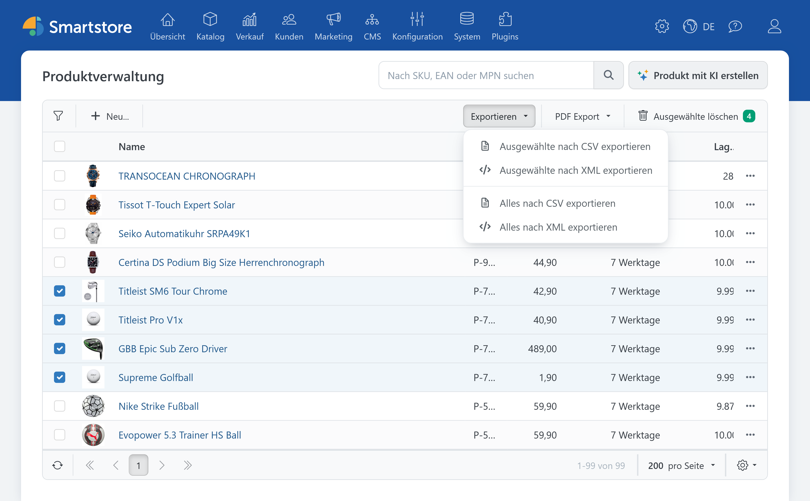
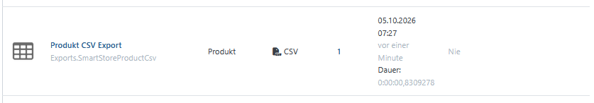
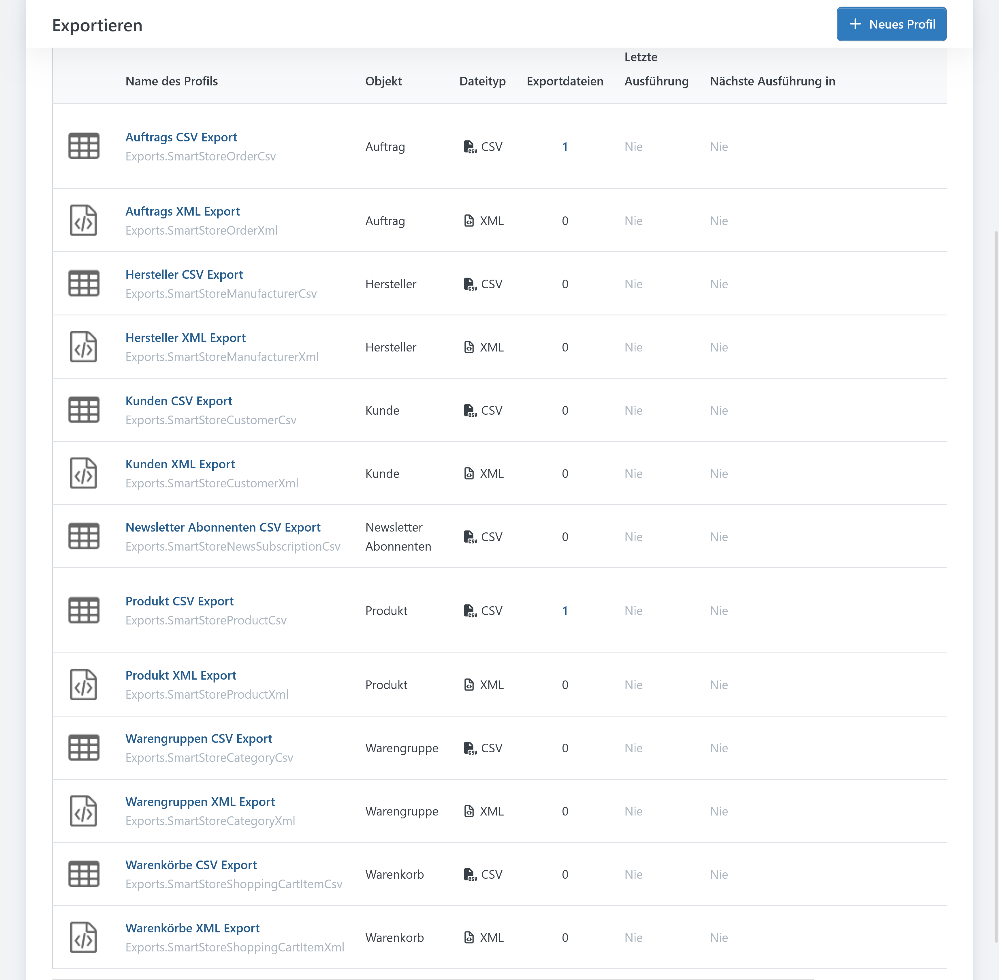
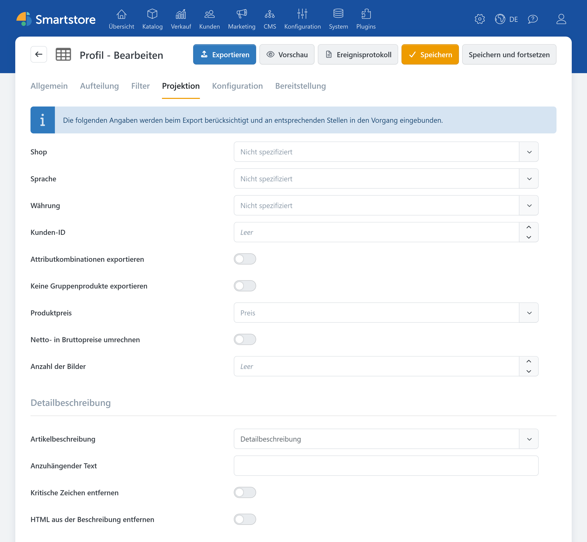
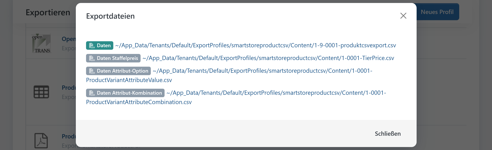

# Datenexporte

> Shopdaten einfach exportieren

Das Plugin **Datenexporte** ergänzt Smartstore um allgemeine CSV- und XML-Exporte für zentrale Shopdaten. Die Exportbefehle werden direkt in die jeweiligen Verwaltungslisten integriert. Zusätzlich legt das Plugin passende Systemprofile an, über die sich Umfang, Verarbeitung und Bereitstellung der Exportdateien steuern lassen.


Im Demo-Modus ist **Common Export Providers** auf höchstens 20 Hauptdatensätze pro Export beschränkt.


Das Plugin stellt insgesamt 13 Export-Provider beziehungsweise Systemprofile bereit.

| Datentyp | CSV | XML | Ausgewählte Datensätze | Alle Datensätze |
|---|:---:|:---:|:---:|:---:|
| Produkte | ✓ | ✓ | ✓ | ✓ |
| Warengruppen | ✓ | ✓ | ✓ | ✓ |
| Hersteller | ✓ | ✓ | ✓ | ✓ |
| Kunden | ✓ | ✓ | ✓ | ✓ |
| Aufträge | ✓ | ✓ | ✓ | ✓ |
| Newsletter-Abonnenten | ✓ | – | – | ✓ |
| Warenkörbe | ✓ | ✓ | – | ✓ |
| Wunschlisten | ✓ | ✓ | – | ✓ |

## Einen Schnell-Export durchführen

Das Plugin ergänzt folgende Verwaltungsseiten um den Befehl **Exportieren**:

- Produkte
- Warengruppen
- Hersteller
- Kunden
- Aufträge
- Newsletter-Abonnenten
- aktuelle Warenkörbe
- aktuelle Wunschlisten.

Bei Produkten, Warengruppen, Herstellern, Kunden und Aufträgen stehen grundsätzlich folgende Befehle zur Verfügung:

- **Ausgewählte nach CSV exportieren**
- **Ausgewählte nach XML exportieren**
- **Alles nach CSV exportieren**
- **Alles nach XML exportieren**.

Der Export ausgewählter Datensätze ist erst verfügbar, nachdem mindestens eine Tabellenzeile markiert wurde.

Newsletter-Abonnenten können vollständig nach CSV exportiert werden. Für aktuelle Warenkörbe und Wunschlisten stehen vollständige CSV- und XML-Exporte zur Verfügung.


Die in einer Verwaltungsliste eingestellten Such- und Tabellenfilter werden beim Schnell-Export nicht automatisch an das Exportprofil übergeben.

**Alles exportieren** bedeutet daher: Alle Daten exportieren, die den Filtern des zugehörigen Systemprofils entsprechen – nicht nur die momentan in der Tabelle angezeigten Zeilen.


Wenn Sie nur eine bestimmte Teilmenge benötigen, markieren Sie die gewünschten Datensätze oder passen Sie die Filter des Exportprofils an.

## Ablauf eines Exports

1. Öffnen Sie die gewünschte Verwaltungsliste.
2. Markieren Sie bei Bedarf einzelne Datensätze.
3. Öffnen Sie das Menü **Exportieren**.
4. Wählen Sie das gewünschte Dateiformat und den Exportumfang.
5. Bestätigen Sie die Sicherheitsabfrage.
6. Smartstore startet den Export als Hintergrundaufgabe.
7. Öffnen Sie **Konfiguration > Exportieren**, um Fortschritt, Ergebnisdateien und Protokoll einzusehen.

Der Schnell-Export erzeugt keinen unmittelbaren Browserdownload. Nach dem Start informiert Smartstore darüber, dass die Datenexportaufgabe ausgeführt wird. Die fertigen Dateien werden anschließend beim zugehörigen Exportprofil bereitgestellt.

Fehlt das vom Schnell-Export benötigte Systemprofil, legt das Plugin es automatisch wieder an. Starten Sie den Export danach erneut.

## Exportprofile verwalten

Bei der Installation legt das Plugin für jeden Export-Provider ein aktiviertes Systemprofil an. Sie finden diese Profile unter **Konfiguration > Exportieren**.

Abhängig vom Datentyp können Sie unter anderem folgende allgemeine Einstellungen verwenden:

- Profil aktivieren oder deaktivieren
- Name und Dateinamensmuster festlegen
- Datensätze überspringen oder deren Anzahl begrenzen
- Daten auf mehrere Exportdateien aufteilen
- separate Dateien pro Shop erzeugen
- Daten nach datentypspezifischen Kriterien filtern
- Daten für den Export projizieren
- ZIP-Archive erzeugen
- automatische Ausführungen planen
- Benachrichtigungen versenden
- Dateien über Dateisystem, öffentlichen Ordner, E-Mail, HTTP oder FTP bereitstellen.

Eine vollständige Beschreibung dieser Funktionen finden Sie unter [Exportprofile verwalten](../datenaustausch/export/exportprofile-verwalten.md).

Systemprofile können bearbeitet, aber nicht über die normale Profilverwaltung gelöscht werden.

### Produktexporte konfigurieren

Die Produkt-Provider unterstützen zusätzliche Funktionen des allgemeinen Exportframeworks. Abhängig vom gewählten Format können Sie unter anderem:

- gruppierte Produkte auslassen
- Attributkombinationen als einzelne Produkte ausgeben
- Produktbeschreibungen projizieren oder zusammenführen
- zugehörige Produktdaten in zusätzliche CSV-Dateien exportieren.

Aktivieren Sie bei einem Produkt-CSV-Profil **Zugehörige Daten exportieren** im Reiter **Allgemein**, um zusätzliche Dateien für folgende Daten zu erzeugen:

- Staffelpreise
- Attributwerte
- Attributkombinationen.

Die Dateinamen enden mit den technischen Bezeichnungen `TierPrice`, `ProductVariantAttributeValue` beziehungsweise `ProductVariantAttributeCombination`.


Ändern Sie diese technischen Namensbestandteile nicht, wenn Sie die Dateien später für einen Produktimport verwenden möchten. Der Produktimport erkennt anhand des Dateinamens, welche zugehörigen Daten die Datei enthält.


Die Ausgabe zugehöriger Daten kann nicht gleichzeitig mit der Projektion von Attributkombinationen als eigenständige Produkte verwendet werden.

Weitere Informationen zu den unterstützten Produktdaten und zum anschließenden Import finden Sie unter [Produkte importieren und exportieren](../../verwalten/katalog/produkte-verwalten/produkte-importieren-exportieren.md).

## Inhalt der Exportdateien

Die Dateien enthalten technische Datenfelder und sind nicht auf die sichtbaren Spalten der jeweiligen Verwaltungsliste beschränkt. Viele Feldnamen werden in englischer Sprache ausgegeben.

| Export | Datenfelder (Auswahl) | Zusätzliche Inhalte und Formatbesonderheiten |
|---|---|---|
| **Produkte** | ID und Produkttyp Name, Kurz- und Langbeschreibung SEO-Daten Artikelnummer, GTIN und Herstellernummer Preise und Sonderpreise Lager- und Bestandsinformationen Versand-, Gewichts- und Maßangaben Lieferzeit und Mengeneinheit Produktbilder Warengruppen- und Herstellerzuordnungen Schlagwörter verbundene und Cross-Selling-Produkte Bundle-Daten Shopzuordnungen lokalisierte Inhalte | Beim CSV-Export können zusätzliche Dateien für Staffelpreise, Attributwerte und Attributkombinationen erzeugt werden. Umfang und Darstellung hängen außerdem von den Projektionseinstellungen des Exportprofils ab. |
| **Warengruppen und Hersteller** | Name und Beschreibung SEO-Daten und URL-Alias Bild-URL Template Veröffentlichungsstatus Sortierreihenfolge Shopzuordnungen lokalisierte Inhalte | Die XML-Ausgabe kann zusätzlich die jeweiligen Produktzuordnungen enthalten. |
| **Kunden** | Kundennummer, Benutzername und E-Mail-Adresse Aktivstatus und Kundenrollen Firma und Kontaktdaten Rechnungs- und Lieferanschriften Newsletterstatus Umsatzsteuerinformationen letzter Login und letzte Aktivität Shopzuordnungen Bonuspunkte Kundenattribute | Die XML-Ausgabe bildet unter anderem Kundenrollen, Anschriften und Bonuspunkte hierarchisch ab. Der CSV-Export kann zusätzlich technische Authentifizierungsfelder wie Passwort-Hash, Passwortformat und Passwort-Salt enthalten. |
| **Aufträge** | Auftragsnummer und Status Kunden- und Shopzuordnung Auftragssummen, Steuern, Rabatte und Versandkosten Währung Zahlungs- und Versandart Rechnungs- und Lieferanschrift Transaktionskennungen Bonuspunkte Zeitstempel | Die XML-Ausgabe kann zusätzlich Kundendaten, Bestellpositionen, Produktinformationen zu den Bestellpositionen, Sendungen und Sendungspositionen, Shopinformationen sowie gespeicherte Zahlungs- oder Lastschriftdaten enthalten. |
| **Warenkörbe und Wunschlisten** | Warenkorb- beziehungsweise Wunschlisteneintrag Menge und Preis ausgewählte Produktattribute zugehöriger Kunde zugehöriges Produkt | Ob Warenkorb- oder Wunschlistendaten ausgegeben werden, hängt von der Verwaltungsseite ab, auf der der Export gestartet wurde. |
| **Newsletter-Abonnenten** | E-Mail-Adresse Aktivstatus Shop-ID | Ausschließlich als CSV-Export verfügbar. |

## Bearbeitung in Excel

Wenn Sie eine CSV-Datei in Excel bearbeiten möchten, öffnen Sie diese nicht per Doppelklick. Importieren Sie die Datei stattdessen über **Daten > Aus Text/CSV** und entfernen Sie gegebenenfalls die automatische Typänderung in den angewendeten Transformationsschritten. Andernfalls kann Excel die Dezimal- oder Tausendertrennzeichen möglicherweise falsch interpretieren.

Weitere Hinweise finden Sie unter [Exportprofile verwalten](../datenaustausch/export/exportprofile-verwalten.md).

## Berechtigungen

Die Exportbefehle werden nur Administratoren angezeigt, die über die Berechtigung **Export ausführen** verfügen.

Für die Verwaltung der Exportprofile, den Zugriff auf Ergebnisdateien und das Lesen der Protokolle gelten zusätzlich die allgemeinen Berechtigungen des Smartstore-Exportsystems.

Vergeben Sie Exportrechte nur an vertrauenswürdige administrative Rollen. Informationen zur Rechtevergabe finden Sie unter [Zugriffsrechte kontrollieren](../konfiguration/zugriffsrechte-kontrollieren.md).

## Datenschutz und sichere Bereitstellung

Exportdateien können sensible oder personenbezogene Informationen enthalten, darunter:

- Kunden- und Kontaktdaten
- Rechnungs- und Lieferanschriften
- IP-Adressen
- Bestell- und Zahlungsinformationen
- Passwort-Hashes und Passwort-Salts
- gespeicherte Karten- oder Lastschriftdaten.

Aus diesem Grund ist es empfehlenswert, die üblichen Datenschutzrichtlinien zu beachten.

## Weiterführende Informationen

- [Exportprofile verwalten](../datenaustausch/export/exportprofile-verwalten.md)
- [Geplante Aufgaben verwalten](../system-wartung/geplante-aufgaben-verwalten.md)
- [Produkte importieren und exportieren](../../verwalten/katalog/produkte-verwalten/produkte-importieren-exportieren.md)
- [Produkt-Feeds exportieren](../../verwalten/katalog/produkte-verwalten/produkt-feeds-exportieren.md)
- [Kunden verwalten](../kunden/kunden-verwalten.md)
- [Aufträge verwalten](../../verwalten/verkauf/auftrage-verwalten.md)
- [Zugriffsrechte kontrollieren](../konfiguration/zugriffsrechte-kontrollieren.md)
