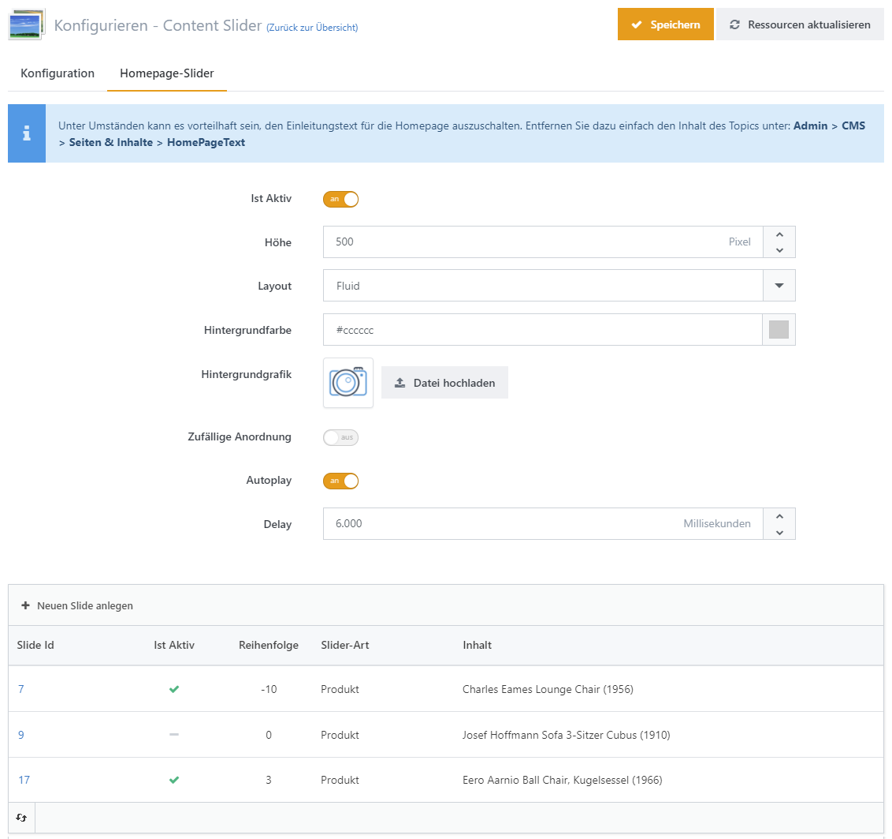
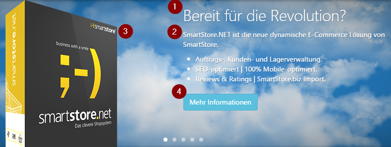

# Content Slider

Ein Content Slider eignet sich ideal, um Besuchern einer Seite wichtige Informationen zu vermitteln. Die Augen der Besucher richten sich während ihres ersten Besuchs direkt auf diesen Bereich. Daher sollten Sie dort Informationen platzieren, die Ihre Shopbesucher besonders interessieren (z. B. Sonderangebote). Sie können den Content Slider für Slides auf der Homepage und auf [Warengruppenseiten](../../verwalten/katalog/warengruppen-organisieren.md) verwenden.


Nach dem Sie das Contentslider Plugin installiert haben, müssen Sie unter **CMS > Widgets** das Content Slider Widget aktivieren.


## Wie Sie den Content Slider konfigurieren können

Sie können den Contentslider für die Homepage im Administrationsbereich unter **Plugins > Contentslider** konfigurieren. Die Slides für Warengruppenseiten können Sie direkt auf den [Warengruppen-Details-Seiten](../../verwalten/katalog/warengruppen-organisieren.md) auf der Registerkarte **Contentslider** konfigurieren.

Hier können Sie die Höhe und das Hintergrundbild eingeben und festlegen, ob der Inhalt automatisch und ohne Interaktion des Nutzers hereinfahren soll.

## Wie Sie einen einzelnen Slide einstellen

Wenn Sie einen einzelnen Slide hinzufügen oder bearbeiten, können Sie **Titel**, **Text** und ein **Bild** festlegen und mehrere Buttons einstellen, die automatisch mit dem Inhalt des Slides verändert werden (siehe unten stehende Grafik). Sie müssen auch die Sprache für den Slide einstellen. Es gibt keine Lokalisierungen für einzelne Slides. Sie müssen also einen Slide für jede aktive Sprache in Ihrem Shop einrichten, wenn Sie den gleichen Inhalt in unterschiedlichen Sprachen anzeigen möchten. Sie können bis zu drei Buttons zu jedem Slide hinzufügen. Um einen Button zu einem Slide hinzuzufügen, müssen Sie ihn lediglich aktivieren, indem Sie einen Haken an **Veröffentlicht** setzen. Dann geben Sie den Button **Text** und eine absolute URL einschließlich des Protokolls (z.B.: [http://www.myshop.com/mypath](http://www.myshop.com/mypath)) ein und wählen den **Buttontyp.** Mögliche **Buttontypen** sind _Primary, Info, Success, Warning, Danger, Inverse_ und _Link._


Die **URL** eines Button kann entweder komplett angeben werden (einschließlich _http_ oder _https_ Protokoll) oder absolut (z. B. ~~_/path/to/ressource_), wobei die vorstehende Tilde (~~) auch weggelassen werden kann.



Die Farben der Button-Typen werden im Konfigurationsbereichs Ihres Themes festgelegt. Für weitere Informationen zur Konfiguration von Themes lesen Sie bitte [Mit Themes arbeiten](../konfiguration/mit-themes-arbeiten.md).


1. Titel
2. Text
3. Bild
4. Button
