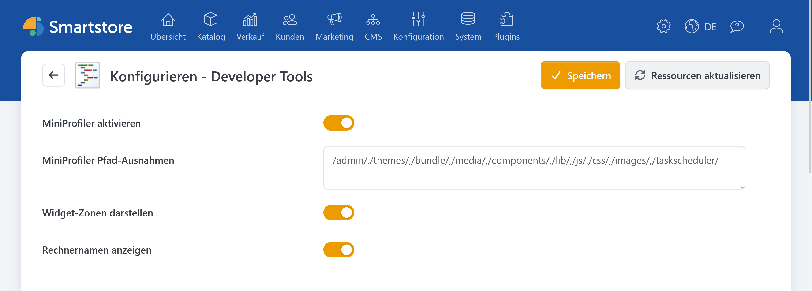
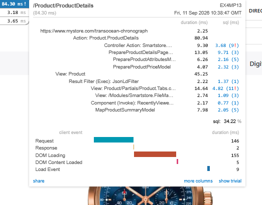
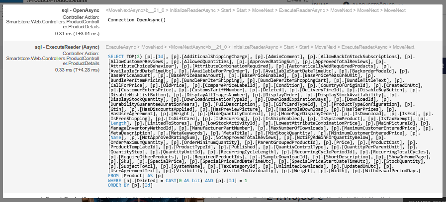
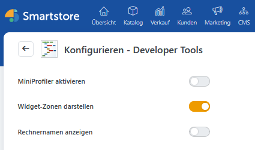
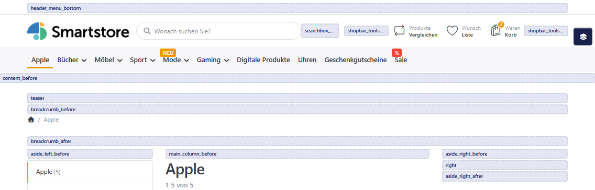
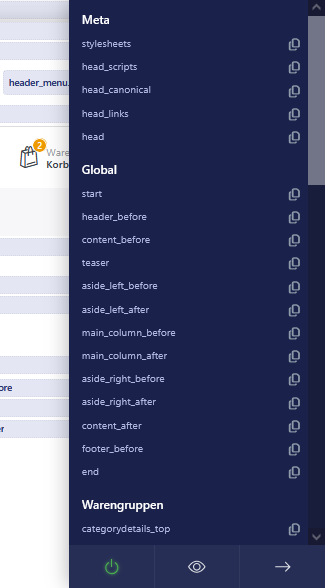
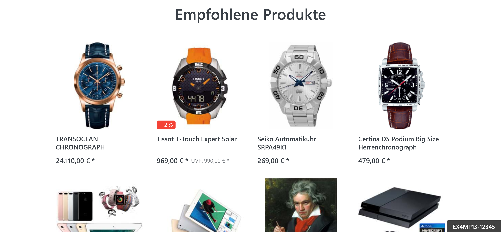

# Developer Tools

> Interaktive Shopdiagnose

Die Developer Tools unterstützen Administratoren bei der Analyse und Konfiguration eines Smartstore-Shops. Sie können damit die Verarbeitung von Seitenaufrufen untersuchen, verfügbare Widget-Zonen sichtbar machen und in verteilten Umgebungen die aktuell antwortende Anwendungsinstanz erkennen.

Die Funktionen sind für Diagnose- und Einrichtungsarbeiten vorgesehen. Schalten Sie nicht benötigte Funktionen nach der Verwendung wieder aus.

## Developer Tools konfigurieren

Öffnen Sie im Administrationsbereich **Plugins > Developer Tools**.

Folgende Einstellungen stehen zur Verfügung:

| Einstellung | Funktion |
| --- | --- |
| **MiniProfiler aktivieren** | Misst die Verarbeitungszeit von Seitenaufrufen. |
| **MiniProfiler Pfad-Ausnahmen** | Schließt bestimmte URL-Pfade von der Messung aus. |
| **Widget-Zonen darstellen** | Zeigt die auf der aktuellen Shopseite verfügbaren Widget-Zonen an. |
| **Rechnernamen anzeigen** | Blendet die Kennung der aktuell antwortenden Anwendungsinstanz ein. |

Wenn Sie mehrere Shops betreiben, können Sie über die Shopauswahl oberhalb der Konfiguration festlegen, ob die Einstellungen global oder für einen bestimmten Shop gelten. Weitere Informationen finden Sie unter [Multi-Shop Konfiguration](../konfiguration/einstellungen/den-einstellungsbereich-festlegen.md).

## MiniProfiler verwenden

Der MiniProfiler hilft Ihnen dabei, langsame Shopseiten zu erkennen. Nach dem Aufruf einer Seite zeigt er deren gemessene Verarbeitungszeit an. So können Sie beispielsweise verschiedene Seiten miteinander vergleichen oder prüfen, ob eine Änderung die Ladezeit beeinflusst.

### MiniProfiler aktivieren

Das MiniProfiler-Widget erscheint im oberen linken Bereich der Shopseite. Es ist bei regulären Shopaufrufen nur für angemeldete Administratoren sichtbar.

Klicken Sie auf einen Messwert, um weitere Einzelheiten zum untersuchten Seitenaufruf anzuzeigen. Die Detailansicht richtet sich vor allem an technisch erfahrene Anwender und Entwickler.


Smartphones werden von der Profilerfassung ausgenommen. Auf Tablets kann der MiniProfiler verwendet werden.



Der MiniProfiler verursacht zusätzlichen Verarbeitungsaufwand. Aktivieren Sie ihn in einem produktiven Shop nur für die Dauer der Untersuchung.


### Pfade von der Profilerfassung ausschließen

Über **MiniProfiler Pfad-Ausnahmen** können technisch erfahrene Anwender URL-Pfade festlegen, die nicht untersucht werden sollen. Die Pfade werden durch Kommas getrennt. Vorkonfigurierte Ausnahmen für den Administrationsbereich und statische Dateien sollten normalerweise beibehalten werden.

Weitere Informationen zur Konfiguration und zur technischen Auswertung finden Sie unter [MiniProfiler in der Entwicklerdokumentation](https://dev.smartstore.com/framework/platform/diagnostics#miniprofiler).

## Widget-Zonen anzeigen

Widget-Zonen sind vordefinierte Positionen, an denen Widgets, Page-Builder-Storys oder eigene Inhalte im Shop ausgegeben werden können. Mit den Developer Tools können Sie prüfen, welche Widget-Zonen auf einer bestimmten Shopseite verfügbar sind und wo sie sich befinden.

Grundlegende Informationen zur Verwendung dieser Positionen finden Sie unter [Widget-Zonen](../content-management/widget-zonen.md).

### Anzeige der Widget-Zonen aktivieren

Die Widget-Zonen werden bei regulären Shopaufrufen nur angezeigt, wenn Sie mit einem Administratorkonto angemeldet sind. Für Kunden bleibt die Anzeige unsichtbar.


Die Darstellung der Widget-Zonen verhindert für die betreffenden Seitenaufrufe die Ausgabe aus dem [Output Cache](output-cache-ausgabecache.md). Schalten Sie die Funktion nach Abschluss der Arbeiten wieder aus.


### Widget-Zonen im Shop anzeigen

Öffnen Sie das Widget-Zonen-Menü über das Ebenensymbol am rechten Rand des Browserfensters.


Das Widget-Zonen-Menü wird nur bei ausreichend breitem Browserfenster angezeigt. Prüfen Sie bei Bedarf, ob das Browserfenster maximiert ist.


Das Menü enthält eine nach Seitenbereichen gegliederte Liste der Widget-Zonen, die auf der aktuell geöffneten Seite zur Verfügung stehen.

Sie können das Menü folgendermaßen verwenden:

| Aktion | Funktion |
| --- | --- |
| **Widget-Zone auswählen** | Scrollt zur entsprechenden Position auf der Seite und hebt sie kurz hervor. |
| **Kopiersymbol** | Kopiert den exakten Namen der Widget-Zone in die Zwischenablage. |
| **Ein-/Ausschalter** | Legt fest, ob die Markierungen der Widget-Zonen dauerhaft ausgegeben werden. |
| **Augensymbol** | Blendet bereits ausgegebene Markierungen vorübergehend ein oder aus. |
| **Schließen** | Schließt das Widget-Zonen-Menü. |

Mit der Tastenkombination **Alt + K** können Sie die Markierungen ebenfalls vorübergehend ein- und ausblenden.

Die Einstellung für die dauerhafte Anzeige wird im Browser gespeichert und bleibt bis zur nächsten Änderung erhalten.


Das Menü zeigt immer die Widget-Zonen der aktuell geöffneten Seite. Wechseln Sie beispielsweise zwischen Startseite, Produktseite, Warengruppe und Warenkorb, um die dort verfügbaren Positionen zu prüfen. Welche Widget-Zonen vorhanden sind, hängt von der jeweiligen Seite, dem verwendeten Theme und den aktiven Funktionen ab.


Gleichnamige Zonen werden im Menü nur einmal aufgeführt, auch wenn sie auf einer Seite mehrfach vorkommen.

Weitere Informationen zur Platzierung und Sortierung von Widgets finden Sie unter [Widgets anordnen](../content-management/widgets-anordnen.md). Zum Prüfen unterschiedlicher Themes oder Shops können Sie außerdem die [Vorschau für Designs & Shops](../allgemeine-konzepte/vorschau-fur-designs-shops.md) verwenden.

## Rechnernamen anzeigen

Mit **Rechnernamen anzeigen** wird am unteren rechten Rand des Shop-Frontends die Kennung der aktuell antwortenden Anwendungsinstanz eingeblendet.

Die Funktion ist besonders für Shops hilfreich, die auf mehreren Servern, Containern oder Anwendungsinstanzen betrieben werden. Durch wiederholtes Aufrufen einer Seite können Sie erkennen, welche Instanz die jeweilige Anfrage verarbeitet hat.

Bei regulären Shopaufrufen ist die Anzeige auf angemeldete Administratoren beschränkt. Lokal auf dem Server ausgeführte Aufrufe bilden eine technische Ausnahme.


Die Kennung gibt Informationen über die technische Umgebung preis. Deaktivieren Sie die Anzeige nach Abschluss der Diagnose.


## Verwandte Beiträge

- [MiniProfiler in der Entwicklerdokumentation](https://dev.smartstore.com/framework/platform/diagnostics#miniprofiler)
- [Widget-Zonen](../content-management/widget-zonen.md)
- [Widgets anordnen](../content-management/widgets-anordnen.md)
- [Output Cache (Ausgabecache)](output-cache-ausgabecache.md)
- [Multi-Shop Konfiguration](../konfiguration/einstellungen/den-einstellungsbereich-festlegen.md)
- [Vorschau für Designs & Shops](../allgemeine-konzepte/vorschau-fur-designs-shops.md)
