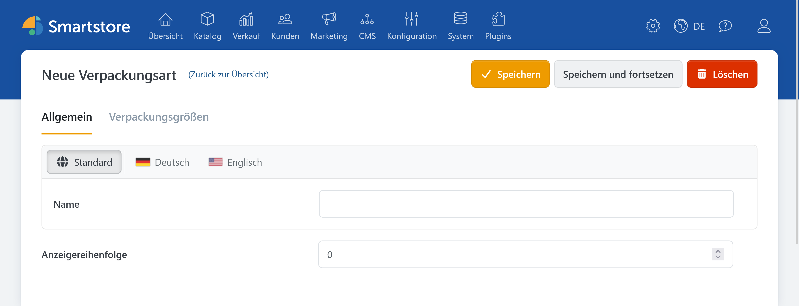
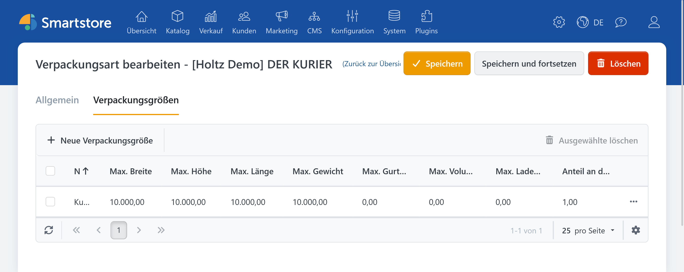
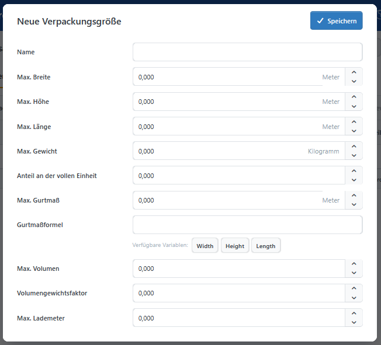

# Verpackungsarten und -größen

Eine **Verpackungsart** fasst zusammengehörende Transportformen zusammen, zum Beispiel Paket, Palette oder Container. Eine **Verpackungsgröße** beschreibt ein konkretes quaderförmiges Format mit seinen Grenzen, zum Beispiel *Paket S* oder *Viertelpalette*.


## Verpackungsart anlegen

In der [Konfiguration des Plugins](../dimension-pricing.md#konfiguration-und-berechtigungen) finden Sie in der Registerkarte **Verpackungsarten und -größen** eine Übersicht aller Einträge.



1. Klicken Sie auf **Neue Verpackungsart**.
2. Geben Sie einen eindeutigen Namen ein, zum Beispiel `Paketversand` oder `Palettenversand`.
3. Legen Sie die **Anzeigereihenfolge** fest. Niedrigere Werte besitzen innerhalb der Auswahl die höhere Priorität.
4. Speichern Sie die Verpackungsart.

## Verpackungsgröße anlegen



Öffnen Sie eine gespeicherte Verpackungsart, wechseln Sie zu **Verpackungsgrößen** und klicken Sie auf **Neue Verpackungsgröße**.



| Option | Beschreibung |
| --- | --- |
| Name | Eindeutige administrative Bezeichnung, zum Beispiel `Paket S` oder `Halbe Palette`. |
| Max. Breite,<br>Max. Höhe,<br>Max. Länge | Höchstmaße der Verpackungsgröße. Der Packalgorithmus versucht, die Produkte innerhalb dieser Grenzen anzuordnen. |
| Max. Gewicht | Höchstgewicht der Verpackungsgröße. Es wird beim Packen berücksichtigt, wenn die gewichtsabhängige Berechnung aktiviert ist. |
| Anteil an der vollen Einheit | Ordnet Teilgrößen einer vollen Einheit zu. `1` steht für eine volle Einheit. Kleinere Werte werden bei sonst gleicher Priorität bevorzugt. |
| Max. Gurtmaß | Optionaler Höchstwert. `0` deaktiviert die Grenze. |
| Gurtmaßformel | Optionale Formel mit `Width`, `Height` und `Length`, die das Gurtmaß des gepackten Ergebnisses berechnet. |
| Max. Volumen | Optionaler Höchstwert für die Summe der Produktvolumen im Packstück. `0` deaktiviert die Grenze. |
| Volumengewichtsfaktor | Multipliziert das gepackte Volumen mit einem Faktor. Als Abrechnungsgewicht gilt der höhere Wert aus Realgewicht und Volumengewicht. `0` deaktiviert die Umrechnung. |
| Max. Lademeter | Optionaler Höchstwert je Packstück. Seine Bedeutung hängt vom gewählten [Lademetermodus](settings.md#lademeterberechnung) ab. `0` deaktiviert die Grenze. |

Beispiel für ein Gurtmaß:

```text
Length + 2 * Width + 2 * Height
```


Für die Gurtmaßformel stehen die Variablen Width, Height und Length sowie die Rechenoperatoren +, -, *, / und Klammern zur Verfügung.


Die Formel wird auf die tatsächlich belegten Maße des gepackten Ergebnisses angewendet. Wenn ein maximales Gurtmaß gesetzt ist, die Formel aber nicht ausgewertet werden kann, ist die Verpackungsgröße nicht geeignet.

Unter dem Formelfeld können Sie `Width`, `Height` und `Length` über Schaltflächen einfügen. Die Gurtmaßformel wird beim Speichern geprüft; Fehler werden direkt am Feld angezeigt.

## Verwendung in Versandbedingungen

Eine Verpackungsgröße wird über eine [Versandbedingung](shipping-conditions.md) mit einer Versandmethode, einem Zielgebiet und einem Preis verbunden. Legen Sie daher zuerst die benötigten Verpackungsarten und -größen an.

Die verwendeten Maß-, Gewichts- und Verpackungseinheiten konfigurieren Sie unter [Gewichte, Verpackungseinheiten und Abmessungen verwalten](../../konfiguration/gewichte-verpackungseinheiten-abmessungen-verwalten.md).

## Wenn keine Verpackungsgröße passt

Prüfen Sie:

- die Höchstmaße und das Höchstgewicht der Verpackungsgrößen,
- die Quelle der Produktmaße in den [Einstellungen](settings.md),
- Gurtmaß-, Volumen- und Lademetergrenzen,
- Packformeln für nicht quaderförmige Produkte,
- Warenkörbe mit mehreren Artikeln oder höheren Mengen.
