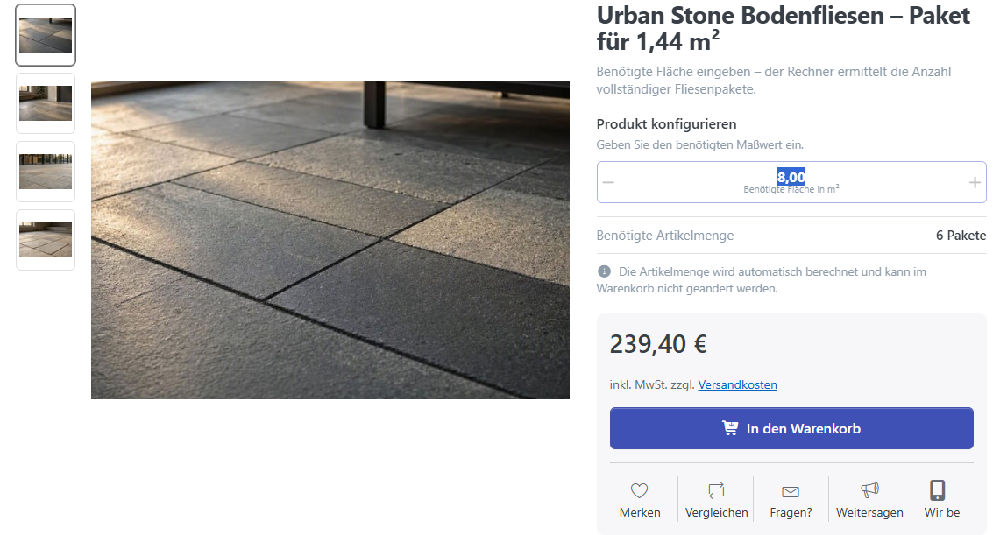
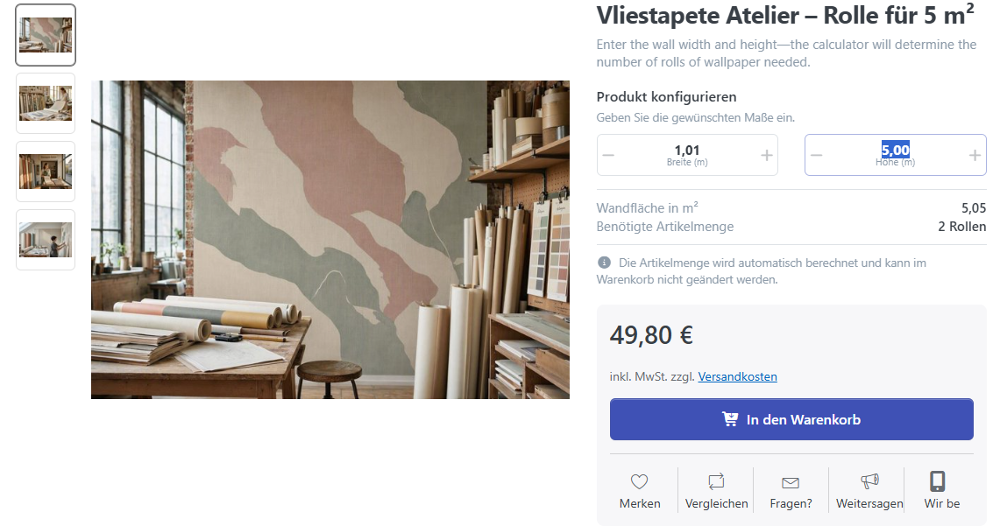
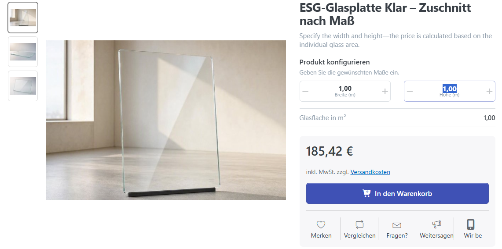
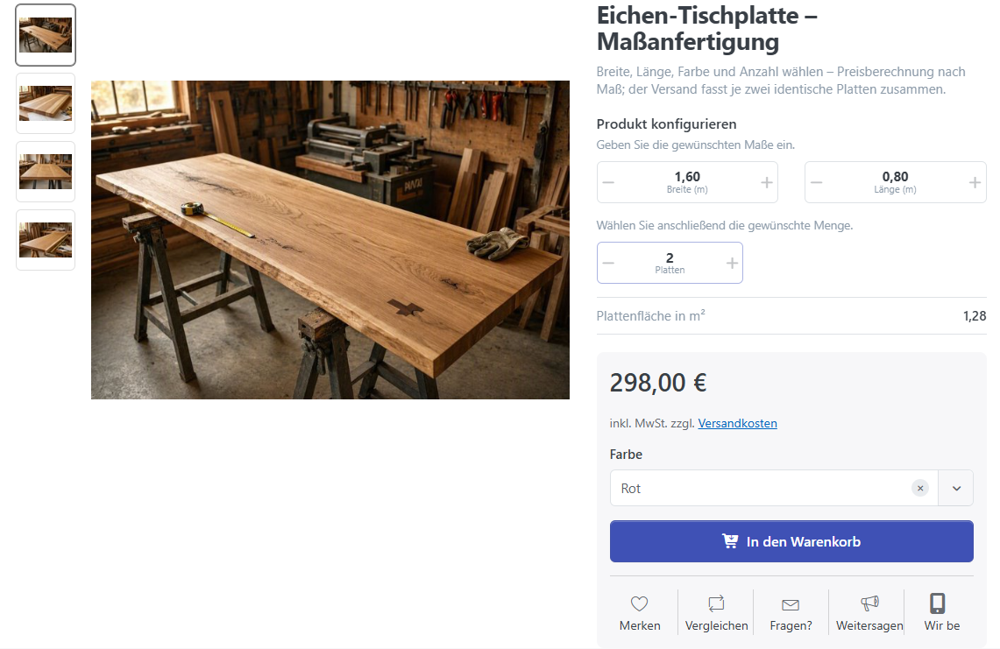
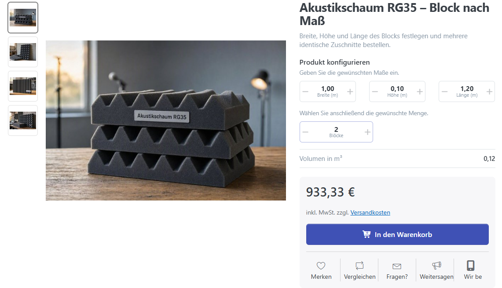

# Praxisbeispiele

Die folgenden Beispiele zeigen typische Einsatzmöglichkeiten des Maß- und Mengenrechners. Sie decken alle vier [Betriebsarten](mass-und-mengenrechner.md#betriebsarten) sowie ein-, zwei- und dreidimensionale Produkte ab.

Die Beispielpreise und Maße dienen der Veranschaulichung. Passen Sie Minimalwerte, Maximalwerte, Schrittweiten und Bezeichnungen an Ihr tatsächliches Sortiment an.

| Beispiel | Eingabe des Kunden | Ergebnis |
| --- | --- | --- |
| [Bodenfliesen](#bodenfliesen-pakete-aus-einer-gesamtfläche-berechnen) | benötigte Gesamtfläche | Anzahl vollständiger Pakete |
| [Vliestapete](#vliestapete-rollen-aus-wandmaßen-berechnen) | Breite und Höhe der Wandfläche | Anzahl vollständiger Rollen |
| [Glasplatte](#glasplatte-preis-eines-zweidimensionalen-zuschnitts-berechnen) | Breite und Länge des Zuschnitts | Preis der Glasplatte |
| [Textilkabel](#textilkabel-preis-aus-einer-länge-berechnen) | gewünschte Länge | Preis des Kabelzuschnitts |
| [Tischplatte](#tischplatte-mehrere-identische-zuschnitte-bestellen) | Breite, Länge und Anzahl | Gesamtpreis identischer Tischplatten |
| [Akustikschaum](#akustikschaum-dreidimensionale-blöcke-konfigurieren) | Breite, Höhe, Länge und Anzahl | Gesamtpreis identischer Schaumstoffblöcke |

## Bodenfliesen: Pakete aus einer Gesamtfläche berechnen

Das Produkt **Urban Stone Bodenfliesen – Paket für 1,44 m²** wird in vollständigen Paketen verkauft. Der Kunde kennt die benötigte Bodenfläche, muss aber nicht selbst berechnen, wie viele Pakete dafür erforderlich sind.

### Konfiguration

| Einstellung | Beispielwert |
| --- | --- |
| Betriebsart | **Gesamtmaß eingeben – Artikelmenge berechnen** |
| Maße eines Pakets | Breite `1,20 m`, Länge `1,20 m` |
| Berechnungsformel | `Width * Length` |
| Divisor | `1` |
| Bezeichnung des Maßwerts | **Benötigte Fläche in m²** |
| Verpackungseinheit des Produkts | **Paket / Pakete** |
| Regulärer Produktpreis | `39,90 €` je Paket |

Die Formel ermittelt aus den festen Produktmaßen zunächst die Fläche eines Pakets:

```text
1,20 m * 1,20 m = 1,44 m² je Paket
```

### Beispielrechnung

Der Kunde gibt einen Gesamtbedarf von `8 m²` ein.

```text
8 m² / 1,44 m² = 5,56 Pakete
Aufgerundet: 6 Pakete
6 * 39,90 € = 239,40 €
```

Der Rechner legt sechs vollständige Pakete in den Warenkorb. Die berechnete Artikelmenge kann dort nicht manuell geändert werden.



## Vliestapete: Rollen aus Wandmaßen berechnen

Die **Vliestapete Atelier – Rolle für 5 m²** wird rollenweise verkauft. Der Kunde gibt Breite und Höhe der zu tapezierenden Fläche ein. Der Rechner bestimmt daraus die benötigte Fläche und die Anzahl vollständiger Rollen.

### Konfiguration

| Einstellung | Beispielwert |
| --- | --- |
| Betriebsart | **Einzelmaße eingeben – Artikelmenge berechnen** |
| Maß einer Rolle | `5 m²` |
| Berechnungsformel | `Width * Height` |
| Divisor | `1` |
| Bezeichnung des Maßwerts | **Fläche in m²** |
| Verpackungseinheit des Produkts | **Rolle / Rollen** |
| Regulärer Produktpreis | `24,90 €` je Rolle |

### Beispielrechnung

Der Kunde gibt eine Breite von `1,01 m` und eine Höhe von `5 m` ein.

```text
1,01 m * 5 m = 5,05 m²
5,05 m² / 5 m² = 1,01 Rollen
Aufgerundet: 2 Rollen
2 * 24,90 € = 49,80 €
```

Der Rechner zeigt die berechnete Fläche und die benötigten zwei Rollen an. Da nur vollständige Rollen verkauft werden, wird auch ein geringer Mehrbedarf auf die nächste Rolle aufgerundet.



## Glasplatte: Preis eines zweidimensionalen Zuschnitts berechnen

Die **ESG-Glasplatte Klar – Zuschnitt nach Maß** wird als einzelner Zuschnitt verkauft. Der Kunde legt Breite und Länge fest; der Preis verändert sich proportional zur berechneten Fläche.

### Konfiguration

| Einstellung | Beispielwert |
| --- | --- |
| Betriebsart | **Einzelmaße eingeben – Preis berechnen** |
| Ausgangsmaß des Produkts | Breite `0,60 m`, Länge `0,80 m` |
| Ausgangsfläche | `0,48 m²` |
| Berechnungsformel | `Width * Length` |
| Divisor | `1` |
| Bezeichnung des Maßwerts | **Glasfläche in m²** |
| Regulärer Produktpreis | `89,00 €` für die Ausgangsfläche |

### Beispielrechnung

Der Kunde konfiguriert eine Glasplatte mit `1 m` Breite und `1 m` Länge.

```text
Konfigurierte Fläche: 1 m * 1 m = 1 m²
Flächenverhältnis: 1 m² / 0,48 m² = 2,0833
Preis: 89,00 € * 2,0833 = 185,42 €
```

Im Warenkorb erscheint eine Glasplatte mit den eingegebenen Maßen und dem berechneten Preis. Eine zusätzliche Mengenauswahl wird in dieser Betriebsart nicht angeboten.



## Textilkabel: Preis aus einer Länge berechnen

Das **Textilkabel Premium – Zuschnitt nach Länge** zeigt, dass der Rechner auch mit nur einem Maß verwendet werden kann. Der Kunde gibt die gewünschte Kabellänge ein und erhält den Preis des gesamten Zuschnitts.

### Konfiguration

| Einstellung | Beispielwert |
| --- | --- |
| Betriebsart | **Einzelmaße eingeben – Preis berechnen** |
| Ausgangslänge des Produkts | `1 m` |
| Berechnungsformel | `Length` |
| Divisor | `1` |
| Bezeichnung des Maßwerts | **Kabellänge in m** |
| Regulärer Produktpreis | `4,50 €` je Meter |

### Beispielrechnung

Der Kunde gibt eine Länge von `3,50 m` ein.

```text
3,50 m / 1 m = 3,5
3,5 * 4,50 € = 15,75 €
```

Im Warenkorb erscheint ein Kabelzuschnitt über `3,50 m` mit einem Preis von `15,75 €`. Das Beispiel unterscheidet sich von gewöhnlicher Meterware dadurch, dass die konfigurierte Länge als Maß des einen Zuschnitts gespeichert wird.


## Tischplatte: mehrere identische Zuschnitte bestellen

Bei der **Eichen-Tischplatte – Maßanfertigung** bestimmt der Kunde Breite und Länge einer Tischplatte. Zusätzlich kann er auswählen, wie viele identische Tischplatten mit genau diesen Maßen bestellt werden sollen.

### Konfiguration

| Einstellung | Beispielwert |
| --- | --- |
| Betriebsart | **Einzelmaße eingeben – Preis berechnen und Menge wählen** |
| Ausgangsmaß des Produkts | Breite `1,60 m`, Länge `0,80 m` |
| Ausgangsfläche | `1,28 m²` |
| Berechnungsformel | `Width * Length` |
| Divisor | `1` |
| Bezeichnung des Maßwerts | **Plattenfläche in m²** |
| Verpackungseinheit des Produkts | **Platte / Platten** |
| Regulärer Produktpreis | `149,00 €` für die Ausgangsfläche |

### Beispielrechnung

Der Kunde übernimmt das Ausgangsmaß von `1,60 m × 0,80 m` und wählt zwei Tischplatten.

```text
Fläche je Tischplatte: 1,60 m * 0,80 m = 1,28 m²
Preis je Tischplatte: 149,00 €
Gesamtpreis: 2 * 149,00 € = 298,00 €
```

Der Warenkorb enthält zwei identische Tischplatten. Sollen Tischplatten mit unterschiedlichen Maßen bestellt werden, wird das Produkt für jede abweichende Konfiguration erneut aufgerufen.



## Akustikschaum: dreidimensionale Blöcke konfigurieren

Der **Akustikschaum RG35 – Block nach Maß** zeigt eine dreidimensionale Konfiguration. Breite, Höhe und Länge bestimmen das Volumen und damit den Preis eines Blocks. Zusätzlich kann der Kunde mehrere identische Blöcke bestellen.

### Konfiguration

| Einstellung | Beispielwert |
| --- | --- |
| Betriebsart | **Einzelmaße eingeben – Preis berechnen und Menge wählen** |
| Ausgangsmaß des Produkts | Breite `0,60 m`, Höhe `0,10 m`, Länge `1,20 m` |
| Ausgangsvolumen | `0,072 m³` |
| Berechnungsformel | `Width * Height * Length` |
| Divisor | `1` |
| Bezeichnung des Maßwerts | **Volumen in m³** |
| Verpackungseinheit des Produkts | **Block / Blöcke** |
| Regulärer Produktpreis | `280,00 €` für das Ausgangsvolumen |

### Beispielrechnung

Der Kunde konfiguriert einen Block mit `1 m` Breite, `0,10 m` Höhe und `1,20 m` Länge und wählt zwei Blöcke.

```text
Konfiguriertes Volumen: 1 m * 0,10 m * 1,20 m = 0,12 m³
Volumenverhältnis: 0,12 m³ / 0,072 m³ = 1,6667
Preis je Block: 280,00 € * 1,6667 = 466,67 €
Gesamtpreis aus dem ungerundeten Einzelpreis: 933,33 €
```

Der angezeigte Einzelpreis ist kaufmännisch gerundet. Für den Gesamtpreis verwendet der Rechner weiterhin den genaueren, ungerundeten Wert. Der Warenkorb zeigt Breite, Höhe, Länge und Volumen des konfigurierten Blocks. Die gewählte Artikelmenge kann dort weiterhin geändert werden; alle Blöcke dieser Position behalten dieselben Maße.


