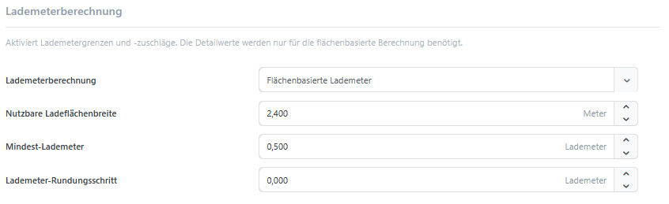

# Einstellungen

In dem Reiter **Einstellungen** in [der Konfiguration](../dimension-pricing.md#konfiguration-und-berechtigungen) werden die zentralen Einstellungen des Plugins **Versandkosten nach Maß** erläutert. Sie bestimmen, welche Maßvorlage standardmäßig angewendet wird, aus welchen Produktdaten die Versandmaße stammen und ob Produktgewichte in die Berechnung einfließen.

Darüber hinaus konfigurieren Sie:

- welche geeigneten Versandmethoden im Checkout angeboten werden,
- wie versandkostenfreie Produkte bei der Gewichtsberechnung behandelt werden,
- nach welcher Regel das Plugin zwischen mehreren geeigneten Versandmethoden auswählt,
- wie Lademeter berechnet, gerundet und mit Mindestwerten versehen werden.

## Versandmethoden

Hier bestimmen Sie, ob Produktgewichte in die Berechnung einfließen und welche geeigneten Versandmethoden im Checkout angeboten werden.

| Option | Beschreibung |
| --- | --- |
| Produktgewicht verwenden | Berücksichtigt das Produktgewicht beim Packen und bei Gewichts- und Volumengewichtsstaffeln. |
| Gewicht der versandkostenfreien Produkte einbeziehen | Versandkostenfreie Produkte erzeugen kein eigenes Packstück. Ihr Gesamtgewicht wird jedoch dem ersten versandpflichtigen Packstück zugeschlagen. |
| Auf konfigurierte Methoden beschränken | Blendet eine Versandmethode aus, wenn keine passende veröffentlichte Versandbedingung gefunden wird. Ist die Einstellung deaktiviert, kann eine [nicht konfigurierte Methode mit einem Preis von `0` angeboten werden](settings.md#wenn-eine-versandmethode-mit-einem-preis-von-0-angeboten-wird). |
| Angebotene Versandmethoden | Legt fest, ob alle geeigneten Versandmethoden, nur die günstigste oder nur die Methode mit der höchsten Priorität angeboten werden. |


**Gewicht der versandkostenfreien Produkte einbeziehen** wird nur angezeigt, wenn **Produktgewicht verwenden** aktiviert ist.


### Auswahl der angebotenen Versandmethoden

Diese Einstellung wird angewendet, nachdem alle geeigneten Versandmethoden berechnet wurden.

| Option | Beschreibung |
| --- | --- |
| Alle geeigneten Versandmethoden | Gibt jede passende Versandmethode zurück. |
| Günstigste geeignete Versandmethode | Gibt nur die Methode mit dem niedrigsten berechneten Preis zurück. Bei Gleichstand entscheidet die Anzeigereihenfolge. |
| Geeignete Versandmethode mit höchster Priorität | Gibt nur die geeignete Methode mit der niedrigsten Anzeigereihenfolge zurück. Bei Gleichstand entscheidet der Preis. |

Alle von diesem Plugin berechneten Methoden nehmen an der Auswahl teil. Wenn beispielsweise **Abholung** nicht mit Liefermethoden konkurrieren soll, darf sie nicht als gleichwertige Methode dieses Plugins konfiguriert werden.

Wenn Sie mehrere Shops betreiben, können Sie über die Shopauswahl oberhalb der Konfiguration festlegen, ob die Einstellungen global oder für einen bestimmten Shop gelten. Weitere Informationen finden Sie unter [Multi-Shop Konfiguration](../../konfiguration/einstellungen/den-einstellungsbereich-festlegen.md).

## Lademeterberechnung

Unter **Lademeterberechnung** stehen drei Optionen zur Verfügung:

| Option | Beschreibung |
| --- | --- |
| Deaktiviert | Grenzen und Zuschläge für Lademeter werden ignoriert. |
| Festzuschlag je Packstück | Die belegte Länge wird gegen [**Max. Lademeter**](package-types-and-sizes.md#verpackungsgröße-anlegen) geprüft. Der in der Versandbedingung hinterlegte [Lademeter-Zuschlag](shipping-conditions.md#zuschläge) wird einmal je Packstück addiert. |
| Flächenbasiert | Berechnet `belegte Länge × belegte Breite ÷ nutzbare Ladeflächenbreite`. Mindestwert und Rundung werden anschließend angewendet. Der Lademeter-Zuschlag gilt als Preis je berechnetem Lademeter. |

Für die flächenbasierte Berechnung konfigurieren Sie zusätzlich:

- **Nutzbare Ladeflächenbreite**: Breite der verfügbaren Ladefläche in der [Standardmaßeinheit](../../konfiguration/gewichte-verpackungseinheiten-abmessungen-verwalten.md).
- **Mindest-Lademeter**: Optionaler Mindestwert je Packstück.
- **Lademeter-Rundungsschritt**: Schritt, auf den je Packstück aufgerundet wird. `0` deaktiviert die Rundung.

Beispiel: Ein Packstück belegt 1,20 m Länge und 0,80 m Breite. Bei 2,40 m nutzbarer Ladeflächenbreite ergeben sich `1,20 × 0,80 ÷ 2,40 = 0,40` Lademeter. Bei einem Mindestwert von `0,50` werden `0,50` Lademeter berechnet.


Die flächenbasierte Berechnung verwendet die rechteckige Grundfläche des gepackten Ergebnisses. Speditionsspezifische Regeln wie Stapelbarkeit, Palettentausch oder Achslast werden nicht automatisch abgeleitet.


## Maße und Maßvorlagen

In diesem Bereich legen Sie fest, welche Maßvorlage automatisch gilt und aus welchen Produktdaten die Versandmaße ermittelt werden.

### Globale Standardmaßvorlage

Mit der **globalen Standardmaßvorlage** legen Sie eine Vorlage fest, die automatisch für Produkte ohne abweichende Produkt- oder Warengruppenvorgabe verwendet wird. Dadurch müssen Sie die Vorlage nicht an jedem Produkt einzeln auswählen.

Wählen Sie **Keine Maßvorlage**, wenn keine globale Vorgabe gelten soll. Maßvorlagen können weiterhin über eine Warengruppe oder direkt am Produkt festgelegt werden.

Wie globale, vererbte und produktspezifische Vorgaben zusammenspielen, erfahren Sie unter [Maßvorlagen zuweisen](dimension-templates.md#maßvorlagen-zuweisen).

Wenn noch keine Maßvorlage vorhanden ist, können Sie über **Maßvorlage anlegen** direkt eine neue Vorlage erstellen.

### Quelle für Breite, Höhe und Länge

Mit **Quelle für Breite, Höhe und Länge** bestimmen Sie, woher die drei für den Versand verwendeten Maße stammen.

| Option | Beschreibung |
| --- | --- |
| Nur reguläre Produktmaße verwenden | Verwendet ausschließlich die Standardfelder des Produkts. |
| Nur Maße aus der Maßvorlage verwenden | Verwendet ausschließlich Maße mit den Systemnamen `Width`, `Height` und `Length`. |
| Zuerst reguläre Produktmaße verwenden | Verwendet für jedes Maß zunächst den regulären Produktwert. Ist dieser `0`, wird der Wert aus der Maßvorlage verwendet. |
| Zuerst Maße aus der Maßvorlage verwenden | Verwendet für jedes Maß zunächst den Wert aus der Maßvorlage. Ist dieser `0`, wird der reguläre Produktwert verwendet. |

Weitere Informationen zum Anlegen eigener Maße finden Sie unter [Maßvorlagen](dimension-templates.md).

## Wenn eine Versandmethode mit einem Preis von 0 angeboten wird

Ist **Auf konfigurierte Methoden beschränken** deaktiviert, kann eine nicht konfigurierte Versandmethode mit einem Preis von `0` angeboten werden. Aktivieren Sie die Einstellung oder legen Sie eine passende veröffentlichte [Versandbedingung](shipping-conditions.md) an.
