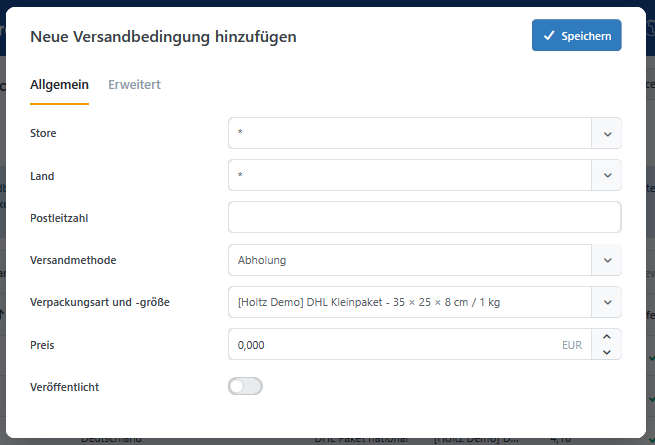
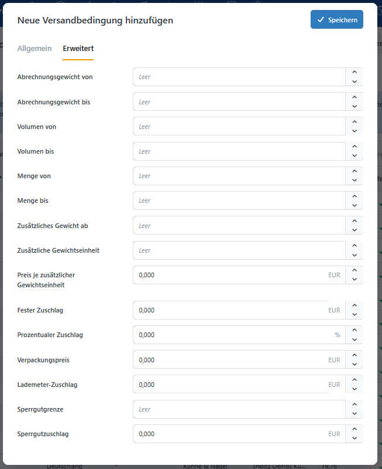

# Versandbedingungen

Eine **Versandbedingung** verbindet eine [Versandmethode](../../konfiguration/versandarten-einrichten.md) und eine [Verpackungsgröße](package-types-and-sizes.md) mit Zielgebiet, Staffelgrenzen, Preis und Zuschlägen.

Öffnen Sie die [Konfiguration des Plugins](../dimension-pricing.md#konfiguration-und-berechtigungen), wechseln Sie zur Registerkarte **Versandbedingungen** und klicken Sie auf **Neue Versandbedingung hinzufügen**.

## Allgemeine Bedingungen

Der Reiter **Allgemein** umfasst den Gültigkeitsbereich, die Verpackungsgröße, den Grundpreis und den Veröffentlichungsstatus. Die allgemeinen Angaben sind in der Übersicht direkt sichtbar.

### Gültigkeitsbereich und Grundpreis

Im Gültigkeitsbereich legen Sie fest, für welche Stores, [Lieferländer](../../konfiguration/lander-und-regionen-verwalten.md), Postleitzahlen und Versandmethoden eine Versandbedingung angewendet werden kann. Zusätzlich wählen Sie die zugehörige Verpackungsart und -größe aus und hinterlegen den Grundpreis je erzeugtem Packstück. Nur veröffentlichte Versandbedingungen werden bei der Berechnung berücksichtigt.

| Option | Beschreibung |
| --- | --- |
| Store | Gilt für einen ausgewählten Store oder mit `*` für alle Stores. |
| Land | Gilt für das Land der Lieferadresse oder mit `*` für alle Länder. |
| Postleitzahl | Gilt für die Postleitzahl der Lieferadresse. |
| Versandmethode | Versandmethode, für die die Versandbedingung gilt; `*` gilt für alle Methoden. |
| Verpackungsart und -größe | Verpackungsgröße, in die der Warenkorb gepackt wird. |
| Preis | Grundpreis je erzeugtem Packstück in der Primärwährung des Stores. |
| Veröffentlicht | Nur veröffentlichte Bedingungen werden bei der Berechnung berücksichtigt. |

Für die Eingabe der Postleitzahl können Sie `*` für beliebig viele und `?` für genau ein beliebiges Zeichen verwenden. Numerische Bereiche können mit einem Bindestrich angegeben und mehrere Muster durch Kommas getrennt werden, z. B. `10*, 12???, 50000-59999`. Ein leeres Feld oder `*` gilt für alle Postleitzahlen.

## Erweiterte Bedingungen

Im Reiter **Erweitert** finden Sie Staffelgrenzen und Zuschläge. In der Übersicht können Sie die erweiterten Werte bei Bedarf über die Spaltenauswahl (Zahnrad-Symbol) einblenden.

### Staffelgrenzen

Mit Staffelgrenzen beschränken Sie eine Versandbedingung auf bestimmte Bereiche für Abrechnungsgewicht, Volumen oder Artikelmenge. Gewichts- und Volumengrenzen beziehen sich jeweils auf ein einzelnes Packstück, während Mengengrenzen für die Gesamtmenge der versandpflichtigen Artikel im Warenkorb gelten.

| Option | Beschreibung |
| --- | --- |
| Abrechnungsgewicht von / bis | Optionaler Bereich für das Abrechnungsgewicht eines einzelnen Packstücks. |
| Volumen von / bis | Optionaler Volumenbereich eines einzelnen Packstücks. |
| Menge von / bis | Optionaler Bereich für die Gesamtmenge der versandpflichtigen Artikel im Warenkorb. |

Alle Unter- und Obergrenzen sind **einschließlich**. Eine Versandbedingung mit `Abrechnungsgewicht bis = 10` gilt auch bei exakt 10 Einheiten der [Standardgewichtseinheit](../../konfiguration/gewichte-verpackungseinheiten-abmessungen-verwalten.md).

### Gewichtsabhängiger Aufpreis

Mit den folgenden Feldern bilden Sie einen Grundpreis mit zusätzlichen Gewichtsschritten ab:

- **Zusätzliches Gewicht ab**: Gewicht, das bereits im Grundpreis enthalten ist.
- **Zusätzliche Gewichtseinheit**: Größe eines weiteren Abrechnungsschritts, beispielsweise `1` kg.
- **Preis je zusätzlicher Gewichtseinheit**: Preis für jeden begonnenen Schritt.

Das folgende Beispiel zeigt, wie sich ein gewichtsabhängiger Aufpreis auf den Versandpreis auswirkt. Sobald das Abrechnungsgewicht eines Packstücks den festgelegten Schwellenwert überschreitet, wird der konfigurierte Aufpreis für jede weitere angefangene Gewichtseinheit berechnet und zum Grundpreis addiert. Die Beispielwerte verdeutlichen die einzelnen Berechnungsschritte und den daraus resultierenden Versandpreis.

> Der Grundpreis enthält 10 kg. Jede weitere angefangene Einheit von 2 kg kostet 3 €. Bei 15 kg werden drei zusätzliche Einheiten berechnet: `Grundpreis + 3 × 3 €`.

### Zuschläge

Zuschläge ergänzen den Grundpreis um weitere Kostenbestandteile. Sie können feste oder prozentuale Zuschläge, Verpackungskosten, Lademeterkosten und Sperrgutzuschläge konfigurieren.

| Option | Beschreibung |
| --- | --- |
| Fester Zuschlag | Fester Betrag je Packstück, zum Beispiel für Maut oder Klimakosten. |
| Prozentualer Zuschlag | Prozentsatz auf die Zwischensumme aus Grundpreis und zusätzlichen Gewichtskosten. |
| Verpackungspreis | Fester Verpackungspreis je Packstück. |
| Lademeter-Zuschlag | Die [Lademeterberechnung](settings.md#lademeterberechnung) **Festzuschlag je Packstück** berechnet einen einmaligen Zuschlag pro Packstück, **Flächenbasiert** den Preis pro Lademeter. |
| Sperrgutgrenze | Grenzwert, ab dem der Sperrgutzuschlag gilt. Ist eine Gurtmaßformel vorhanden, wird deren Ergebnis verwendet, andernfalls die längste belegte Kante. |
| Sperrgutzuschlag | Fester Betrag je Packstück ab einschließlich der Sperrgutgrenze. |

Der Preis eines einzelnen Packstücks wird in dieser Reihenfolge berechnet:

1. Grundpreis
2. Preis für jede begonnene zusätzliche Gewichtseinheit
3. prozentualer Zuschlag auf diese Zwischensumme
4. fester Zuschlag
5. Verpackungspreis
6. Lademeter-Zuschlag
7. gegebenenfalls Sperrgutzuschlag

Benötigt der Warenkorb mehrere Packstücke, wird jedes Packstück einzeln berechnet und die Ergebnisse werden addiert.

## Überlappende Versandbedingungen

Bei der Vorauswahl werden spezifische Treffer gegenüber allgemeinen Treffern bevorzugt:

- konkrete Versandmethode vor `*`,
- konkreter Store vor `*`,
- konkretes Land vor `*`,
- konkretes Postleitzahlenmuster vor leer oder `*`.

Sind mehrere Bedingungen gleich spezifisch und erfüllen dieselben Staffelgrenzen, wird die Bedingung mit dem niedrigsten berechneten Preis verwendet. Eine eigene Reihenfolge für Versandbedingungen ist nicht erforderlich.

Die Anzeigereihenfolge der Verpackungsart bleibt davon unberührt. Sie entscheidet weiterhin, welche geeignete Verpackungsart bevorzugt wird.

## Wenn eine Versandmethode fehlt

Prüfen Sie der Reihe nach:

1. Ist die Versandmethode vorhanden und aktiv?
2. Ist mindestens eine passende Versandbedingung veröffentlicht?
3. Passt sie zu Store, Land und Postleitzahl der Lieferadresse?
4. Ist das Postleitzahlenmuster korrekt?
5. Kann mindestens eine konfigurierte Verpackungsgröße den Warenkorb aufnehmen?
6. Liegen Gewicht, Volumen und Menge innerhalb der konfigurierten Bereiche?

## Wenn eine Staffel oder ein Zuschlag nicht wirkt

Gewichts- und Volumenbereiche gelten für das einzelne Packstück. Mengenbereiche beziehen sich dagegen auf die Gesamtmenge der versandpflichtigen Artikel im Warenkorb.

Prüfen Sie außerdem:

- den Veröffentlichungsstatus der Versandbedingung,
- die Spezifität und der berechneter Preis überlappender Bedingungen,
- die gewählte Methode zur Berechnung der Lademeter,
- die Konfiguration der zusätzlichen Gewichtsschritte.
