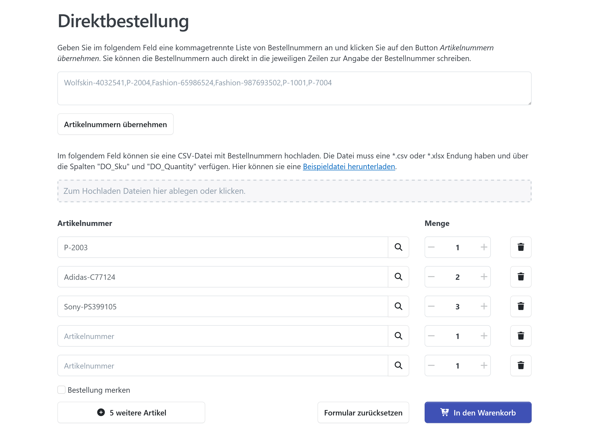
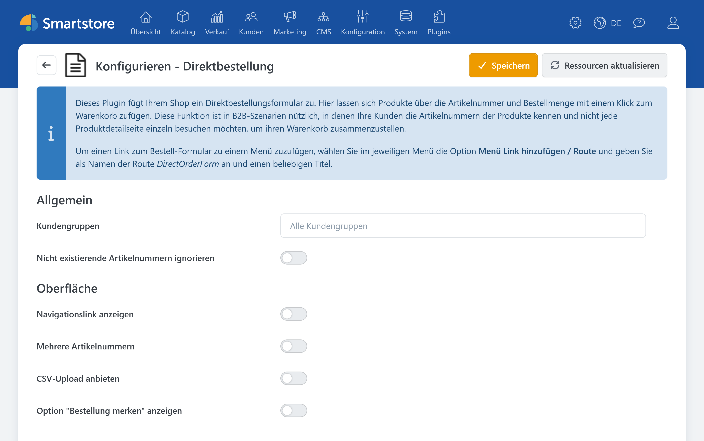

# DirectOrder

> Von der Artikelnummer direkt zum Warenkorb.

DirectOrder ermöglicht die schnelle, SKU-basierte Produkterfassung. Das Plugin richtet sich insbesondere an Geschäftskunden, die Artikelnummern und gewünschte Mengen bereits kennen und deshalb nicht jedes Produkt einzeln über die Produktdetailseite auswählen möchten.

Kunden geben mehrere Artikelnummern mit den jeweiligen Mengen in ein kompaktes Bestellformular ein. DirectOrder prüft die Eingaben und überträgt die gefundenen Produkte anschließend in den regulären Warenkorb. Der weitere Bestellablauf erfolgt wie gewohnt über Warenkorb und Checkout.

## Typische Einsatzgebiete

DirectOrder eignet sich besonders für:

* B2B-Kunden, die regelmäßig dieselben Produkte bestellen
* Bestellungen anhand von Preislisten, Katalogen oder Warenwirtschaftsdaten
* die schnelle Erfassung größerer Bestellmengen
* die gleichzeitige Übernahme mehrerer Artikel in den Warenkorb
* wiederkehrende Bestellzusammenstellungen
* die Übernahme vorbereiteter Bestelllisten aus einer CSV- oder Excel-Datei

Voraussetzung ist, dass die verwendeten Artikelnummern als SKU am jeweiligen Produkt hinterlegt sind. Weitere Informationen zur Pflege und Suche von Artikelnummern finden Sie unter [Produkte erstellen und bearbeiten](../../verwalten/katalog/produkte-verwalten/produkte-erstellen-und-bearbeiten.md).

### Zugriff nach Kundengruppe steuern

Sie können festlegen, welchen Kundengruppen das DirectOrder-Bestellformular angeboten wird. Dadurch lässt sich die Schnellerfassung beispielsweise ausschließlich für Händler, Großkunden oder andere ausgewählte B2B-Kundengruppen freischalten.

Ein Kunde kann mehreren Kundengruppen angehören. Hinweise zum Anlegen und Zuweisen von Gruppen finden Sie unter [Kundengruppen verwalten](../kunden/kundengruppen-verwalten.md).

### Mehrere Produkte gleichzeitig erfassen

Im Bestellformular geben Kunden die SKU und die gewünschte Menge eines Produkts ein. Auf diese Weise lassen sich mehrere Produkte in einem Arbeitsschritt zusammenstellen und anschließend in den Warenkorb übernehmen.

Die SKU entspricht der in den Produktdaten hinterlegten Artikelnummer. Sie sollte innerhalb des Produktkatalogs eindeutig und aktuell sein.

### Bestelllisten hochladen

Wenn der Datei-Upload aktiviert ist, können Kunden eine vorbereitete Bestellliste hochladen. Unterstützt werden die Dateiformate `.csv` und `.xlsx`.

Die Datei muss mindestens folgende Spalten enthalten:

| Spalte | Datentyp | Beschreibung |
| --- | --- | --- |
| `DO_Sku` | Text | Artikelnummer beziehungsweise SKU des Produkts |
| `DO_Quantity` | Zahl | Gewünschte Bestellmenge |

Beispiel:

| DO_Sku | DO_Quantity |
| --- | ---: |
| ART-10001 | 5 |
| ART-10027 | 2 |
| ART-10480 | 10 |

Eine Erklärung und eine Beispieldatei stehen direkt im Bestellformular zum Download bereit.


Der DirectOrder-Upload dient ausschließlich zur Zusammenstellung eines Warenkorbs. Er ist nicht mit dem administrativen Produktimport zu verwechseln. Informationen zum Import von Produkt- und Katalogdaten finden Sie unter [Produkte importieren & exportieren](../../verwalten/katalog/produkte-verwalten/produkte-importieren-exportieren.md).


### Wiederkehrende Bestellungen merken

Mit der Funktion **Meine Bestellung merken** können angemeldete Kunden häufig verwendete Bestellzusammenstellungen speichern und später erneut aufrufen. Dadurch müssen regelmäßig benötigte Artikel nicht bei jeder Bestellung neu eingegeben werden.

Vor dem Abschluss sollten Kunden den erzeugten Warenkorb wie gewohnt auf Produkte, Mengen, Preise und Verfügbarkeit prüfen.

## Konfiguration

Öffnen Sie die Konfiguration des Plugins im Administrationsbereich über **Plugins > Plugins verwalten**. Suchen Sie dort nach DirectOrder und wählen Sie **Konfigurieren**. Allgemeine Informationen zur Pluginverwaltung finden Sie unter [Plugins verwalten](plugins-verwalten.md).

In der DirectOrder-Konfiguration legen Sie insbesondere fest:

* welchen Kundengruppen das Bestellformular zur Verfügung steht
* ob Kunden Bestelllisten als Datei hochladen dürfen
* wie DirectOrder mit unbekannten Artikelnummern umgehen soll

### Kundengruppen auswählen

Wählen Sie die Kundengruppen aus, die das Bestellformular verwenden dürfen. Prüfen Sie anschließend mit einem Testkonto aus einer berechtigten und einer nicht berechtigten Gruppe, ob das Formular wie vorgesehen angezeigt beziehungsweise ausgeblendet wird.

Wenn der Zugriff zusätzlich über allgemeine Rechte gesteuert werden soll, finden Sie weitere Informationen unter [Zugriffsrechte kontrollieren](../konfiguration/zugriffsrechte-kontrollieren.md).

### Navigationslink konfigurieren

DirectOrder kann einen Link zum Bestellformular in der Shopnavigation bereitstellen. Soll der Link an einer anderen Stelle oder in einem eigenen Menü erscheinen, können Sie ihn über den Menü-Builder anlegen.

Verwenden Sie dafür die Route: `DirectOrderForm`. Die Hinweisbox innerhalb der Plugin-Konfiguration enthält weitere Angaben zur Verwendung der Route.

Informationen zum Erstellen von Menüelementen und zum Menütyp **Route** finden Sie unter [Menüs](../content-management/menus.md).

### Verhalten bei unbekannten Artikelnummern

Wenn eine eingegebene Artikelnummer nicht gefunden wird, kann DirectOrder standardmäßig zur Produktsuche weiterleiten. Dadurch erhält der Kunde die Möglichkeit, das gesuchte Produkt über alternative Suchbegriffe zu finden.

Alternativ können unbekannte Artikelnummern ignoriert werden. Diese Einstellung eignet sich beispielsweise für umfangreiche Upload-Dateien, bei denen gültige Positionen trotzdem übernommen werden sollen.

Prüfen Sie vor der Aktivierung dieser Option, ob übergangene Positionen für den Kunden ausreichend erkennbar sind. Andernfalls könnte eine unvollständige Bestellung unbemerkt bleiben.

## Verwendung im Shop

1. Öffnen Sie das DirectOrder-Bestellformular.
2. Geben Sie pro Position die Artikelnummer und die gewünschte Menge ein oder laden Sie eine vorbereitete Bestellliste im Format `.csv` oder `.xlsx` hoch.
3. Prüfen Sie die erkannten Produkte und Mengen.
4. Übernehmen Sie die Positionen in den Warenkorb.
5. Kontrollieren Sie den Warenkorb und setzen Sie den regulären Checkout fort.
6. Speichern Sie die Zusammenstellung bei Bedarf über **Meine Bestellung merken**.

## FAQ

### Wie kann ich den Link zum Bestellformular selbst platzieren?

Legen Sie im Menü-Builder ein Menüelement vom Typ **Route** an und verwenden Sie die Route `DirectOrderForm`. Die Hinweisbox der DirectOrder-Konfiguration enthält die dazugehörige Erklärung.

Weitere Informationen finden Sie unter [Menüs](../content-management/menus.md).

### Was geschieht mit unbekannten Artikelnummern?

Abhängig von der Plugin-Konfiguration wird zur Produktsuche weitergeleitet oder die unbekannte Artikelnummer wird ignoriert. Kontrollieren Sie deshalb nach der Erfassung beziehungsweise nach einem Upload die übernommenen Positionen.

## Weiterführende Dokumentation

* [Plugins verwalten](plugins-verwalten.md)
* [Kundengruppen verwalten](../kunden/kundengruppen-verwalten.md)
* [Zugriffsrechte kontrollieren](../konfiguration/zugriffsrechte-kontrollieren.md)
* [Menüs](../content-management/menus.md)
* [Produkte erstellen und bearbeiten](../../verwalten/katalog/produkte-verwalten/produkte-erstellen-und-bearbeiten.md)
* [Produkte importieren & exportieren](../../verwalten/katalog/produkte-verwalten/produkte-importieren-exportieren.md)
