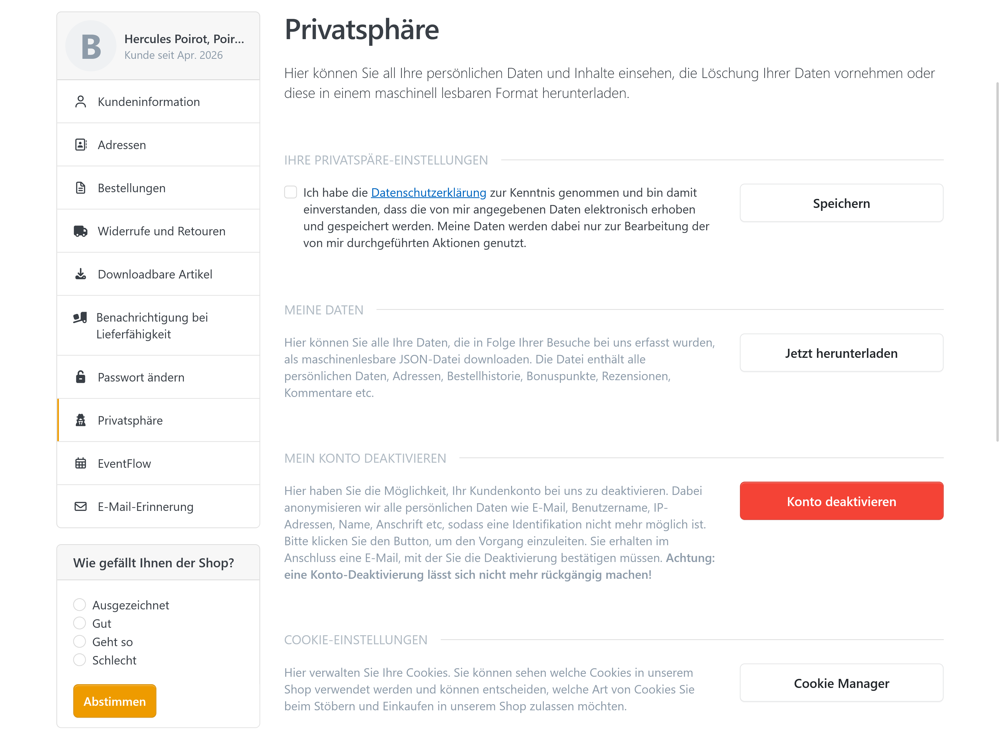
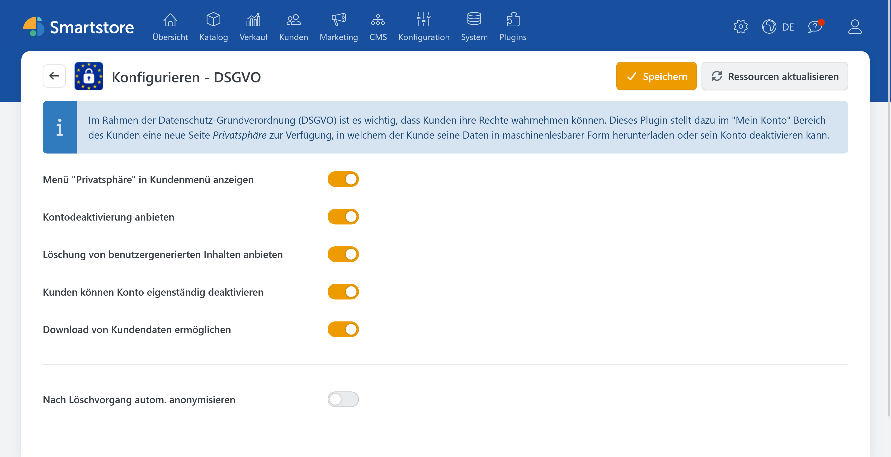

# DSGVO

Seit Smartstore **3.1.5** unterstützt Smartstore die Anforderungen der Datenschutz-Grundverordnung (DSGVO) durch integrierte Funktionen im Shop. Ziel ist es, Kundinnen und Kunden sowie Shopbetreiber dabei zu unterstützen, datenschutzrelevante Prozesse rechtssicher abzubilden und konkrete Rechte der Betroffenen umzusetzen.

Im Rahmen der DSGVO-Funktionalität deckt Smartstore insbesondere folgende Bereiche ab:

* **EU-Cookie-Richtlinie**: Transparente und kontrollierbare Nutzung von Cookies über geeignete Hinweise und Einstellungen.
* **Löschung bzw. Einschränkung von Kundendaten**: Unterstützung von Löschanfragen, die am Ende die Identifizierbarkeit des Kunden reduzieren (z. B. durch Anonymisierung).
* **Anonymisierung von Kundendaten**: Eine Funktion, die Daten so verändert, dass eine direkte Zuordnung zu einer Person nicht mehr möglich ist.
* **Download-Funktionalität für Kundendaten**: Kunden können ihre eigenen Daten einsehen bzw. als Export erhalten (JSON-Format), um ihre Rechte aus der DSGVO wahrnehmen zu können.

Dabei ist besonders wichtig, dass je nach gewählter Einstellung Aktionen entweder:

* direkt im Kundenkonto ausgelöst werden (z. B. Konto deaktivieren),
* eine zusätzliche Bestätigungsstufe erfordern,
* oder eine optionale Backend-Nachverarbeitung starten (z. B. automatische Anonymisierung nach einem Löschvorgang).

Weiterhin wird berücksichtigt, dass Smartstore Kundendatensätze **grundsätzlich nicht vollständig aus der Datenbank entfernt**, sondern als **gelöscht markiert** und anschließend (wenn konfiguriert) anonymisiert werden. So können technische Integrität und nachvollziehbare Abläufe im System gewährleistet werden, während gleichzeitig die Identifizierbarkeit des Datensatzes reduziert wird.

## Konfiguration

| **Eingabefeld / Option**                           | **Beschreibung**                                                                                                                                                                                                                                  |
| -------------------------------------------------- | ------------------------------------------------------------------------------------------------------------------------------------------------------------------------------------------------------------------------------------------------- |
| Menü "Privatsphäre" in Kundenmenü anzeigen         | Bestimmt, ob im "Mein Konto" Kundenmenü ein neues Element "Privatsphäre" angeboten werden soll.                                                                                                                                                   |
| Kontodeaktivierung anbieten                        | Bei der Kontodeaktivierung werden alle Daten anonymisiert, die einen Kunden identifizieren könnten (E-Mail, IP-Adresse, Name, Anschrift etc.)                                                                                                     |
| Löschung von benutzergenerierten Inhalten anbieten | Bei benutzergenerierten Inhalten handelt es sich um Produktrezensionen, Forenbeiträge, News- und Blogkommentare etc. Daten werden lediglich maskiert/pseudonymisiert. Eine tatsächliche Löschung auf Datensatz-Ebene findet zu keiner Zeit statt. |
| Kunden können Konto eigenständig deaktivieren      | Bestimmt, ob ein Kunde sein Konto eigenständig deaktivieren kann oder ob zunächst eine Anforderung an den Shopbetreiber gesendet werden soll. In beiden Fällen ist eine mehrfache Bestätigung durch den Kunden erforderlich.                      |
| Download von Kundendaten ermöglichen               | Bestimmt, ob ein Kunde seine Daten eigenständig im JSON-Format downloaden kann.                                                                                                                                                                   |
| Nach Löschvorgang autom. anonymisieren             | Legt fest, ob nach einem Kunden-Löschvorgang im Backend automatisch anonymisiert werden soll. Bitte bachten Sie: in Smartstore werden Kundendatensätze grundsätzlich nicht aus der Datenbank entfernt, sondern lediglich als gelöscht markiert.   |
