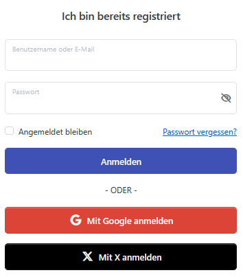
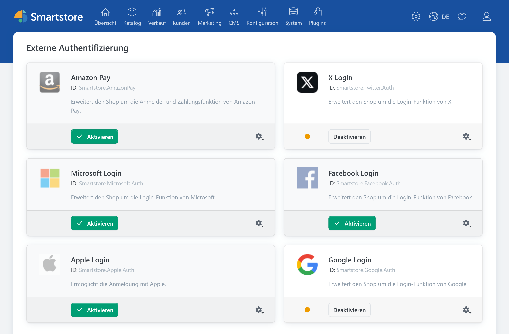
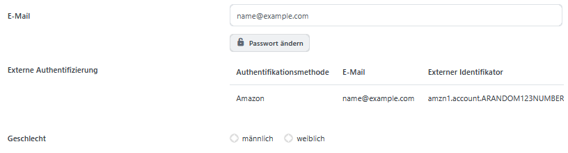

# Externe Authentifizierung einrichten

Mit Plugins für die externe Authentifizierung können sich Kunden über ein bestehendes Konto bei Apple, Google, Facebook, Microsoft oder X in Ihrem Shop anmelden. Nach der Einrichtung erscheint auf der Anmeldeseite eine zusätzliche Schaltfläche, beispielsweise **Mit Google anmelden**.

Die verfügbaren Anbieter verwalten Sie unter **Kunden > Externe Authentifizierungsmethoden**.

## Unterstützte Anbieter

| Anbieter | Benötigte Zugangsdaten | Weiterleitungs-URL |
| --- | --- | --- |
| [Apple](auth/apple-auth.md) | Client-ID, Team-ID, Schlüssel-ID und privater Schlüssel | `https://shop.example.com/signin-apple` |
| [Google](auth/google-auth.md) | Client-ID und Clientschlüssel | `https://shop.example.com/signin-google` |
| [Facebook](auth/facebook-auth.md) | App-ID und App-Geheimcode | `https://shop.example.com/signin-facebook` |
| [Microsoft](auth/microsoft-auth.md) | Anwendungs-ID und geheimer Clientschlüssel | `https://shop.example.com/signin-microsoft` |
| [X](auth/twitter-auth.md) | API Key und Consumer Secret | `https://shop.example.com/signin-twitter` |


Die Domain `shop.example.com` dient nur als Beispiel. Verwenden Sie immer die Weiterleitungs-URL, die Smartstore auf der Konfigurationsseite des jeweiligen Plugins anzeigt.


## Allgemeiner Einrichtungsablauf

Die Einrichtung folgt bei allen Anbietern demselben Grundprinzip:

1. Öffnen Sie **Kunden > Externe Authentifizierungsmethoden**.
2. Klicken Sie beim gewünschten Anbieter auf **Konfigurieren**.
3. Kopieren Sie die von Smartstore angezeigte Weiterleitungs-URL.
4. Richten Sie beim Anbieter eine Anwendung für die externe Anmeldung ein und hinterlegen Sie dort die Weiterleitungs-URL.
5. Übertragen Sie die vom Anbieter erzeugten Zugangsdaten nach Smartstore.
6. Klicken Sie auf **Speichern**.
7. Kehren Sie zur Übersicht der Authentifizierungsmethoden zurück und aktivieren Sie den Anbieter.
8. Testen Sie die Anmeldung im Frontend.


Konfiguration und Aktivierung sind getrennte Schritte. Ein vollständig konfiguriertes Plugin wird erst nach seiner Aktivierung auf der Anmeldeseite angeboten.


## Weiterleitungs-URL verwenden

Die Weiterleitungs-URL, auch Callback-URL oder Redirect-URI genannt, bestimmt, wohin der Anbieter den Kunden nach der Anmeldung zurückleitet. Smartstore berechnet sie aus der Basis-URL des aktuellen Shops.

Übernehmen Sie die angezeigte URL unverändert in die Konfiguration beim Anbieter. Folgende Bestandteile müssen übereinstimmen:

- Protokoll, beispielsweise `https`,
- Domain,
- gegebenenfalls der Port,
- vollständiger Pfad,
- Groß- und Kleinschreibung, sofern der Anbieter diese unterscheidet,
- sowie ein eventuell vorhandener abschließender Schrägstrich.

Nach einem Wechsel der Shopdomain müssen Sie die neue Weiterleitungs-URL auch beim Anbieter hinterlegen.

## Einstellungen für mehrere Shops

Die Konfigurationsseiten unterstützen Multi-Shops, sodass Sie für unterschiedliche Shops eigene Zugangsdaten verwenden können.

Wählen Sie vor dem Speichern den Shop aus, für den die Zugangsdaten gelten sollen. Kontrollieren Sie anschließend, ob die beim Anbieter hinterlegte Weiterleitungs-URL zur Domain dieses Shops gehört.

Weitere Informationen finden Sie unter [Multi-Shop Konfiguration](../konfiguration/einstellungen/den-einstellungsbereich-festlegen.md).

## Zugriffsrechte

Smartstore unterscheidet folgende Zugriffsrechte:

- Authentifizierungsmethoden anzeigen,
- Authentifizierungsmethoden konfigurieren,
- Authentifizierungsmethoden aktivieren oder deaktivieren.

Damit können Mitarbeiter beispielsweise die Konfiguration einsehen, ohne einen Anbieter aktivieren zu dürfen. Die Rechte vergeben Sie unter **Kunden > Kundengruppen** im Reiter **Zugriffsrechte** der jeweiligen Kundengruppe.

Weitere Informationen finden Sie unter [Zugriffsrechte kontrollieren](../konfiguration/zugriffsrechte-kontrollieren.md).

## Verhalten bei der Kundenanmeldung

Nach Auswahl eines Anbieters leitet Smartstore den Kunden zur externen Anmeldung weiter. Nach erfolgreicher Authentifizierung kehrt der Kunde über die beim Anbieter registrierte Weiterleitungs-URL zum Shop zurück.

### Bereits verknüpftes Kundenkonto

Smartstore sucht nach einer vorhandenen Verknüpfung aus:

- Authentifizierungsanbieter,
- und eindeutiger externer Benutzer-ID.

Wird eine passende Verknüpfung gefunden, meldet Smartstore den zugehörigen Kunden an. Anschließend wird der Kunde zur ursprünglich aufgerufenen Shopseite oder zur Startseite weitergeleitet.

### Erste externe Anmeldung

Ist noch keine Verknüpfung vorhanden, beginnt der normale Registrierungsablauf:

1. Smartstore übernimmt Name und E-Mail-Adresse aus den vom Anbieter übermittelten Daten.
2. Smartstore legt ein Kundenkonto an.
3. Die externe Benutzer-ID wird mit dem neuen Kundenkonto verknüpft.
4. Die vorgesehenen Kundengruppen und Registrierungsaktionen werden angewendet.
5. Der unter **Konfiguration > Einstellungen > Kunden-Einstellungen** festgelegte Registrierungstyp bestimmt den weiteren Ablauf.

| Registrierungstyp | Verhalten |
| --- | --- |
| Standard | Das Konto wird aktiviert. Der Kunde erhält die vorgesehene Willkommensnachricht und wird angemeldet. |
| E-Mail-Validierung | Smartstore versendet die Validierungsnachricht. Das Konto muss anschließend über den enthaltenen Link aktiviert werden. |
| Freigabe durch Administrator | Das Konto bleibt inaktiv, bis es von einem Administrator freigegeben wird. |
| Registrierung deaktiviert | Über den externen Anbieter wird kein neues Kundenkonto angelegt. |

Weitere Informationen finden Sie unter [Kunden-Einstellungen](../konfiguration/einstellungen/kunden-einstellungen.md).


Eine identische E-Mail-Adresse führt nicht automatisch zur Verknüpfung mit einem bereits vorhandenen Kundenkonto. Smartstore erkennt bestehende externe Anmeldungen anhand der externen Benutzer-ID. Kunden sollten deshalb vor einer dauerhaften Umstellung über alternative Anmeldemöglichkeiten informiert werden.


## Verknüpfte Anmeldungen anzeigen

Eine bestehende externe Anmeldung wird sowohl im persönlichen Kundenkonto als auch in der Kundenverwaltung angezeigt. Sichtbar sind die Authentifizierungsmethode, die übermittelte E-Mail-Adresse und die externe Kennung.

Weitere Informationen zur Kundendetailansicht finden Sie unter [Kunden verwalten](../kunden/kunden-verwalten.md).

## Anbieter deaktivieren

Wenn Sie einen Anbieter deaktivieren:

- verschwindet seine Schaltfläche von der Anmeldeseite,
- können Kunden die betreffende externe Anmeldung nicht mehr verwenden,
- bleiben vorhandene Verknüpfungen zu Kundenkonten gespeichert.

Nach einer späteren Reaktivierung können vorhandene Verknüpfungen wieder verwendet werden.


Stellen Sie vor einer dauerhaften Deaktivierung sicher, dass betroffene Kunden eine andere Möglichkeit zur Anmeldung besitzen.


## Fehlerbehebung

### Die Anmeldeschaltfläche erscheint nicht

Prüfen Sie, ob:

- die Authentifizierungsmethode aktiviert wurde,
- alle erforderlichen Zugangsdaten gespeichert sind,
- die Einstellungen für den richtigen Shop-Geltungsbereich gelten,
- und die Zugangsdaten technisch verarbeitet werden konnten.

Bei Apple kann insbesondere ein ungültiger privater Schlüssel verhindern, dass die Schaltfläche erscheint.

### Nach der Anmeldung tritt ein Fehler auf

Vergleichen Sie die in Smartstore angezeigte Weiterleitungs-URL mit der beim Anbieter gespeicherten URL. Beide Werte müssen vollständig übereinstimmen.

### Die Anmeldung funktioniert seit einem Domainwechsel nicht mehr

Öffnen Sie die Konfiguration des Plugins und kopieren Sie die neu berechnete Weiterleitungs-URL. Ersetzen beziehungsweise ergänzen Sie anschließend die bisherige URL beim Anbieter.

### Es wird kein neues Kundenkonto angelegt

Prüfen Sie den Registrierungstyp unter **Konfiguration > Einstellungen > Kunden-Einstellungen**. Außerdem muss der Anbieter die für die Registrierung benötigten Kontodaten, insbesondere eine verwendbare E-Mail-Adresse, übermitteln.

### Ein Bestandskunde kann sich nicht über den Anbieter anmelden

Eine bereits im Shop verwendete E-Mail-Adresse stellt noch keine externe Kontoverknüpfung her. Eine bestehende Verknüpfung wird über die externe Benutzer-ID erkannt.

### Weitere technische Informationen ermitteln

Smartstore protokolliert technische Anbieterfehler im Ereignisprotokoll. Der Kunde erhält im Frontend lediglich eine allgemeine Fehlermeldung.

Weitere Informationen finden Sie unter [Den Log der Ereignisse analysieren](../system-wartung/den-log-der-ereignisse-analysieren.md).