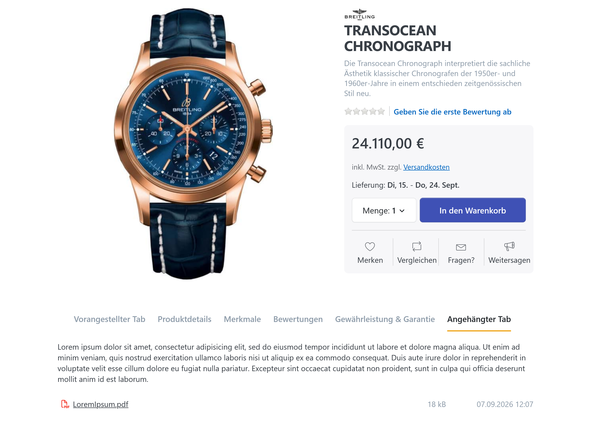
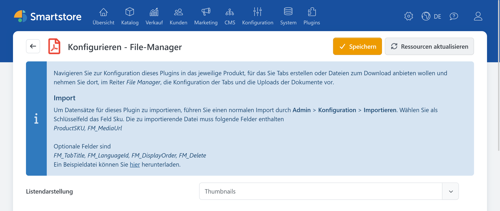
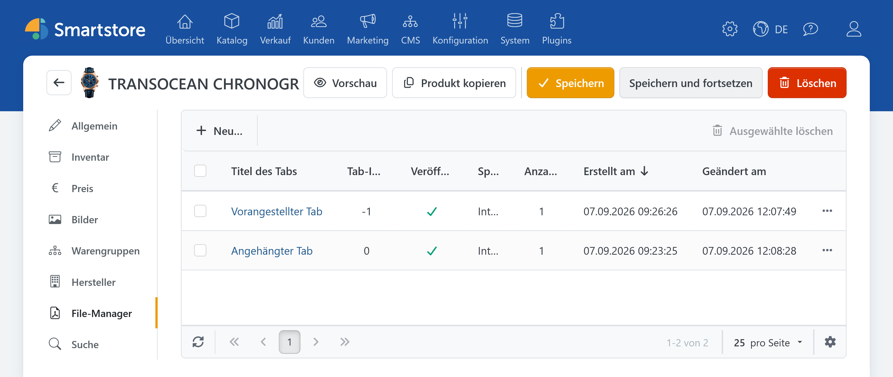
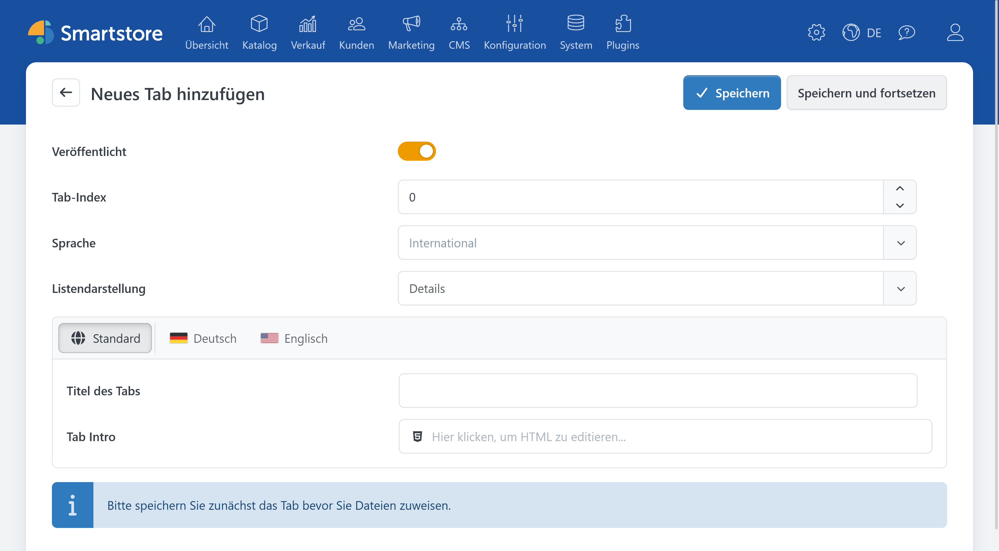
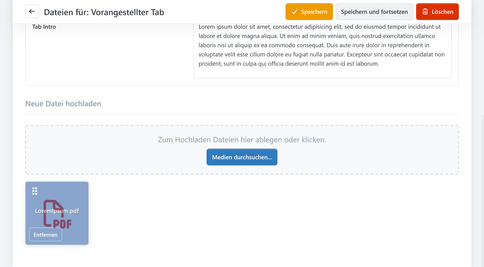
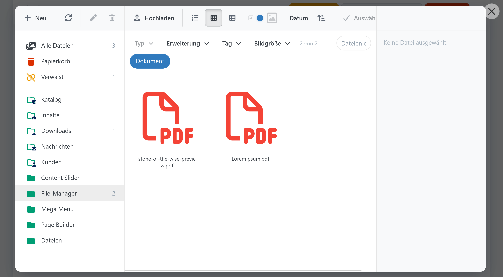
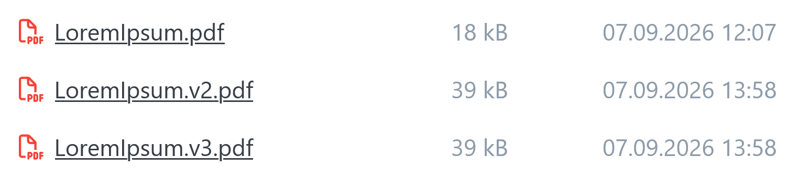
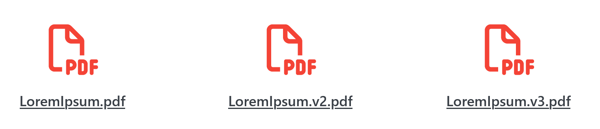
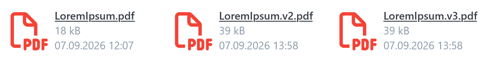

# File Manager

> Eigene Tabs auf der Produktdetailseite

Mit dem **File Manager** können Sie Produkten Dokumente wie Bedienungsanleitungen, Datenblätter, Zertifikate oder Broschüren zuordnen. Die Dokumente erscheinen im Shop in zusätzlichen Tabs auf der Produktdetailseite.

Typische Anwendungsfälle sind:

- Bedienungs- und Montageanleitungen
- technische Datenblätter
- Sicherheitsinformationen
- Zertifikate und Prüfberichte
- Produktbroschüren
- Preislisten
- Treiber und Software-Downloads


Der File Manager stellt ergänzende Dokumente auf der Produktdetailseite bereit. Wenn Sie stattdessen eine Datei als gekauftes digitales Produkt ausliefern möchten, verwenden Sie die Download-Funktionen des Produkts. Weitere Informationen finden Sie unter [Mit digitalen Produkten umgehen (ESD)](../../verwalten/katalog/produkte-verwalten/mit-digitalen-produkten-umgehen-esd.md).


## File Manager konfigurieren

Öffnen Sie im Administrationsbereich **Plugins > Plugins verwalten**. Suchen Sie nach **File Manager** und wählen Sie **Konfigurieren**.

Auf der Konfigurationsseite legen Sie die standardmäßige [Darstellung der Dokumentlisten](#darstellung-im-shop-kontrollieren) fest. Zur Auswahl stehen:

| Darstellung | Beschreibung |
| --- | --- |
| **Details** | Kompakte Listenansicht mit Dateiname, Dateigröße und Änderungsdatum |
| **Thumbnails** | Vorschauorientierte Darstellung, in der Dateigröße und Änderungsdatum ausgeblendet werden |
| **Kacheln** | Kacheldarstellung mit Datei-Icon und zusätzlichen Dateiinformationen |

Diese Einstellung dient als Standardwert. Die Darstellung kann später für jeden Dokument-Tab individuell festgelegt werden.


Die Konfigurationsseite enthält außerdem eine Beispieldatei für den Import von Dokumentzuordnungen. Der Import wird im Abschnitt [Dokumente importieren](#dokumente-importieren) beschrieben.


## File Manager am Produkt öffnen

Die eigentliche Zuordnung der Dokumente erfolgt direkt am Produkt.

1. Öffnen Sie **Katalog > Produktverwaltung**.
2. Wählen Sie das gewünschte Produkt.
3. Öffnen Sie in der Produktbearbeitung die Registerkarte **File-Manager**.

In der Übersicht werden die bereits angelegten Dokument-Tabs des Produkts angezeigt. Dazu gehören unter anderem:

- Titel
- Tab-Index
- Veröffentlichungsstatus
- Sprache
- Anzahl der zugeordneten Dateien
- Erstellungsdatum
- letztes Änderungsdatum

Abhängig von Ihren Zugriffsrechten können Sie neue Tabs erstellen, bestehende Tabs bearbeiten oder mehrere ausgewählte Tabs löschen. Weitere Informationen finden Sie unter [Zugriffsrechte kontrollieren](#berechtigungen).

## Dokument-Tab anlegen

Klicken Sie in der File-Manager-Registerkarte auf **Neues Tab hinzufügen**.

Legen Sie anschließend die Eigenschaften des Tabs fest.

### Veröffentlicht

Aktivieren Sie **Veröffentlicht**, damit der Tab auf der Produktdetailseite angezeigt wird.

Sie können einen Tab zunächst unveröffentlicht speichern, die Texte und Dokumente vorbereiten und ihn erst nach einer Kontrolle freischalten.

### Tab-Index

Der Tab-Index bestimmt die Position und Reihenfolge der File-Manager-Tabs. Ein negativer Tab-Index positioniert den Tab vor den regulären Produkt-Tabs. Tabs mit einem Index ab `0` werden hinter den regulären Produkt-Tabs eingefügt. Tabs mit einem niedrigeren Index werden vor Tabs mit einem höheren Index angeordnet.

Verwenden Sie beispielsweise eine Staffelung wie `10`, `20` und `30`. Dadurch können Sie später weitere Tabs zwischen bestehenden Tabs einordnen.

### Sprache

Ein Dokument-Tab kann entweder international oder für eine bestimmte Sprache angelegt werden.

- **International:** Der Tab kann in allen Shop-Sprachen angezeigt werden.
- **Bestimmte Sprache:** Der Tab erscheint nur, wenn der Besucher diese Sprache verwendet.

Im Frontend berücksichtigt Smartstore sowohl internationale Tabs als auch Tabs der aktuell ausgewählten Sprache.

### Titel

Der Titel erscheint als Beschriftung des Tabs auf der Produktdetailseite.

Verwenden Sie möglichst kurze und eindeutige Bezeichnungen, beispielsweise:

- Dokumente
- Bedienungsanleitungen
- Technische Datenblätter
- Zertifikate
- Downloads

### Einleitung

In der optionalen Einleitung können Sie oberhalb der Dokumentliste zusätzliche Informationen bereitstellen. Dafür steht ein HTML-Editor zur Verfügung.

Die Einleitung eignet sich beispielsweise für:

- Hinweise zur Verwendung der Dokumente
- Versions- oder Gültigkeitshinweise
- Sicherheitshinweise
- Verweise auf weitere Informationsseiten
- Kontaktdaten für Rückfragen

Informationen zur Bedienung des Editors finden Sie unter [HTML-Inhalte bearbeiten](../allgemeine-konzepte/html-inhalte-bearbeiten.md).

### Darstellung

Wählen Sie aus, wie die Dokumente innerhalb dieses Tabs angezeigt werden sollen:

- Details
- Thumbnails
- Kacheln

Die Einstellung gilt nur für den aktuellen Tab. Dadurch können Sie beispielsweise technische Dokumente als Detailansicht und Broschüren als Thumbnailübersicht darstellen.

## Sprachen und Übersetzungen verwenden

Die Sprachauswahl des Tabs und die Übersetzung seiner Texte erfüllen unterschiedliche Aufgaben:

1. Die **Sprache des Tabs** legt fest, in welcher Shop-Sprache der gesamte Tab angezeigt wird.
2. Der **lokalisierte Editor** ermöglicht Übersetzungen von Titel und Einleitung.

### Gleiche Dokumente in allen Sprachen

Wenn dieselben Dateien in allen Shop-Sprachen verwendet werden sollen:

1. Legen Sie einen internationalen Tab an.
2. Übersetzen Sie Titel und Einleitung über den lokalisierten Editor.
3. Ordnen Sie die gemeinsamen Dokumente diesem Tab zu.

### Unterschiedliche Dokumente je Sprache

Wenn Sie beispielsweise getrennte deutsch- und englischsprachige Anleitungen anbieten:

1. Legen Sie für jede Sprache einen eigenen Tab an.
2. Wählen Sie am jeweiligen Tab die zugehörige Sprache.
3. Ordnen Sie jedem Tab nur die Dokumente dieser Sprache zu.


Ein internationaler und ein sprachabhängiger Tab können gleichzeitig angezeigt werden. Prüfen Sie deshalb, ob sich Titel oder Dokumente ungewollt überschneiden.


Weitere Informationen zur Einrichtung von Sprachen und zum lokalisierten Editor finden Sie unter [Mit mehreren Sprachen arbeiten](../allgemeine-konzepte/mit-mehreren-sprachen-arbeiten.md).

## Dokumente zuordnen

Speichern Sie einen neuen Dokument-Tab zunächst. Erst danach können Sie ihm Dateien zuordnen.

Anschließend können Sie:

- neue Dokumente hochladen,
- vorhandene Dokumente aus dem Medien-Manager auswählen,
- mehrere Dokumente gleichzeitig zuordnen,
- die Reihenfolge der Dokumente ändern,
- einzelne Dokumentzuordnungen entfernen.

Die Medienauswahl ist auf den Medientyp **Dokument** beschränkt. Weitere Informationen dazu finden Sie unter [Medien-Einstellungen](../konfiguration/einstellungen/medien-einstellungen.md).

Eine Mediendatei kann demselben Tab nicht mehrfach zugeordnet werden.

### Vorhandene Dokumente auswählen

Öffnen Sie die Medienauswahl und wählen Sie die gewünschten Dateien aus. Bestätigen Sie die Auswahl anschließend mit **Auswählen**.

Ausführliche Informationen zur Dateiauswahl und Medienverwaltung finden Sie unter:

- [Medien-Manager](mediamanager.md)
- [Dateien und Ordner verwalten](mediamanager/files-and-folders.md)

### Dokumente sortieren

Bringen Sie die zugeordneten Dokumente in die gewünschte Reihenfolge. Diese Reihenfolge wird auch auf der Produktdetailseite verwendet.

Verwenden Sie eindeutige Dateinamen, damit Kunden Inhalt, Sprache und Version eines Dokuments erkennen können, beispielsweise:

- `Bedienungsanleitung-Modell-A-DE.pdf`
- `User-Manual-Model-A-EN.pdf`
- `Datenblatt-Modell-A-2026-08.pdf`
- `EU-Konformitaetserklaerung-Modell-A.pdf`

### Zuordnung entfernen

Wenn Sie ein Dokument aus einem Tab entfernen, wird dessen Zuordnung zu diesem Tab gelöscht. Die eigentliche Mediendatei kann weiterhin im Medien-Manager vorhanden und an anderen Stellen in Verwendung sein.

Möchten Sie die Mediendatei vollständig löschen, prüfen Sie zuvor ihre Verwendungen im Medien-Manager. Hinweise zum Papierkorb und zu verwaisten Dateien finden Sie unter [Medienbestand bereinigen](mediamanager/cleanup.md).


Löschen Sie eine verwendete Mediendatei nicht unbedacht direkt im Medien-Manager. Sie könnte weiteren Produkten, Seiten oder anderen Shop-Inhalten zugeordnet sein.


## Darstellung im Shop kontrollieren

Speichern Sie den Tab und öffnen Sie die Produktdetailseite im Shop.

Ein File-Manager-Tab wird nur angezeigt, wenn die erforderlichen Bedingungen erfüllt sind:

- Der Tab ist veröffentlicht.
- Die Sprache des Tabs passt zur aktuellen Shop-Sprache oder der Tab ist international.
- Der Besucher besitzt die erforderliche [Anzeigeberechtigung](#berechtigungen).
- Der Tab enthält mindestens ein Dokument oder eine Einleitung.

Vollständig leere Tabs werden nicht angezeigt.

| Darstellung | Vorschau |
| --- | --- |
| **Details** |  |
| **Thumbnails** |  |
| **Kacheln** |  |

Je nach gewählter Darstellung werden unter anderem folgende Informationen angezeigt:

- Datei-Icon
- Dateiname
- Dateigröße
- letztes Änderungsdatum

Beim Anklicken öffnet sich das Dokument in einem neuen Browser-Tab. Ob der Browser die Datei unmittelbar darstellt oder einen Download anbietet, hängt vom Dateityp und von den Browser-Einstellungen des Besuchers ab.


Das Änderungsdatum wird auf kleinen Bildschirmen gegebenenfalls ausgeblendet, damit mehr Platz für den Dateinamen bleibt.


## Mehrere Dokument-Tabs verwenden

Einem Produkt können mehrere File-Manager-Tabs zugeordnet werden. Das ist hilfreich, wenn Sie viele Dokumente nach Thema oder Sprache gliedern möchten.

| Tab | Sprache | Tab-Index | Inhalt |
| --- | --- | ---: | --- |
| Bedienungsanleitungen | International | 10 | allgemein gültige Anleitungen |
| Datenblätter | International | 20 | technische Spezifikationen |
| Zertifikate | International | 30 | Prüfberichte und Zertifikate |
| Downloads | Deutsch | 40 | deutschsprachige Zusatzdateien |
| Downloads | Englisch | 40 | englischsprachige Zusatzdateien |

Verwenden Sie nicht unnötig viele Tabs. Für wenige Dateien ist ein gemeinsamer Tab meist übersichtlicher.

## Dokumente importieren

File-Manager-Zuordnungen können über den regulären Produktimport verarbeitet werden. Das eignet sich insbesondere, wenn Sie Dokumente für viele Produkte bereitstellen möchten.

Die Import-Grundlagen finden Sie unter:

- [Produkte importieren & exportieren](../../verwalten/katalog/produkte-verwalten/produkte-importieren-exportieren.md)
- [Importprofile verwalten](../datenaustausch/import/importprofile-verwalten.md)

### Importfelder

| Feld | Erforderlich | Beschreibung |
| --- | ---: | --- |
| `ProductSKU` | Ja | SKU des Produkts, dem das Dokument zugeordnet wird |
| `FM_MediaUrl` | Ja | URL oder Importpfad des Dokuments |
| `FM_TabTitle` | Nein | Titel des Ziel-Tabs |
| `FM_LanguageId` | Nein | ID der Sprache des Tabs |
| `FM_DisplayOrder` | Nein | Position des Dokuments innerhalb des Tabs |

Wenn noch kein passender Tab vorhanden ist, kann der Import automatisch einen veröffentlichten Tab anlegen. Ohne Angabe eines Tabtitels wird dabei **Dokumente** als Titel verwendet.

Kontrollieren Sie insbesondere Importe mit:

- fehlendem `FM_TabTitle`,
- identischen Dateinamen in mehreren Tabs,
- unterschiedlichen Sprach-IDs,
- bereits vorhandenen Dokumentzuordnungen,
- Dokumenten mit nicht erlaubten Dateiendungen.

Die erlaubten Dokument-Dateiendungen und die maximale Uploadgröße werden über die [Medien-Einstellungen](../konfiguration/einstellungen/medien-einstellungen.md) gesteuert.

## Berechtigungen

Der File Manager besitzt getrennte Berechtigungen für verschiedene Aktionen:

- File-Manager-Daten anzeigen
- Tabs erstellen
- Tabs bearbeiten
- Tabs löschen
- Dokument-Tabs im Frontend anzeigen

Dadurch können Sie beispielsweise Mitarbeitern lesenden Zugriff geben, ohne ihnen das Erstellen oder Löschen von Tabs zu erlauben.

Frontend-Berechtigungen können außerdem beeinflussen, welche Kundengruppen die Dokument-Tabs sehen. Prüfen Sie die Rechte unter **Kunden > Kundengruppen** im Reiter **Zugriffsrechte** der Kundengruppe, wenn ein veröffentlichter Tab nur bei bestimmten Benutzern fehlt.

Weitere Informationen finden Sie unter [Zugriffsrechte kontrollieren](../konfiguration/zugriffsrechte-kontrollieren.md).

## Tabs und Dokumente löschen

Unterscheiden Sie zwischen folgenden Aktionen:

| Aktion | Wirkung |
| --- | --- |
| **Dokumentzuordnung entfernen** | Das Dokument wird nicht mehr in diesem Tab angezeigt. |
| **Tab löschen** | Der Tab und seine Dokumentzuordnungen werden entfernt. |
| **Produkt dauerhaft löschen** | Die zum Produkt gehörenden File-Manager-Datensätze werden bereinigt. |
| **Mediendatei löschen** | Die eigentliche Datei wird über den Medien-Manager gelöscht. Andere Verwendungen können betroffen sein. |

Wenn Sie einen Tab nur vorübergehend ausblenden möchten, deaktivieren Sie **Veröffentlicht**, statt ihn zu löschen.

## Fehlerbehebung

### Ein Dokument kann nicht hochgeladen werden

Prüfen Sie:

- Ist die Dateiendung unter **Konfiguration > Einstellungen > Medien** dem Medientyp **Dokument** zugeordnet?
- Überschreitet die Datei die dort festgelegte maximale Upload-Dateigröße?
- Besitzt der Administrator die erforderlichen [Medien-Berechtigungen](#berechtigungen)?

Weitere Informationen finden Sie unter [Medien-Einstellungen](../konfiguration/einstellungen/medien-einstellungen.md) und [Probleme mit dem Medien-Manager lösen](mediamanager/troubleshooting.md).

## Weiterführende Dokumentation

- [Produkte importieren & exportieren](../../verwalten/katalog/produkte-verwalten/produkte-importieren-exportieren.md)
- [Importprofile verwalten](../datenaustausch/import/importprofile-verwalten.md)
- [Medien-Manager](mediamanager.md)
- [Dateien und Ordner verwalten](mediamanager/files-and-folders.md)
- [Medienbestand bereinigen](mediamanager/cleanup.md)
- [Medien-Einstellungen](../konfiguration/einstellungen/medien-einstellungen.md)
- [Mit mehreren Sprachen arbeiten](../allgemeine-konzepte/mit-mehreren-sprachen-arbeiten.md)
- [HTML-Inhalte bearbeiten](../allgemeine-konzepte/html-inhalte-bearbeiten.md)
- [Zugriffsrechte kontrollieren](../konfiguration/zugriffsrechte-kontrollieren.md)
