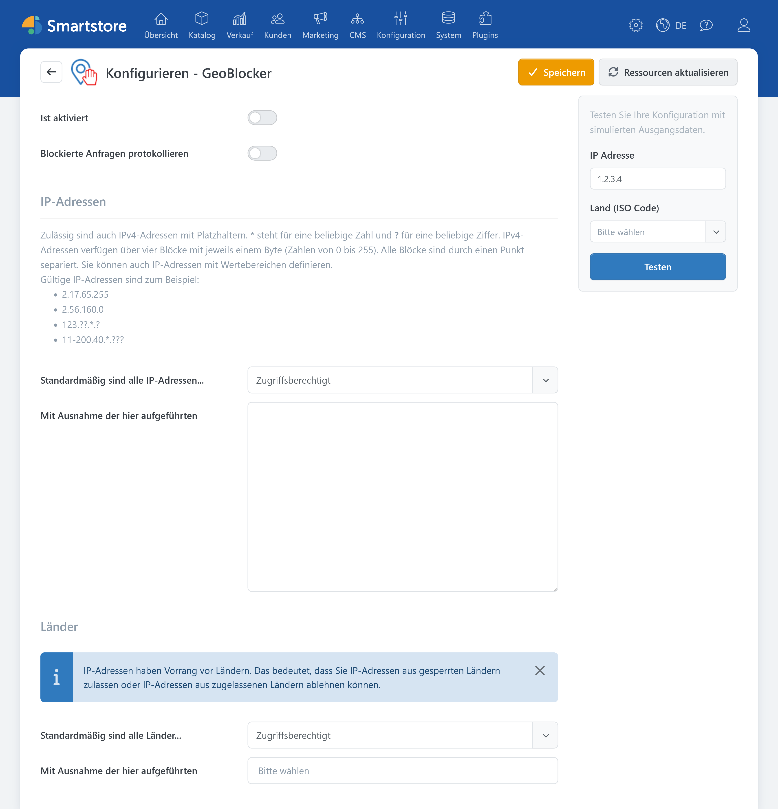
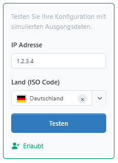
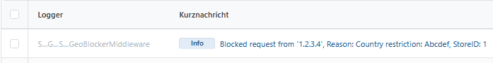

# GeoBlocker

> Blockieren mit Präzision

Mit dem **GeoBlocker** beschränken Sie den Zugriff auf Ihren Shop anhand von IP-Adressen und Herkunftsländern. Sie können beispielsweise einzelne Adressen sperren, nur festgelegte IP-Bereiche zulassen oder Zugriffe aus ausgewählten Ländern blockieren.

Wird eine Anfrage abgewiesen, antwortet Smartstore mit dem HTTP-Statuscode **403 Forbidden**. Das Plugin stellt keine eigene Sperrseite bereit.

## Einsatzmöglichkeiten

Der GeoBlocker eignet sich unter anderem für folgende Aufgaben:

- bekannte einzelne IP-Adressen sperren,
- bestimmte IPv4-Adressbereiche blockieren,
- unerwünschte automatisierte Zugriffe aus bekannten IP-Adressen oder Herkunftsregionen reduzieren,
- Schutzmaßnahmen gegen Bots, Scraper und missbräuchliche Anfragen ergänzen,
- Zugriffe aus ausgewählten Ländern einschränken,
- nur Besucher aus bestimmten Ländern zulassen,
- einen Shop nur aus festgelegten Netzwerken erreichbar machen.


Ländersperren beruhen auf der geografischen Zuordnung von IP-Adressen. Diese Zuordnung ist nicht in jedem Fall eindeutig oder vollständig. Der GeoBlocker ist daher eine ergänzende Schutzmaßnahme und ersetzt keine Firewall, Web Application Firewall oder sichere Konfiguration des Administrationsbereichs.


## GeoBlocker öffnen

Öffnen Sie die Konfiguration im Administrationsbereich unter **Plugins > GeoBlocker**.



In einer Multi-Shop-Installation können die Einstellungen für einzelne Shops überschrieben werden. Wählen Sie dazu zunächst im oberen Bereich der Seite den gewünschten Shop aus.

Weitere Informationen finden Sie unter [Multi-Shop-Konfiguration](../konfiguration/einstellungen/den-einstellungsbereich-festlegen.md) und [Mit mehreren Shops arbeiten](../allgemeine-konzepte/mit-mehreren-shops-arbeiten.md).

## Allgemeine Einstellungen

| Einstellung | Beschreibung |
|---|---|
| **Ist aktiviert** | Schaltet die Zugriffsprüfung ein oder aus. |
| **Blockierte Anfragen protokollieren** | Schreibt blockierte Anfragen als Information in das Ereignisprotokoll. |


Die Anzahl der Protokolleinträge ist technisch begrenzt. Bei sehr vielen blockierten Anfragen muss deshalb nicht jede einzelne Anfrage im Ereignisprotokoll erscheinen.


## Zugriffe über IP-Adressen steuern

Im Bereich **IP-Adressen** legen Sie fest, wie IPv4-Adressen behandelt werden.

### Betriebsart auswählen

Die Einstellung **Standardmäßig sind alle IP-Adressen...** bietet zwei Auswahlmöglichkeiten:

| Auswahl | Verhalten |
|---|---|
| **Zugriffsberechtigt** | Grundsätzlich dürfen alle IP-Adressen zugreifen.<br>Die eingetragenen Adressen und Muster werden gesperrt (Sperrliste). |
| **Vom Zugriff ausgeschlossen** | Grundsätzlich werden alle IP-Adressen gesperrt.<br>Nur Adressen, die mit einem eingetragenen Muster übereinstimmen, dürfen die IP-Prüfung passieren (Positivliste). |


Bei einer Positivliste kann eine fehlerhafte Regel auch Ihren eigenen Zugriff auf den Administrationsbereich sperren. Tragen Sie Ihre öffentliche IP-Adresse ein und testen Sie die Konfiguration, bevor Sie den GeoBlocker aktivieren.


### IP-Regeln eingeben

Geben Sie im Feld **Mit Ausnahme der hier aufgeführten** eine Regel pro Zeile ein. Unterstützt werden vollständige IPv4-Adressen, Platzhalter (`*`, `?`) und numerische Wertebereiche.

Beispiele:

```text
2.17.65.255
2.56.160.0
123.??.*.?
11-200.40.*.???
```

Die Platzhalter haben folgende Bedeutung:

| Schreibweise | Bedeutung |
|---|---|
| `*` | Beliebige Ziffernfolge innerhalb des Musters |
| `?` | Genau eine beliebige Ziffer |
| `11-200` | Numerischer Bereich einschließlich der angegebenen Grenzwerte |

IPv4-Adressen bestehen aus vier durch Punkte getrennten Zahlenblöcken. Jeder vollständig angegebene Block muss einen Wert zwischen `0` und `255` enthalten.

Ungültige Zeilen verhindern das Speichern. Die Fehlermeldung zeigt die Nummer und den Inhalt der betroffenen Zeile an. Bleibt die Liste leer, erzeugt Smartstore keine IP-Regel. Die Auswahl **Vom Zugriff ausgeschlossen** allein sperrt daher noch keine Besucher.


Als IP-Regeln werden ausschließlich IPv4-Adressen und die beschriebenen IPv4-Muster unterstützt. IPv6-Adressen können in diesem Bereich nicht konfiguriert werden.


## Zugriffe über Länder steuern

Im Bereich **Länder** legen Sie fest, wie das ermittelte Herkunftsland eines Besuchers behandelt wird.

Die Länderzuordnung erfolgt anhand der IP-Adresse des Besuchers. Der GeoBlocker verwendet dafür die im System vorhandene IP-Geodatenbank.

### Betriebsart auswählen

Die Einstellung **Standardmäßig sind alle Länder...** bietet ebenfalls zwei Möglichkeiten:

| Auswahl | Verhalten |
|---|---|
| **Zugriffsberechtigt** | Grundsätzlich dürfen Besucher aus allen Ländern zugreifen. Die ausgewählten Länder werden gesperrt. |
| **Vom Zugriff ausgeschlossen** | Grundsätzlich werden alle erkannten Länder gesperrt. Nur die ausgewählten Länder dürfen die Länderprüfung passieren. |

Wählen Sie anschließend unter **Mit Ausnahme der hier aufgeführten** die Länder aus, die von der Standardregel abweichen sollen. Bleibt die Länderliste leer, erzeugt Smartstore keine Länderregel. Die gewählte Betriebsart allein bewirkt dann keine Sperre.

Weitere Informationen zu den in Smartstore vorhandenen Ländern finden Sie unter [Länder und Regionen verwalten](../konfiguration/lander-und-regionen-verwalten.md).

### Nicht erkannte Länder

Kann Smartstore für eine IP-Adresse kein Land bestimmen, löst die Länderregel keine Sperre aus. Das gilt auch, wenn standardmäßig alle Länder vom Zugriff ausgeschlossen sind.

Berücksichtigen Sie deshalb, dass eine Länder-Positivliste keine vollständige Zugriffskontrolle für unbekannte oder nicht eindeutig zuordenbare IP-Adressen darstellt.

## Konfiguration testen

Auf der rechten Seite der Konfigurationsseite befindet sich der Bereich **Testen**. Damit simulieren Sie die Auswertung der gespeicherten Regeln.

Geben Sie folgende Daten an:

- **IP Adresse**
- optional ein **Land (ISO Code)**
- bei mehreren Shops den zu prüfenden **Shop**

Wenn Sie kein Land auswählen, versucht Smartstore, das Land aus der eingegebenen IP-Adresse zu ermitteln.

Klicken Sie anschließend auf **Testen**. Das Ergebnis wird als **Erlaubt** oder **Blockiert** angezeigt. Bei einer Sperre erscheint zusätzlich der von der Regel ermittelte Sperrgrund.




Speichern Sie geänderte Einstellungen, bevor Sie den Test ausführen. Der Test verwendet die bereits gespeicherten Regeln und berücksichtigt keine noch nicht gespeicherten Formulareingaben.


Der Test simuliert ausschließlich die IP- und Länderregeln. Folgende Bedingungen der tatsächlichen Anfrageverarbeitung werden dabei nicht geprüft:

- ob **Ist aktiviert** eingeschaltet ist,
- ob es sich um eine lokale Anfrage handelt.

Der Test kann deshalb **Blockiert** anzeigen, obwohl eine reale Anfrage aufgrund einer dieser Bedingungen nicht gesperrt würde.

## GeoBlocker sicher aktivieren

Gehen Sie bei einer neuen Konfiguration möglichst schrittweise vor:

1. Lassen Sie **Ist aktiviert** zunächst ausgeschaltet.
2. Wählen Sie in einer Multi-Shop-Installation den richtigen Shop aus.
3. Legen Sie die gewünschte IP- und Länderbetriebsart fest.
4. Tragen Sie die benötigten IP-Adressen, Muster und Länder ein.
5. Klicken Sie auf **Speichern**.
6. Testen Sie mehrere erlaubte und gesperrte Kombinationen.
7. Prüfen Sie insbesondere Ihre eigene öffentliche IP-Adresse.
8. Aktivieren Sie **Blockierte Anfragen protokollieren**.
9. Schalten Sie **Ist aktiviert** ein und speichern Sie erneut.
10. Kontrollieren Sie den Zugriff von einem zweiten Netzwerk oder Gerät.


Für Administratoren, registrierte Kunden oder den Administrationsbereich besteht keine automatische Ausnahme. Eine ungeeignete Positivliste kann daher auch den Administrator aussperren.


Beachten Sie außerdem, dass sich dynamisch vergebene öffentliche IP-Adressen ändern können. Eine heute funktionierende Positivliste kann dadurch zu einem späteren Zeitpunkt den Zugriff verhindern.

## Blockierte Anfragen überprüfen

Wenn **Blockierte Anfragen protokollieren** aktiviert ist, finden Sie die Einträge im Ereignisprotokoll.

Ein Eintrag enthält insbesondere:

- die IP-Adresse der blockierten Anfrage,
- den Sperrgrund,
- den betroffenen Shop.



Hinweise zur Suche und Detailansicht finden Sie unter [Den Log der Ereignisse analysieren](../system-wartung/den-log-der-ereignisse-analysieren.md).

## Weiterführende Dokumentation

- [Plugins installieren](plugins-installieren.md)
- [Plugins verwalten und lizenzieren](plugins-verwalten.md)
- [Multi-Shop-Konfiguration](../konfiguration/einstellungen/den-einstellungsbereich-festlegen.md)
- [Mit mehreren Shops arbeiten](../allgemeine-konzepte/mit-mehreren-shops-arbeiten.md)
- [Allgemeine Einstellungen](../konfiguration/einstellungen/allgemeine-einstellungen.md)
- [Länder und Regionen verwalten](../konfiguration/lander-und-regionen-verwalten.md)
- [Den Log der Ereignisse analysieren](../system-wartung/den-log-der-ereignisse-analysieren.md)
