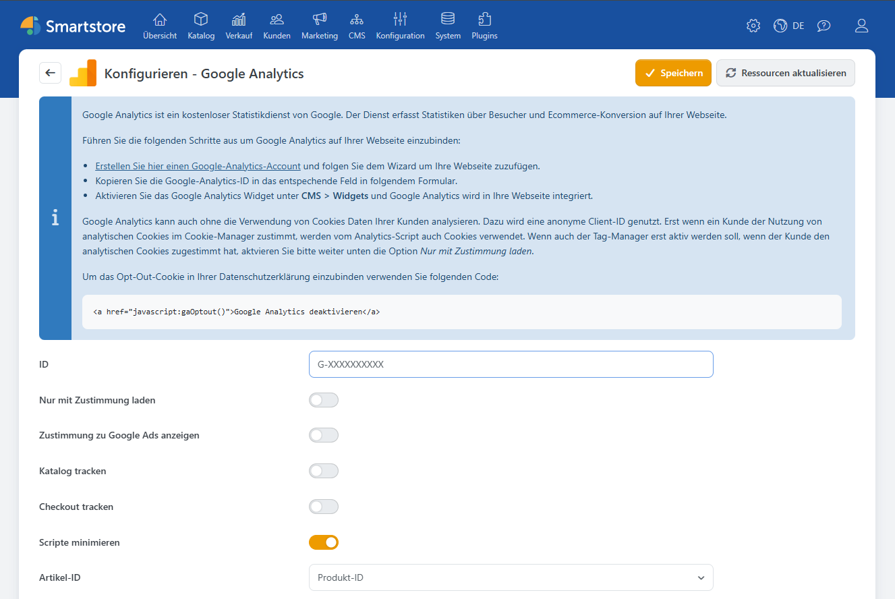

# Google Analytics

Das Plugin **Google Analytics** bindet Google Analytics in Smartstore ein. Damit erhalten Sie Einblick in die Nutzung Ihres Shops und können nachvollziehen, wie Besucher mit Produkten, Warenkorb und Checkout interagieren. Neben allgemeinen Seitenaufrufen unterstützt das Plugin auch E-Commerce-Ereignisse wie Produktansichten, den Beginn des Checkouts und abgeschlossene Bestellungen.


Welche Daten in Google Analytics angezeigt und wie lange sie gespeichert werden, hängt auch von der Konfiguration Ihres Google-Analytics-Kontos ab. Das Plugin stellt die Verbindung her und übermittelt die in Smartstore aktivierten Shop-Ereignisse.


Für den Betrieb benötigen Sie:

- ein Google-Analytics-Konto
- eine eingerichtete Google-Analytics-Property mit Web-Datenstream
- die zugehörige Mess-ID.

## Konfiguration

Öffnen Sie unter **Plugins > Plugins verwalten** die Konfiguration des Plugins **Google Analytics**. Hier hinterlegen Sie die Mess-ID, wählen die gewünschten Tracking-Bereiche und stimmen die Einbindung auf Ihre Einwilligungsverwaltung ab.



| Einstellung | Beschreibung |
|---|---|
| **ID** | Mess-ID des Web-Datenstreams Ihrer Google-Analytics-Property, zum Beispiel `G-XXXXXXXXXX`. |
| **Nur mit Zustimmung laden** | Lädt das Analytics-Skript erst, nachdem der Besucher analytischen Cookies zugestimmt hat. Weitere Informationen finden Sie unter [Cookies und Einwilligung](#cookies-und-einwilligung). |
| **Zustimmung zu Google Ads anzeigen** | Ergänzt den Cookie-Manager um Einwilligungen für werbebezogene Daten und personalisierte Werbung. Aktivieren Sie diese Option nur, wenn Sie Google Ads verwenden. |
| **Katalog tracken** | Erfasst ausgewählte Aufrufe und Interaktionen im Produktkatalog. |
| **Checkout tracken** | Erfasst Warenkorb-, Checkout- und Kaufvorgänge. |
| **Scripte minimieren** | Verkleinert die erzeugten Tracking-Skripte. Diese Option sollte normalerweise aktiviert bleiben. |
| **Artikel-ID** | Bestimmt, mit welcher Kennung Produkte an Google Analytics übertragen werden. Weitere Informationen finden Sie unter [Artikel-ID festlegen](#artikel-id-festlegen). |

Die darunter angezeigten Tracking-Codes werden vom Plugin mit passenden Standardwerten vorbelegt und müssen für die normale Einrichtung nicht bearbeitet werden. Zeigt Smartstore einen Hinweis auf veraltete Skripte an, können Sie über **Scripte wiederherstellen** die aktuellen Standardwerte einsetzen. Dabei werden eigene Änderungen in den Skriptfeldern überschrieben.

### Google Analytics verbinden

1. Erstellen Sie in Google Analytics eine Property für Ihren Shop.
2. Richten Sie für die Website einen Web-Datenstream ein.
3. Kopieren Sie die zugehörige Mess-ID.
4. Tragen Sie die Mess-ID in Smartstore in das Feld **ID** ein.
5. Aktivieren Sie bei Bedarf [**Katalog tracken**](#katalog-und-checkout-tracken) und [**Checkout tracken**](#katalog-und-checkout-tracken).
6. Legen Sie die gewünschten Einstellungen für Cookies und Einwilligungen fest.
7. Klicken Sie auf **Speichern**.


Solange keine Mess-ID hinterlegt ist oder noch der Platzhalter `UA-0000000-0` verwendet wird, bindet das Plugin kein Tracking ein.


### Google-Analytics-Widget aktivieren

Damit das Plugin die Tracking-Skripte im Storefront einbindet, muss das zugehörige Widget aktiviert sein.

1. Öffnen Sie **CMS > Widgets**.
2. Suchen Sie das Widget **Google Analytics**.
3. Aktivieren Sie das Widget.


### Katalog und Checkout tracken

Mit **Katalog tracken** können Sie unter anderem Produktdetailseiten, Produktlisten und Suchanfragen auswerten. Außerdem werden unterstützte Interaktionen wie das Auswählen eines Produkts oder das Hinzufügen zum Warenkorb erfasst.

Mit **Checkout tracken** übermittelt das Plugin unterstützte Ereignisse aus Warenkorb und Bestellprozess. Dazu gehören der Aufruf des Warenkorbs, der Beginn des Checkouts, die Auswahl von Versand- und Zahlungsinformationen sowie der erfolgreiche Abschluss einer Bestellung.


Aktivieren Sie nur die Bereiche, die Sie tatsächlich in Google Analytics auswerten möchten. Prüfen Sie die Einrichtung anschließend mit geeigneten Testaktionen in Ihrem Shop und den Diagnosewerkzeugen von Google Analytics.


### Artikel-ID festlegen

Die Einstellung **Artikel-ID** bestimmt, wie Produkte in Google Analytics identifiziert werden.

| Auswahl | Verwendung |
|---|---|
| **SKU** | Verwendet die Artikelnummer des Produkts beziehungsweise der ausgewählten Variante. |
| **Produkt-ID** | Verwendet die interne Produkt-ID aus Smartstore. |
| **Produkt-ID mit Varianten-ID** | Kombiniert die Produkt-ID mit der ID der ausgewählten Variante. |

Wenn Sie Google Ads oder einen Google-Merchant-Center-Feed verwenden, sollte die ausgewählte Artikel-ID mit der dort verwendeten Produktkennung übereinstimmen.


Ändern Sie die Artikel-ID nicht ohne Grund. Nach einer Änderung können Produkte in Google Analytics unter einer neuen Kennung erscheinen, wodurch zusammengehörige Statistiken getrennt werden.


## Cookies und Einwilligung

Das Plugin ist in den Smartstore Cookie-Manager eingebunden. Mit **Nur mit Zustimmung laden** bestimmen Sie, dass das Analytics-Skript erst nach der Einwilligung zu analytischen Cookies geladen wird.

Wenn Sie zusätzlich Google Ads verwenden, können Sie mit **Zustimmung zu Google Ads anzeigen** weitere Auswahlmöglichkeiten für werbebezogene Daten und personalisierte Werbung im Cookie-Manager bereitstellen.

Weitere Informationen zur Einwilligungsverwaltung finden Sie unter [Cookie-Manager](../konfiguration/cookie-manager.md).

### Opt-out-Link bereitstellen

Das Plugin stellt eine Opt-out-Funktion bereit, mit der Besucher das Google-Analytics-Tracking deaktivieren können. Sie können dafür beispielsweise folgenden Link in Ihre Datenschutzerklärung aufnehmen:

```html
<a href="javascript:gaOptout()">Google Analytics deaktivieren</a>
```

Nach Auswahl des Links wird die Deaktivierung für die konfigurierte Mess-ID im Browser des Besuchers gespeichert.


Berücksichtigen Sie Google Analytics und gegebenenfalls Google Ads in der Datenschutzerklärung Ihres Shops. Prüfen Sie außerdem die Datenaufbewahrung, Einwilligungseinstellungen und weitere Datenschutzoptionen direkt in Ihrem Google-Konto.


## Multi-Shop-Konfiguration

In einer Multi-Shop-Installation können Sie die Einstellungen für einzelne Shops festlegen. Wählen Sie vor der Konfiguration den gewünschten Shop über die Shopauswahl aus und hinterlegen Sie die zu diesem Shop gehörende Mess-ID und Tracking-Einstellungen.

Weitere Informationen finden Sie unter [Multi-Shop Konfiguration](../konfiguration/einstellungen/den-einstellungsbereich-festlegen.md).

## Weiterführende Informationen

- [Widgets anordnen](../content-management/widgets-anordnen.md)
- [Cookie-Manager](../konfiguration/cookie-manager.md)
- [Multi-Shop Konfiguration](../konfiguration/einstellungen/den-einstellungsbereich-festlegen.md)
