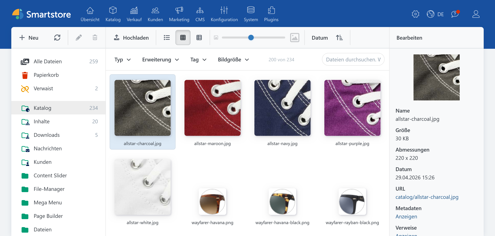
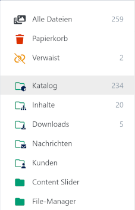
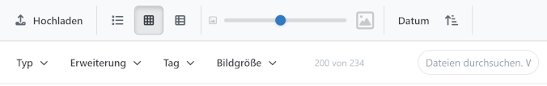
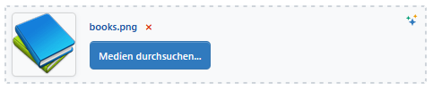

# Medien-Manager

> Shop-Dateien strukturiert und auffindbar an einem Ort.

Der Medien-Manager ist die zentrale Dateiverwaltung im Smartstore-Backend. Hier laden Sie Bilder, Videos, Audiodateien, Dokumente und andere Dateien hoch, organisieren und finden sie und wählen sie für die Verwendung im Shop aus.


Welche Funktionen angezeigt werden, hängt von Ihren Benutzerrechten sowie von den installierten und lizenzierten Modulen ab.




## Medien-Manager öffnen

Öffnen Sie im Backend den Menüpunkt **CMS** &rarr; **Medien**.

Für den Zugriff gelten zwei getrennte Berechtigungen:

- **Medien anzeigen:** Der Benutzer darf den Medienbestand durchsuchen und Dateien herunterladen.
- **Medien bearbeiten:** Der Benutzer darf unter anderem Dateien hochladen, ändern, verschieben und löschen.

## Benutzeroberfläche kennenlernen

Der Medien-Manager besteht aus drei Bereichen:

1. **Ordnerbereich:** Zeigt Alben, Ordner und besondere Dateiansichten an.
2. **Dateibereich:** Zeigt die Dateien des ausgewählten Ordners oder Suchergebnisses an.
3. **Detailbereich:** Zeigt eine Vorschau und Informationen zur ausgewählten Datei an.

Sie können die Breite des Ordner- und Detailbereichs mit den Trennlinien anpassen. Der Medien-Manager speichert die gewählte Breite sowie Ansicht, Sortierung und Thumbnailgröße im verwendeten Browser.

## Alben, Ordner und besondere Ansichten verstehen

Alben sind die obersten, vom System vorgesehenen Ablagebereiche. Innerhalb eines Albums können Sie eigene Ordner anlegen. Systemalben können nicht umbenannt, verschoben oder gelöscht werden.



Oberhalb der regulären Alben und Ordner stehen besondere Ansichten zur Verfügung:

| Ansicht | Inhalt |
| --- | --- |
| **Alle Dateien** | Gesamter aktiver Medienbestand |
| **Papierkorb** | Noch nicht endgültig gelöschte Dateien |
| **Flüchtig** | Dateien, die beim nächsten Aufräumvorgang gelöscht werden können |
| **Verwaist** | Dateien ohne bekannte Referenz durch eine Datenentität |
| **Ungeordnet** | Dateien ohne Ordnerzuordnung |

In besonderen Ansichten können Sie keine neuen Dateien hochladen und keine Ordner anlegen.

Ausführliche Informationen finden Sie unter [Dateien und Ordner verwalten](mediamanager/files-and-folders.md) und [Medienbestand bereinigen](mediamanager/cleanup.md).

## Dateien hochladen

1. Wählen Sie den gewünschten Zielordner aus.
2. Klicken Sie auf **Hochladen**.
3. Wählen Sie eine oder mehrere Dateien aus.
4. Warten Sie, bis alle Uploads abgeschlossen sind.

Alternativ ziehen Sie Dateien aus Ihrem Dateisystem in den Dateibereich. Legen Sie sie in der eingeblendeten Uploadfläche ab.

Für Uploads gelten die allgemeinen Medieneinstellungen:

- maximal erlaubte Dateigröße,
- maximale Bildabmessungen, auf die größere Bilder verkleinert werden,
- erlaubte Dateiendungen und Medientypen.

Weitere Informationen finden Sie unter [Medien-Einstellungen](../konfiguration/einstellungen/medien-einstellungen.md).

### Gleichnamige Dateien behandeln

Existiert im Zielordner bereits eine Datei mit demselben Namen, wählen Sie eine Aktion:

- **Ersetzen:** Die vorhandene Datei wird ersetzt.
- **Umbenennen:** Die neue Datei erhält automatisch einen eindeutigen Namen.
- **Überspringen:** Die neue Datei wird nicht übernommen.

Bei mehreren Konflikten können Sie die Entscheidung auf alle verbleibenden Dateien anwenden.

## Dateien anzeigen und finden



### Ansicht ändern

Für den Dateibereich stehen drei Ansichten zur Verfügung:

- **Details:** Kompakte Liste mit Dateiinformationen
- **Thumbnails:** Große Vorschauübersicht
- **Kacheln:** Kombination aus Vorschau und Dateiinformationen

Mit dem Größenregler passen Sie die Thumbnailgröße in der Thumbnail- und Kachelansicht an.

### Dateien sortieren

Sie können nach Datum, Name, Änderungsdatum, Dateigröße, Bildgröße, Medientyp oder Dateiendung sortieren. Über die Schaltfläche neben der Sortierung wechseln Sie die Sortierreihenfolge.

### Nach Dateinamen suchen

Geben Sie den Suchbegriff in das Suchfeld ein. Die Suche unterstützt Platzhalter:

- `*` steht für beliebig viele Zeichen.
- `?` steht für genau ein Zeichen.

Beispiel:

```text
produkt-*.jpg
```

### Dateien filtern

Sie können mehrere Filter kombinieren:

- Medientyp,
- Dateiendung,
- Tag,
- Bildgröße.

Aktive Filter erscheinen unterhalb der Filterleiste. Große Ergebnismengen werden beim Scrollen schrittweise nachgeladen.

## Dateien auswählen

- Klicken Sie auf eine Datei, um sie auszuwählen.
- Halten Sie `Strg` gedrückt, um einzelne Dateien zur Auswahl hinzuzufügen oder daraus zu entfernen.
- Halten Sie die Umschalttaste gedrückt, um einen zusammenhängenden Bereich auszuwählen.
- Verwenden Sie `Strg+A`, um alle aktuell geladenen Dateien auszuwählen.
- Verwenden Sie `Strg+I`, um die Auswahl umzukehren.

Es können maximal 500 Dateien gleichzeitig ausgewählt werden.

## Kontextmenüs verwenden

Viele zentrale Funktionen sind nur über die Kontextmenüs schnell erreichbar. Klicken Sie mit der rechten Maustaste auf einen Ordner oder eine Datei, um das passende Menü zu öffnen.

- Das **Ordner-Kontextmenü** enthält unter anderem Neuer Ordner, Herunterladen, Ausschneiden, Kopieren, Einfügen, Umbenennen und Löschen.
- Das **Datei-Kontextmenü** enthält unter anderem Vorschau, Herunterladen, Ausschneiden, Kopieren, Einfügen, Wiederherstellen, Neu verarbeiten, Umbenennen, Ersetzen und Löschen.
- Installierte Erweiterungen können zusätzliche Aktionen ergänzen.


Das Datei-Kontextmenü wirkt auf die aktuelle Dateiauswahl. Prüfen Sie vor einer Aktion, ob alle gewünschten Dateien ausgewählt sind.



Die Aktion **Endgültig löschen** ist auch außerhalb des Papierkorbs verfügbar. Die Dateien können danach nicht über den Medien-Manager wiederhergestellt werden.


Eine vollständige Beschreibung aller Menüeinträge finden Sie unter [Dateien und Ordner verwalten](mediamanager/files-and-folders.md).

## Häufige Dateiaktionen

Über Symbolleisten, Drag-and-drop und Kontextmenüs können Sie:

- Ordner anlegen, umbenennen, kopieren, verschieben und löschen,
- Dateien kopieren, verschieben, umbenennen und ersetzen,
- einzelne Dateien direkt herunterladen,
- mehrere Dateien oder Ordner als ZIP-Archiv herunterladen,
- Dateien in den Papierkorb verschieben oder endgültig löschen.

Die vollständigen Anleitungen finden Sie unter [Dateien und Ordner verwalten](mediamanager/files-and-folders.md).

## Tastaturkürzel

Klicken Sie zunächst in den Datei- oder Ordnerbereich, damit dieser den Tastaturfokus besitzt.

| Tastenkürzel | Aktion |
| --- | --- |
| `Strg` + Klick | Einzelne Datei zur Auswahl hinzufügen oder daraus entfernen |
| Umschalttaste + Klick | Zusammenhängenden Dateibereich auswählen |
| `Strg+A` | Alle aktuell geladenen Dateien auswählen |
| `Strg+I` | Dateiauswahl umkehren |
| `Strg+C` | Ausgewählte Dateien oder Ordner kopieren |
| `Strg+X` | Ausgewählte Dateien oder Ordner ausschneiden |
| `Strg+V` | Dateien oder Ordner einfügen |
| `Entf` | Auswahl löschen beziehungsweise in den Papierkorb verschieben |
| `Strg` beim Drag-and-drop | Dateien oder Ordner kopieren statt verschieben |

## Medien in anderen Backend-Bereichen auswählen



In Produkt-, Kategorie-, Seiten- und anderen Bearbeitungsmasken kann der Medien-Manager als Auswahldialog geöffnet werden.

Der aufrufende Bereich kann die Auswahl auf bestimmte Medientypen, Dateiendungen, ein Zielalbum oder eine Einzel- beziehungsweise Mehrfachauswahl begrenzen.

Wählen Sie die gewünschten Dateien aus und klicken Sie auf **Auswählen**. Liegt eine Datei außerhalb des vorgesehenen Albums, kann der Medien-Manager anbieten, sie dorthin zu kopieren.

## Medien-Manager und Medieneinstellungen

Der Medien-Manager besitzt keine eigene Konfigurationsseite für Shopbetreiber. Uploadgrenzen, erlaubte Dateitypen, Bildverarbeitung, Dateispeicher und Medien-Caching werden zentral über die [Medien-Einstellungen](../konfiguration/einstellungen/medien-einstellungen.md) gesteuert.

## Weiterführende Themen

- [Dateien und Ordner verwalten](mediamanager/files-and-folders.md): Alle Dateiaktionen und Kontextmenüs im Detail.
- [Dateiinformationen und Metadaten pflegen](mediamanager/metadata.md): ALT-Texte, Titel, Tags, Sprachen und Verweise pflegen.
- [Medienbestand bereinigen](mediamanager/cleanup.md): Papierkorb, Wiederherstellung und verwaiste Dateien.
- [Bilder neu verarbeiten](mediamanager/image-processing.md): Bilder erneut kodieren und Video-Thumbnails verstehen.
- [Erweiterungen für den Medien-Manager](mediamanager/integrations.md): TinyImage, Smartstore AI und Pixlr integrieren.
- [Probleme mit dem Medien-Manager lösen](mediamanager/troubleshooting.md): Antworten auf häufige Fragen und Fehlerbilder.

## Empfehlungen für die tägliche Arbeit

- Verwenden Sie verständliche Datei- und Ordnernamen.
- Pflegen Sie aussagekräftige ALT-Texte für relevante Bilder.
- Verwenden Sie Tags für Merkmale, die sich nicht sinnvoll über Ordner abbilden lassen.
- Prüfen Sie die Dateiverwendungen, bevor Sie Dateien löschen oder ersetzen.
- Löschen Sie Dateien zunächst über den Papierkorb.
- Berücksichtigen Sie Dateigröße und Bildabmessungen, um die Ladezeit des Frontends gering zu halten.

## Medienprozesse passend erweitern

Der Medien-Manager lässt sich mit Funktionen für Bildoptimierung, KI-gestützte Inhaltserstellung und externe Bildbearbeitung ergänzen. Welche Kombination sinnvoll ist, hängt von Medienbestand, Arbeitsabläufen und den Anforderungen Ihres Shops ab.

Das Smartstore-Team unterstützt Sie gerne dabei, passende Module und eine geeignete Konfiguration einzuordnen.

<a href="https://smartstore.com/de/persoenliche-beratung/" class="button primary">Persönliche Beratung anfragen</a>
