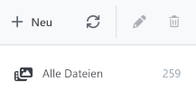
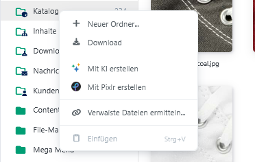
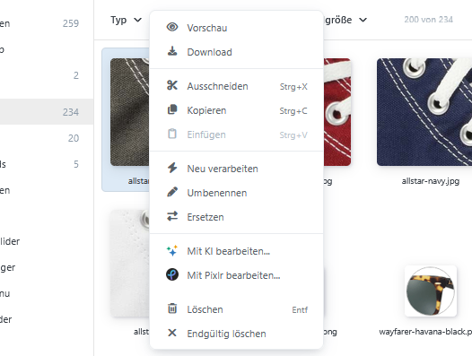

# Dateien und Ordner verwalten

Organisieren Sie Ihren Medienbestand mit Alben und Ordnern, verschieben oder kopieren Sie Dateien und nutzen Sie die Kontextmenüs für einen schnellen Zugriff auf alle wichtigen Aktionen.



## Alben und Ordner unterscheiden

Alben sind die obersten, vom System vorgesehenen Ablagebereiche. Sie ordnen Mediendateien bestimmten Anwendungsbereichen des Shops zu. Systemalben können nicht umbenannt, verschoben oder gelöscht werden.

Innerhalb eines Albums können Sie eigene Ordner anlegen. Die Zahl rechts neben einem Ordner zeigt an, wie viele Dateien ihm zugeordnet sind.

## Ordner anlegen

1. Wählen Sie das Album oder den Ordner aus, in dem der neue Ordner entstehen soll.
2. Klicken Sie im Ordnerbereich auf **Neu**.
3. Geben Sie einen Namen ein.
4. Bestätigen Sie die Eingabe.

Folgende Zeichen sind in Ordnernamen nicht zulässig:

```text
: * ? & " < > |
```

## Ordner umbenennen

1. Wählen Sie den Ordner aus.
2. Klicken Sie auf **Ordner umbenennen** oder öffnen Sie das Kontextmenü.
3. Geben Sie den neuen Namen ein und bestätigen Sie die Eingabe.

Systemalben und besondere Ansichten können nicht umbenannt werden.

## Ordner kopieren oder verschieben

Sie können einen Ordner über das Kontextmenü ausschneiden oder kopieren und anschließend in einem Zielordner einfügen.

Alternativ ziehen Sie den Ordner per Drag-and-drop auf den Zielordner:

- Ziehen ohne Zusatztaste verschiebt den Ordner.
- Ziehen mit gedrückter `Strg`-Taste kopiert den Ordner.

Ein Ordner kann nur innerhalb desselben Albums verschoben werden. Das Kopieren in ein anderes Album ist möglich.

## Ordner löschen

Beim Löschen eines Ordners werden auch seine Unterordner entfernt. Für die enthaltenen Dateien stehen drei Möglichkeiten zur Verfügung:

- Dateien in den Papierkorb verschieben,
- Dateien in den Album-Stammordner verschieben,
- Dateien endgültig löschen.

Dateien, die verwendet oder gesperrt sind, können gegebenenfalls nicht gelöscht werden. Der Medien-Manager informiert Sie über übersprungene Dateien.

## Ordner herunterladen

Öffnen Sie das Kontextmenü eines Ordners und wählen Sie **Herunterladen**. Die enthaltenen Dateien werden als ZIP-Archiv bereitgestellt.


Ein Ordnerdownload enthält maximal 1.000 Dateien. Wird diese Grenze überschritten, zeigt das System einen Hinweis an.


## Dateien kopieren oder verschieben

Wählen Sie eine oder mehrere Dateien aus. Anschließend können Sie die Dateien über das Kontextmenü ausschneiden oder kopieren und in einem Zielordner einfügen.

Alternativ ziehen Sie die ausgewählten Dateien auf den Zielordner:

- Ziehen ohne Zusatztaste verschiebt die Dateien.
- Ziehen mit gedrückter `Strg`-Taste kopiert die Dateien.

Bei gleichnamigen Dateien erscheint die Konfliktauflösung mit den Optionen **Ersetzen**, **Umbenennen** und **Überspringen**.

## Datei umbenennen

1. Wählen Sie eine einzelne Datei aus.
2. Öffnen Sie das Kontextmenü.
3. Wählen Sie **Umbenennen**.
4. Geben Sie den neuen Dateinamen ein.

## Datei ersetzen

Mit **Ersetzen** tauschen Sie den Dateiinhalt aus, ohne die Datei vorher löschen und neu zuordnen zu müssen.

1. Wählen Sie eine einzelne Datei aus.
2. Öffnen Sie das Kontextmenü und wählen Sie **Ersetzen**.
3. Wählen Sie die neue Datei aus.

Der Ersatz muss zum Medientyp der vorhandenen Datei passen und die geltenden Uploadbeschränkungen erfüllen.

## Dateien herunterladen

- Eine einzelne Datei wird in ihrem ursprünglichen Format heruntergeladen.
- Mehrere ausgewählte Dateien werden als ZIP-Archiv bereitgestellt.

## Kontextmenü für Ordner



Klicken Sie mit der rechten Maustaste auf ein Album oder einen Ordner.

| Aktion | Verfügbarkeit und Wirkung |
| --- | --- |
| **Neuer Ordner** | Legt einen Unterordner an. In besonderen Ansichten nicht verfügbar. |
| **Herunterladen** | Lädt die Dateien des Ordners als ZIP-Archiv herunter. Bei einem leeren Ordner deaktiviert. |
| **Erweiterungsaktionen** | Zeigt zusätzliche Befehle installierter Plugins an, beispielsweise zur Bilderstellung. |
| **Verwaiste Dateien ermitteln** | Prüft die Verwendungen der Dateien eines geeigneten Systemalbums. |
| **Ausschneiden** | Merkt einen regulären Ordner zum Verschieben vor. |
| **Kopieren** | Merkt einen regulären Ordner zum Kopieren vor. |
| **Einfügen** | Fügt zuvor ausgeschnittene oder kopierte Dateien beziehungsweise Ordner ein. |
| **Umbenennen** | Ändert den Namen eines regulären Ordners. |
| **Löschen** | Löscht einen regulären Ordner und fragt, wie mit den enthaltenen Dateien verfahren werden soll. |

## Kontextmenü für Dateien



Das Datei-Kontextmenü wirkt auf die aktuelle Dateiauswahl.

| Aktion | Verfügbarkeit und Wirkung |
| --- | --- |
| **Auswählen** | Übernimmt die Auswahl, wenn der Medien-Manager als Auswahldialog geöffnet wurde. |
| **Vorschau** | Öffnet eine einzelne Datei zur Vorschau. |
| **Herunterladen** | Lädt eine Datei direkt oder mehrere Dateien als ZIP-Archiv herunter. |
| **Ausschneiden** | Merkt die ausgewählten Dateien zum Verschieben vor. |
| **Kopieren** | Merkt die ausgewählten Dateien zum Kopieren vor. |
| **Einfügen** | Fügt zuvor ausgeschnittene oder kopierte Elemente in den aktuellen Ordner ein. |
| **Wiederherstellen** | Stellt geeignete Dateien aus dem Papierkorb wieder her. |
| **Neu verarbeiten** | Kodiert ausgewählte Bilddateien mit den aktuellen Medieneinstellungen neu. |
| **Umbenennen** | Ändert den Namen einer einzelnen Datei. |
| **Ersetzen** | Ersetzt den Inhalt einer einzelnen Datei. |
| **Erweiterungsaktionen** | Zeigt zusätzliche Befehle installierter Plugins an. |
| **Löschen** | Verschiebt die Auswahl in den Papierkorb. |
| **Endgültig löschen** | Löscht die Auswahl ohne Umweg über den Papierkorb. |


**Endgültig löschen** ist auch außerhalb des Papierkorbs verfügbar. Die Dateien können danach nicht über den Medien-Manager wiederhergestellt werden.


Die vollständige Übersicht finden Sie im Abschnitt [Tastaturkürzel](../mediamanager.md#tastaturkurzel) auf der Hauptseite.
