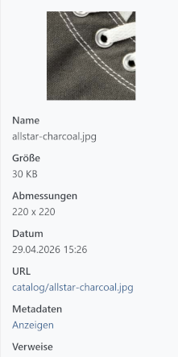

# Dateiinformationen und Metadaten pflegen

Prüfen Sie Dateiinformationen, pflegen Sie ALT-Texte, Titel und Tags und erkennen Sie, wo eine Datei im Shop verwendet wird.

## Vorschau und Dateiinformationen anzeigen

Wählen Sie eine Datei aus, um im rechten Bereich weitere Informationen anzuzeigen. Bilder werden direkt dargestellt; Video- und Audiodateien können abgespielt werden.

Der Medien-Manager zeigt abhängig vom Dateityp unter anderem:

- Dateiname,
- ALT-Text,
- Dateigröße,
- Bildabmessungen,
- Datum,
- Medienpfad beziehungsweise URL,
- Administratorkommentar.

Über den Medienpfad können Sie die Datei in einem neuen Browserfenster öffnen.

## EXIF- und IPTC-Metadaten anzeigen

Bei Bilddateien können Sie über **Metadaten > Anzeigen** vorhandene EXIF- und IPTC-Daten laden. Dazu gehören abhängig von der Datei beispielsweise Aufnahmeinformationen, Kameradaten oder redaktionelle Bildinformationen.

Die angezeigten EXIF- und IPTC-Daten können im Medien-Manager nicht bearbeitet werden.

## Verwendungen einer Datei anzeigen

Über **Verweise > Anzeigen** sehen Sie, welche Datenentitäten auf eine Datei verweisen. Wenn für die Entität eine Backend-Seite verfügbar ist, können Sie diese direkt öffnen.

Diese Funktion hilft Ihnen zu beurteilen, ob eine Datei noch benötigt wird und wo Änderungen an ihr sichtbar werden.

## Dateiinformationen bearbeiten

Klicken Sie im Detailbereich auf **Bearbeiten**. Folgende Informationen können gepflegt werden:

- ALT-Attribut,
- Titel,
- Tags,
- Administratorkommentar.

### ALT-Attribute pflegen

Das ALT-Attribut beschreibt den Bildinhalt. Es unterstützt die Barrierefreiheit und kann Suchmaschinen helfen, das Bild einzuordnen.

Formulieren Sie den ALT-Text kurz und inhaltlich aussagekräftig. Vermeiden Sie eine reine Wiederholung des Dateinamens.

### Titel pflegen

Der Titel ist eine zusätzliche redaktionelle Bezeichnung der Mediendatei. Ob und wo er im Frontend ausgegeben wird, hängt vom jeweiligen Anwendungsfall und Theme ab.

### Sprachabhängige Angaben pflegen

Sind mehrere Sprachen eingerichtet, können Sie ALT-Attribut und Titel für jede Sprache getrennt erfassen. Die Registerkarte **Standard** enthält den sprachunabhängigen Ausgangswert.

### Tags verwenden

Tags sind frei definierbare Schlagwörter. Sie helfen dabei, Dateien unabhängig von ihrer Ordnerstruktur wiederzufinden.

- Wählen Sie einen vorhandenen Tag aus.
- Geben Sie einen neuen Begriff ein, um einen Tag anzulegen.
- Entfernen Sie einen Tag aus der Auswahl, um die Zuordnung zur Datei aufzuheben.

Ein Tag wird automatisch vollständig entfernt, wenn er keiner Mediendatei mehr zugeordnet ist.

### Administratorkommentar hinterlegen

Der Administratorkommentar ist eine interne Notiz. Er wird im Detailbereich des Medien-Managers angezeigt und ist nicht für die Ausgabe im Frontend vorgesehen.

## Mehrere Dateien gemeinsam bearbeiten

Wählen Sie mehrere Dateien aus und klicken Sie auf **Alle bearbeiten**. Die erfassten Werte werden auf sämtliche ausgewählten Dateien angewendet. Sprachabhängige Titel und ALT-Texte können ebenfalls gemeinsam gesetzt werden.


Bei der Mehrfachbearbeitung werden ALT-Attribut, Titel, Tags und Administratorkommentar gemeinsam gespeichert. Leere Felder können vorhandene Werte der ausgewählten Dateien entfernen. Prüfen Sie die Auswahl und die eingegebenen Werte daher sorgfältig.

