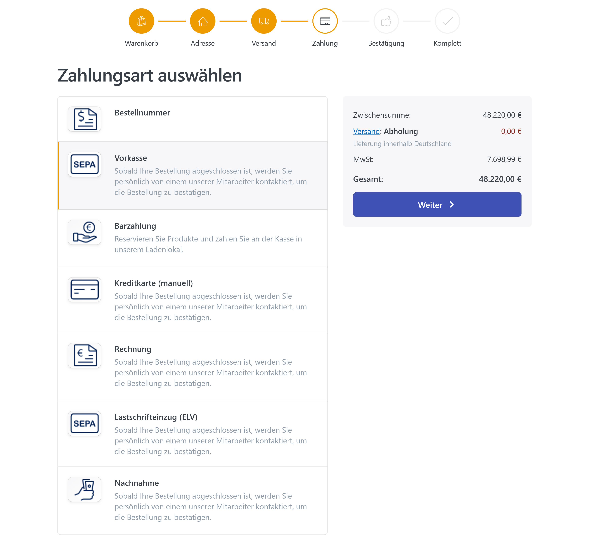
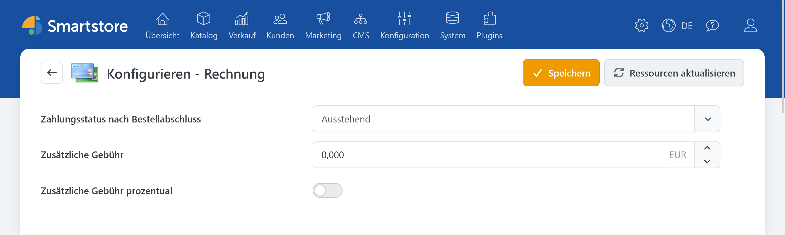
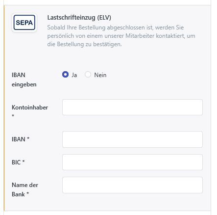
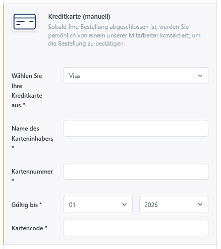
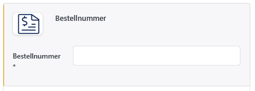

# OfflinePayment

Das Plugin **OfflinePayment** stellt klassische Zahlungsarten bereit, die nicht über einen externen Zahlungsdienstleister abgewickelt werden. Smartstore erfasst die Bestellung und setzt den konfigurierten Zahlungsstatus. Zahlungseingang, Belastung, Erstattung und Stornierung müssen vom Händler außerhalb eines Payment-Gateways bearbeitet werden.

Das Plugin enthält Zahlungsarten für Nachnahme, Rechnung, Barzahlung, Vorkasse, Lastschrift, manuell verarbeitete Kreditkarten und kundenseitige Bestellnummern.


Offline-Zahlungsarten übertragen kein Geld und prüfen keinen tatsächlichen Zahlungseingang. Auch die Zahlungsstatus **Autorisiert** und **Bezahlt** werden ausschließlich innerhalb von Smartstore gesetzt.

Einen Vergleich mit weiteren Zahlungsplugins finden Sie unter [Zahlungsanbieter und Zahlungsarten](paymentproviders.md).


Für den Betrieb benötigen Sie kein Konto bei einem externen Zahlungsdienstleister. Die gewünschten Zahlungsarten müssen unter **Konfiguration > Zahlungsarten** aktiviert sein.

Weitere Informationen zur Aktivierung, Sortierung und Einschränkung von Zahlungsarten finden Sie unter [Zahlungsarten einrichten](../konfiguration/zahlungsarten-einrichten.md).

## Verfügbare Zahlungsarten

| Zahlungsart | Angaben des Kunden | Verwendung |
|---|---|---|
| **Nachnahme** | Keine zusätzlichen Angaben | Der Kunde bezahlt üblicherweise bei Übergabe der Ware. Das Plugin bindet keinen Versanddienstleister an und bestätigt keinen Zahlungseingang. |
| **Rechnung** | Keine zusätzlichen Angaben | Die Zahlung erfolgt nach Erhalt der Ware oder Zahlungsaufforderung. Das Plugin erzeugt keine Buchhaltungstransaktion und überwacht keine Zahlungsfrist. |
| **Barzahlung** | Keine zusätzlichen Angaben | Produkte können beispielsweise zur Abholung reserviert und im Ladengeschäft bezahlt werden. |
| **Vorkasse** | Keine zusätzlichen Angaben | Der Kunde bezahlt außerhalb des Shops, beispielsweise per Überweisung. Das Plugin bringt keine Bankverbindung mit. |
| **Lastschrifteinzug (ELV)** | Kontoinhaber und Bankverbindung | Bankdaten werden im Checkout erfasst. Es findet kein automatischer Bankeinzug statt. |
| **Kreditkarte (manuell)** | Kartenart, Karteninhaber, Kartennummer, Ablaufdatum und Prüfziffer | Die Kartendaten werden erfasst, aber nicht an einen Zahlungsdienstleister übertragen. Autorisierung und Belastung erfolgen manuell. |
| **Bestellnummer** | Bestell- oder Auftragsnummer des Kunden | Für Beschaffungsprozesse, bei denen der Kunde eine eigene Referenznummer angeben muss. |

## Konfiguration

Öffnen Sie im Administrationsbereich **Konfiguration > Zahlungsarten** und klicken Sie bei der gewünschten Offline-Zahlungsart auf **Konfigurieren**. Jede Zahlungsart wird separat konfiguriert. Sie können dadurch beispielsweise für Rechnung und Vorkasse unterschiedliche Zahlungsstatus und Gebühren festlegen.

Die Einstellungen unterstützen den Store-Scope und können somit je Shop abweichend hinterlegt werden.

| Einstellung | Beschreibung |
|---|---|
| **Zahlungsstatus nach Bestellabschluss** | Legt fest, welchen Zahlungsstatus Smartstore unmittelbar nach Abschluss der Bestellung einträgt. Zur Auswahl stehen **Ausstehend**, **Autorisiert** und **Bezahlt**. |
| **Zusätzliche Gebühr** | Legt einen Zuschlag für die jeweilige Zahlungsart fest. Ohne prozentuale Berechnung wird der Wert als Festbetrag in der primären Shopwährung verwendet. |
| **Zusätzliche Gebühr prozentual** | Interpretiert den eingetragenen Gebührenwert als Prozentsatz des Bestellbetrags. |
| **Auszuschließende Kreditkarten** | Nur bei **Kreditkarte (manuell)** verfügbar. Legt fest, welche der hinterlegten Kartenarten im Checkout **nicht** angeboten werden. |

Ohne abweichende Konfiguration beträgt die Zusatzgebühr `0` und der Zahlungsstatus nach Bestellabschluss lautet **Ausstehend**.


Die Auswahl **Autorisiert** oder **Bezahlt** löst keine Autorisierung und keinen Zahlungseinzug aus. Verwenden Sie diesen Status nur, wenn der dazugehörige betriebliche Ablauf sicherstellt, dass der Auftrag entsprechend bearbeitet wird.


### Zusatzgebühren

Zusatzgebühren können als Festbetrag oder prozentual berechnet werden. Sie werden dem Kunden im Bestellprozess angezeigt und in die Auftragssumme einbezogen.


Zahlungsaufschläge können abhängig von Land, Kundengruppe und Zahlungsart rechtlich eingeschränkt oder unzulässig sein. Prüfen Sie die für Ihren Shop geltenden Anforderungen, bevor Sie eine zusätzliche Gebühr aktivieren.


## Verhalten im Checkout

Die Zahlungsarten des Plugins unterscheiden sich danach, ob der Kunde im Checkout zusätzliche Zahlungsdaten eingeben muss.

### Zahlungsarten ohne zusätzliche Angaben

Für Nachnahme, Rechnung, Barzahlung und Vorkasse sind keine weiteren Kundeneingaben erforderlich. Falls eine dieser Zahlungsarten die einzige verfügbare Option ist, kann Smartstore die Auswahl der Zahlungsart abhängig von der Checkout-Konfiguration überspringen.

### Zahlungsarten mit zusätzlichen Angaben

Für Lastschrift, manuelle Kreditkarte und Bestellnummer zeigt Smartstore zusätzliche Eingabefelder an:

- Beim **Lastschrifteinzug** gibt der Kunde seine Bankverbindung an.
- Bei der **manuellen Kreditkartenzahlung** werden die Kartendaten erfasst.
- Bei der **Zahlung per Bestellnummer** wird eine auftragsspezifische Referenznummer verlangt.

Beim Quick Checkout kann Smartstore gültige Lastschrift- oder Kreditkartendaten aus der letzten passenden Bestellung des angemeldeten Kunden übernehmen. Eine Bestellnummer wird nicht wiederverwendet, da sie für jeden Auftrag neu eingegeben werden soll.

## Lastschrifteinzug

Beim **Lastschrifteinzug (ELV)** kann der Kunde zwischen zwei Eingabevarianten wählen:

- **IBAN-Verfahren:** Kontoinhaber, IBAN, BIC und Bankname
- **Traditionelle Bankverbindung:** Kontoinhaber, Kontonummer, BLZ, Land und Bankname.

IBAN und BIC werden anhand ihrer jeweiligen Formate geprüft. In der Bestellübersicht zeigt Smartstore nur eine gekürzte Zusammenfassung der Bankverbindung an.

Die eingegebenen Bankdaten werden verschlüsselt an der Bestellung gespeichert. Bei einer späteren Bestellung kann Smartstore die Daten für den Quick Checkout wiederverwenden, sofern sie weiterhin gültig sind.


Das Plugin führt keinen Lastschrifteinzug aus und erzeugt kein SEPA-Mandat. Der Händler ist für Einzug, Mandatsverwaltung, Datenschutz und die Einhaltung der geltenden rechtlichen Anforderungen verantwortlich.


## Kreditkarte (manuell)

Die Zahlungsart **Kreditkarte (manuell)** erfasst Kartendaten im Checkout, ohne eine Verbindung zu einem Kreditkartenanbieter oder Payment-Gateway herzustellen.

Standardmäßig stehen folgende Kartenarten zur Verfügung:

- Visa
- MasterCard
- Discover
- American Express.

Einzelne Kartenarten können über **Auszuschließende Kreditkarten** aus der Auswahl entfernt werden.

Smartstore prüft, ob Karteninhaber, Kartennummer und Prüfziffer angegeben wurden und ob Kartennummer und Prüfziffer grundsätzlich gültig formatiert sind. Eine Online-Autorisierung, Deckungsprüfung oder Belastung findet nicht statt.

In der Bestellübersicht für den Kunden werden nur Kartenart und maskierte Kartennummer angezeigt. Das Plugin kann die vollständigen Kartendaten einschließlich der Prüfziffer verschlüsselt an der Bestellung speichern und für einen späteren Quick Checkout wiederverwenden.

Die Zahlungsart unterstützt außerdem manuell abzuwickelnde wiederkehrende Zahlungen. Sie führt jedoch weder eine automatische Folgebelastung noch eine Kündigung beim Kreditkartenanbieter aus. Weitere Informationen finden Sie unter [Wiederkehrende Zahlungen verwalten](../../verwalten/verkauf/wiederkehrende-zahlungen-verwalten.md).


Bei der manuellen Kreditkartenzahlung liegt die Verantwortung für Verarbeitung, Speicherung und Schutz der Kartendaten vollständig beim Shopbetreiber. Prüfen Sie vor der Aktivierung insbesondere die geltenden PCI-DSS-, Datenschutz- und Sicherheitsanforderungen. Die Zahlungsart ersetzt kein zertifiziertes Payment-Gateway.


## Zahlung per Bestellnummer

Bei der Zahlungsart **Bestellnummer** gibt der Kunde eine eigene Bestell-, Auftrags- oder Referenznummer an. Das Feld ist erforderlich und wird direkt am Smartstore-Auftrag gespeichert.

Das Plugin prüft ausschließlich, ob ein Wert eingegeben wurde. Es prüft nicht:

- ob die Nummer tatsächlich eindeutig ist,
- ob sie einem bestimmten Format entspricht,
- ob sie in einem Warenwirtschafts- oder Beschaffungssystem existiert,
- ob sie dem angemeldeten Kunden zugeordnet ist.

Da die Nummer für jede Bestellung neu eingegeben werden soll, wird sie nicht aus einer früheren Bestellung übernommen.


Die hier erfasste Bestellnummer ist eine Referenz des Kunden. Sie ist nicht mit der von Smartstore erzeugten Auftragsnummer identisch.


## Zahlungen bearbeiten

Das OfflinePayment-Plugin stellt keine Funktionen für den automatischen Einzug, die Erstattung oder die Stornierung über einen Zahlungsdienstleister bereit.

Abhängig vom Zahlungsstatus können in der Smartstore-Auftragsverwaltung dennoch manuelle Zahlungsaktionen angezeigt werden. Diese ändern den internen Zahlungsstatus, ohne eine externe Transaktion auszuführen.

Das Plugin unterstützt insbesondere nicht:

- die Online-Autorisierung oder Belastung,
- den nachträglichen Einzug über ein Payment-Gateway,
- automatische vollständige oder teilweise Erstattungen,
- die Stornierung einer externen Transaktion,
- Zahlungsbenachrichtigungen oder Webhooks,
- die automatische Prüfung eines Zahlungseingangs.

Weitere Informationen zur Auftragsansicht finden Sie unter [Aufträge verwalten](../../verwalten/verkauf/auftrage-verwalten.md). Eine Erläuterung der manuellen Zahlungsaktionen enthält der Abschnitt [Funktionen von Zahlart-Plugins](../konfiguration/zahlungsarten-einrichten.md#funktionen-von-zahlart-plugins).

## Hinweise für Kunden anpassen

Für Nachnahme, Rechnung, Vorkasse, Lastschrift und manuelle Kreditkarte enthält das Plugin allgemeine Standardhinweise. Diese informieren den Kunden im Wesentlichen darüber, dass er nach Abschluss der Bestellung kontaktiert wird.

Konkrete Bankverbindungen, Zahlungsfristen, Abholadressen oder weitere Zahlungsanweisungen werden vom Plugin nicht automatisch ergänzt. Hinterlegen Sie solche Informationen deshalb entsprechend Ihrem betrieblichen Ablauf.

Namen und Beschreibungen der Zahlungsarten können unter **Konfiguration > Zahlungsarten** angepasst und für mehrere Sprachen gepflegt werden. Weitere Texte lassen sich über die Sprachressourcen ändern. Informationen hierzu finden Sie unter [Mit mehreren Sprachen arbeiten](../allgemeine-konzepte/mit-mehreren-sprachen-arbeiten.md).

## Weiterführende Informationen

- [Zahlungsanbieter und Zahlungsarten](paymentproviders.md)
- [Zahlungsarten einrichten](../konfiguration/zahlungsarten-einrichten.md)
- [Aufträge verwalten](../../verwalten/verkauf/auftrage-verwalten.md)
- [Wiederkehrende Zahlungen verwalten](../../verwalten/verkauf/wiederkehrende-zahlungen-verwalten.md)
- [Mit mehreren Sprachen arbeiten](../allgemeine-konzepte/mit-mehreren-sprachen-arbeiten.md)
