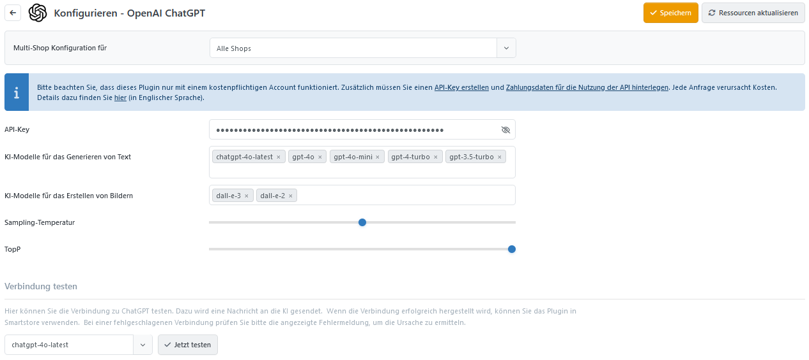

# OpenAI ChatGPT

Mit dem Plugin erstellen Sie Texte und Bilder mithilfe der generativen Sprachmodelle von OpenAI ChatGPT.

## Konfiguration des ChatGPT Plugins

| **Option**                                | **Beschreibung** |
| ----------------------------------------- | ---------------- |
| API-Key                                   |                  |
| KI-Modelle für das Generieren von Text    |                  |
| KI-Modelle für das Generieren von Bildern |                  |
| Sampling-Temperatur                       |                  |
| TopP                                      |                  |


Das OpenAI-ChatGPT-Plugin ist nur die KI-Schnittstelle, die eigentliche Arbeit macht das AI Plugin.

