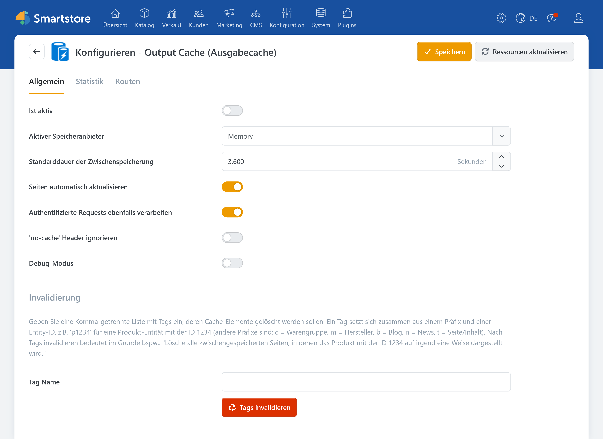
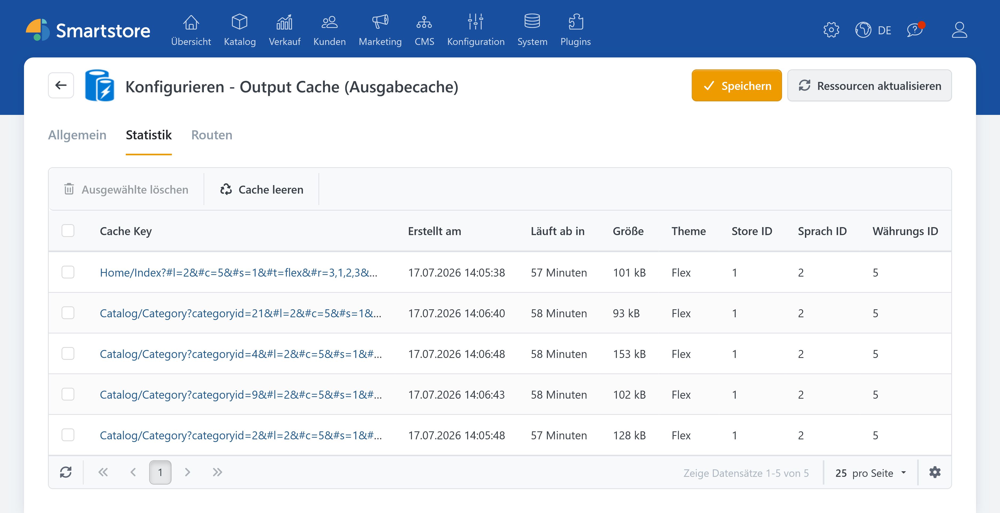

# Output Cache (Ausgabecache)

Der **Output Cache** speichert die vollständig erzeugten Ausgaben kompletter Shop-Seiten zwischen. Das bedeutet: Smartstore muss nicht für jede Anfrage alles neu berechnen und neu ausgeben. Stattdessen kann die Seite bei passenden Anfragen aus dem Cache ausgeliefert werden. Das spart Rechenzeit und macht Seiten schneller, vor allem bei stark frequentierten Seiten wie Kategorien, Listenansichten oder Übersichtsseiten mit Inhalten.

Der Cache arbeitet auf dem Server und kann optional so eingestellt werden, dass er aktualisiert wird, wenn sich wichtige Inhalte im Shop ändern. Dadurch bleibt die Seite schnell und gleichzeitig möglichst aktuell.

## Vorteile

### Schnellere Seitenladezeiten

Häufig besuchte Seiten müssen nicht jedes Mal komplett neu erstellt werden. Dadurch wird die Wartezeit insbesondere bei häufig aufgerufenen Seiten spürbar reduziert.

### Weniger Last auf dem System

Smartstore muss weniger Rechenarbeit leisten, weil die fertigen Seiteninhalte wiederverwendet werden. Dadurch fallen weniger wiederholte Verarbeitungsschritte bei jeder Anfrage an, und der Shop bleibt insgesamt _entspannter_ im Betrieb.

### Stabileres Nutzererlebnis bei hohem Traffic

Wenn viele Besucher gleichzeitig im Shop aktiv sind, steigt die Wahrscheinlichkeit, dass einzelne Seiten langsamer laden, da viele Anfragen parallel neu berechnet werden müssen. Durch den Output Cache wird ein Teil dieser Arbeit vorab erledigt und wiederverwendet, sodass die Performance eher konstant bleibt.

### Steuerung der Speicherzeit von Inhalten

Es kann festgelegt werden, wie lange eine Seite im Zwischenspeicher bleibt, bevor sie neu erstellt wird. Dadurch wird bestimmt, wie stark „Geschwindigkeit“ gegenüber „maximaler Aktualität“ priorisiert wird. Kurze Cache-Zeiten sorgen für aktuellere Inhalte, während längere Cache-Zeiten die Performance verbessern.

## Konfiguration

| **Eingabefeld / Option**                        | **Beschreibung**                                                                                                                                                                                                                                                    |
| ----------------------------------------------- | ------------------------------------------------------------------------------------------------------------------------------------------------------------------------------------------------------------------------------------------------------------------- |
| Ist aktiv                                       | Legt fest, ob Ausgabespeicherung aktiv ist.                                                                                                                                                                                                                         |
| Aktiver Speicheranbieter                        | Bestimmt den aktiven Speicheranbieter. 'Lokaler Speicher' ist am schnellsten, aber nicht geeignet für Webfarmen. Wählen Sie 'Datenbank' oder einen anderen verteilten Speichermechanismus - z.B. 'Redis' -, wenn Sie eine Webfarm betreiben.                        |
| Standarddauer der Zwischenspeicherung           | Legt die Dauer in Sekunden fest, die Seiten standardmäßig auf dem Server zwischengespeichert werden sollen.                                                                                                                                                         |
| Seiten automatisch aktualisieren                | Legt fest, ob zwischengespeicherte Seiten automatisch aktualisiert werden sollen, wenn mind. eine Abhängigkeit geändert wurde (Abhängigkeiten sind Entitäten wie Produkt, Warengruppe, Blog-Eintrag etc.).                                                          |
| Authentifizierte Requests ebenfalls verarbeiten | Legt fest, ob das Caching auch dann aktiv ist, wenn der Kunde eingeloggt ist. Beachten Sie jedoch, dass lediglich nach Kundengruppen variiert wird, nicht nach einzelnen Kunden. Deaktivieren Sie diese Option, wenn ihr Shop kundenspezifischen Content generiert. |
| 'no-cache' Header ignorieren                    | Legt fest, ob Seiten trotz 'Content-cache: no-cache' Header aus dem Zwischenspeicher geladen werden sollen. Empfohlen zum Testen.                                                                                                                                   |
| Debug-Modus                                     | Gibt allgemeine Informationen im Response Header aus ((X-SmartStore-Cached-On, X-SmartStore-Cached-Until))                                                                                                                                                          |


**Achtung**

Die Optionen Routen und Invalidierung sollten nur von erfahrenen Anwendern genutzt / geändert werden.


## Statistik

Unter dem Reiter Statistik werden die im Cache gespeicherten Seiten angezeigt und können dort auch aus dem Cache gelöscht werden.

