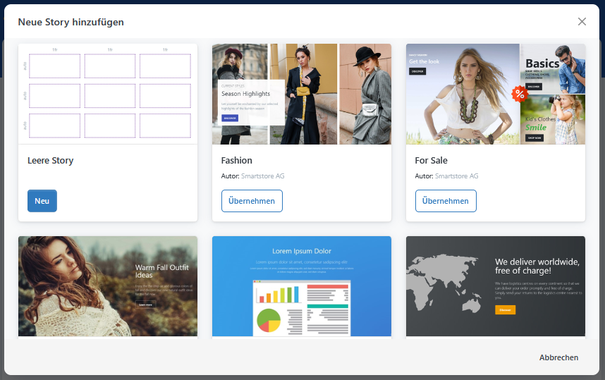
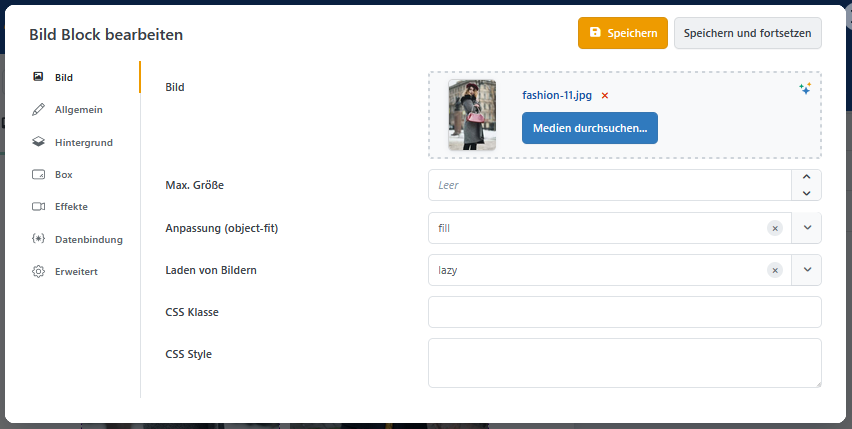
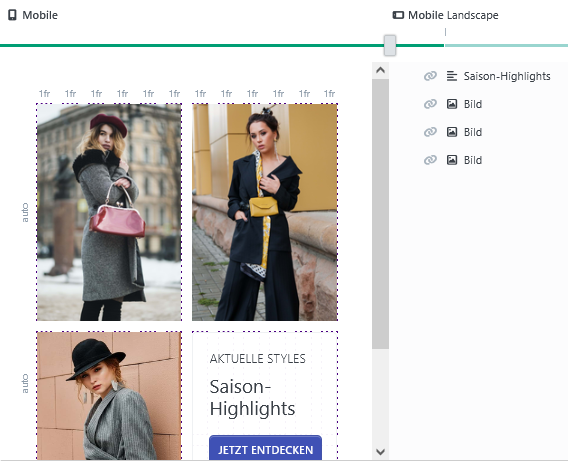
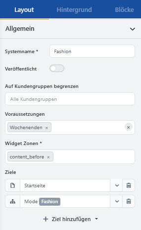

# Page Builder

> Inhalte schnell und einfach per Drag &amp; Drop gestalten

Mit dem **Page Builder** erstellen Sie visuell gestaltete Inhaltsbereiche für Ihren Shop. Texte, Bilder, Videos und Produktdarstellungen lassen sich ohne HTML- oder CSS-Kenntnisse zu Bannern, Aktionsflächen oder vollständigen Landingpages zusammenstellen.


Welche Blöcke und Funktionen zur Verfügung stehen, hängt von den installierten Plugins ab.


## Grundbegriffe

Ein mit dem Page Builder erstellter Inhalt wird als **Story** bezeichnet. Eine Story kann einen einzelnen Teaser, einen größeren Seitenabschnitt oder eine vollständige Landingpage bilden.

Stories bestehen aus **Blöcken**. Jeder Block enthält einen bestimmten Inhalt, zum Beispiel einen Text, ein Bild, ein Video oder eine Produktliste. Eine Übersicht finden Sie unter [Blöcke](pagebuilder/blocks.md).

Die Positionen und Größen der Blöcke werden über ein **Raster** gesteuert. Weitere Informationen dazu finden Sie unter [Mit dem Raster arbeiten](pagebuilder/grid.md).

## Page Builder öffnen

Öffnen Sie im Administrationsbereich **CMS** &rarr; **Page Builder**.

Die Übersicht zeigt die vorhandenen Stories. Hier können Sie neue Stories erstellen und bestehende Inhalte öffnen, duplizieren oder verwalten.

## Eine Story erstellen

1. Klicken Sie auf **Neu hinzufügen**.
2. Wählen Sie eine leere Story oder eine geeignete Vorlage aus.
3. Vergeben Sie einen aussagekräftigen Namen.
4. Speichern Sie die Story.
5. Öffnen Sie die Story zur Bearbeitung.


Für den Einstieg empfiehlt sich eine vorhandene Vorlage. Ersetzen Sie zunächst die enthaltenen Texte und Bilder und passen Sie das Layout erst anschließend an.


## Benutzeroberfläche kennenlernen

Im Editor bearbeiten Sie den Aufbau, die Inhalte und die Darstellung Ihrer Story.

Zu den wichtigsten Bereichen gehören:

- die Arbeitsfläche mit dem Raster,
- die Toolbox mit Blöcken und Einstellungen,
- die Übersicht der verwendeten Blöcke,
- die Auswahl der Bildschirmgröße,
- die Steuerelemente zum Speichern und Anzeigen der Vorschau.

Eine ausführlichere Beschreibung der Arbeitsbereiche finden Sie unter [Benutzeroberfläche](pagebuilder/editor.md).

## Inhalte hinzufügen

Öffnen Sie in der Toolbox die Auswahl der verfügbaren Blöcke. Ziehen Sie den gewünschten Block anschließend an eine freie Position im Raster.

So bearbeiten Sie einen Block:

1. Wählen Sie den Block auf der Arbeitsfläche aus.
2. Öffnen Sie seine Einstellungen.
3. Hinterlegen Sie den gewünschten Inhalt.
4. Passen Sie bei Bedarf Darstellung und Abstände an.
5. Speichern Sie Ihre Änderungen.

Je nach Block können Sie beispielsweise Texte formatieren, Bilder auswählen, Produkte zusammenstellen oder Videos einbinden. Informationen zu den verfügbaren Blocktypen und ihren wichtigsten Einstellungen finden Sie unter [Blöcke](pagebuilder/blocks.md).

Bilder, Videos und andere Dateien werden über den [Medien-Manager](mediamanager.md) ausgewählt. Hinweise zum Hochladen und Organisieren eigener Dateien finden Sie unter [Dateien und Ordner verwalten](mediamanager/files-and-folders.md).

## Layout gestalten

Das Raster unterteilt die Story in Zeilen und Spalten. Innerhalb dieses Rasters können Sie Blöcke platzieren, verschieben und in ihrer Größe anpassen.

Beginnen Sie mit einem einfachen Aufbau. Komplexe Überlagerungen und abweichende Darstellungen für einzelne Bildschirmgrößen lassen sich später ergänzen.

Weitere Informationen zur Strukturierung einer Story finden Sie unter [Mit dem Raster arbeiten](pagebuilder/grid.md).

## Darstellung auf verschiedenen Geräten prüfen

Der Page Builder unterstützt unterschiedliche Bildschirmgrößen. Beginnen Sie mit der mobilen Darstellung und prüfen Sie das Ergebnis anschließend für größere Auflösungen.

Achten Sie insbesondere auf:

- die Reihenfolge der Inhalte,
- die Lesbarkeit von Texten,
- den Zuschnitt von Bildern,
- die Größe und Position von Schaltflächen,
- ausreichende Abstände zwischen den Elementen.

Kontrollieren Sie das Ergebnis regelmäßig im **Vorschaumodus**. Dort wird die Story ohne Bearbeitungsraster und mit den vorgesehenen Medien und Effekten dargestellt.

## Story im Shop platzieren

Damit eine Story im Shop erscheint, benötigt sie eine Zielseite und eine Position auf dieser Seite.

Die Position wird über eine **Widget-Zone** festgelegt. Widget-Zonen sind vordefinierte Bereiche innerhalb der Shopseiten, in denen Inhalte oder Widgets ausgegeben werden können.

Weitere Informationen zur Auswahl und Verwendung dieser Positionen finden Sie unter [Widget-Zonen](../content-management/widget-zonen.md).


Wird eine Story nicht im Shop angezeigt, prüfen Sie den Veröffentlichungsstatus, die ausgewählte Zielseite und die zugewiesene Widget-Zone.


## Story veröffentlichen

Prüfen Sie vor der Veröffentlichung:

- Sind alle Texte vollständig und fehlerfrei?
- Werden die Bilder in ausreichender Qualität dargestellt?
- Funktionieren Links und Schaltflächen?
- Passt die Darstellung auf Mobilgeräten und Desktop-Bildschirmen?
- Sind Zielseite und Widget-Zone korrekt gewählt?
- Ist gegebenenfalls ein Veröffentlichungszeitraum eingestellt?

Aktivieren Sie anschließend die Option **Veröffentlicht** und speichern Sie die Story. Kontrollieren Sie das Ergebnis abschließend direkt im Shop.

## Erweiterungen und Integrationen

Der Page Builder kann durch weitere Smartstore-Module und Funktionen ergänzt werden. Dadurch können je nach Installation zusätzliche Blöcke, Inhaltsquellen oder Bearbeitungsmöglichkeiten zur Verfügung stehen.

Eine Übersicht der unterstützten Erweiterungen und ihrer Verwendung finden Sie unter [Integrationen](pagebuilder/integrations.md).

## Weiterführende Dokumentation

- [Benutzeroberfläche](pagebuilder/editor.md)
- [Blöcke](pagebuilder/blocks.md)
- [Mit dem Raster arbeiten](pagebuilder/grid.md)
- [Integrationen](pagebuilder/integrations.md)
- [Widget-Zonen](../content-management/widget-zonen.md)