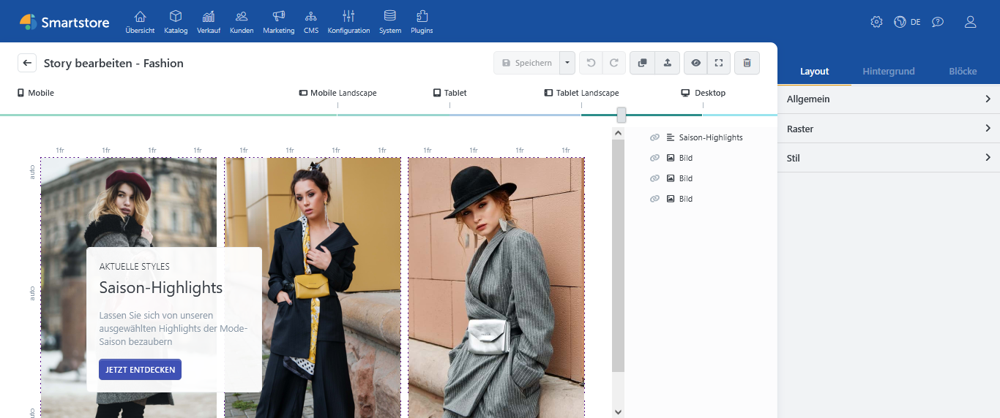
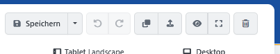
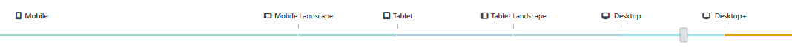
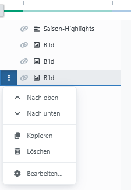

# Benutzeroberfläche

Im Page-Builder-Editor gestalten Sie eine Story, verwalten ihre Blöcke und prüfen die Darstellung für unterschiedliche Bildschirmgrößen.

## Arbeitsbereiche im Überblick

Der Editor besteht aus folgenden Bereichen:

1. **Werkzeugleiste:** Speichern, rückgängig machen, Vorschau und weitere Aktionen.
2. **Device-Slider:** Auswahl der aktuell bearbeiteten Bildschirmgröße.
3. **Arbeitsfläche:** Darstellung und Bearbeitung der Story im Raster.
4. **Block-Manager:** Übersicht der in der Story verwendeten Blöcke.
5. **Seitenleiste:** Einstellungen für Story, Hintergrund, Raster und Blöcke.

## Werkzeugleiste

Die Werkzeugleiste oberhalb der Story enthält die wichtigsten Aktionen.

| Aktion | Funktion |
| --- | --- |
| **Speichern** | Speichert die Story und die vorgenommenen Einstellungen. |
| **Als Vorlage speichern** | Erstellt aus der Story eine wiederverwendbare Vorlage. |
| **Rückgängig** | Macht die letzte Bearbeitung rückgängig. |
| **Wiederholen** | Stellt eine zuvor rückgängig gemachte Bearbeitung wieder her. |
| **Klonen** | Erstellt eine Kopie der Story. |
| **Exportieren** | Exportiert die Story zur späteren Wiederverwendung. |
| **Vorschaumodus** | Zeigt die Story ohne Bearbeitungsraster und mit ihrer vorgesehenen Darstellung. |
| **Vollbild** | Vergrößert den Editor auf die verfügbare Bildschirmfläche. |
| **Löschen** | Löscht die Story nach Bestätigung. |

Für häufig verwendete Aktionen stehen Tastenkombinationen zur Verfügung:

- **Strg + S:** speichern
- **Strg + Z:** rückgängig machen
- **Strg + Y:** wiederholen
- **Strg + Alt + P:** Vorschaumodus umschalten
- **Strg + F11:** Vollbildmodus umschalten


Speichern Sie umfangreiche Bearbeitungen regelmäßig. Der Vorschaumodus ersetzt nicht das Speichern der Story.


## Device-Slider

Mit dem Device-Slider wählen Sie die Bildschirmgröße aus, für die Sie die Story gerade bearbeiten.

Zur Verfügung stehen:

- **Mobile**
- **Mobile Landscape**
- **Tablet**
- **Tablet Landscape**
- **Desktop**
- **Desktop&plus;**

Der Page Builder arbeitet nach dem Mobile-First-Prinzip. Einstellungen einer kleineren Bildschirmgröße werden an die nächstgrößere Stufe weitergegeben, solange dort kein eigener Wert hinterlegt wurde.

Beginnen Sie deshalb mit **Mobile** und arbeiten Sie sich schrittweise bis **Desktop&plus;** vor. Weitere Informationen finden Sie unter [Mit dem Raster arbeiten](grid.md#story-responsiv-gestalten).

## Arbeitsfläche

Auf der Arbeitsfläche sehen Sie das Raster und die darin platzierten Blöcke. Hier können Sie:

- Blöcke auswählen,
- Blöcke per Drag-and-drop verschieben,
- die Größe von Blöcken verändern,
- Zeilen und Spalten bearbeiten,
- Blockaktionen öffnen.

Die Arbeitsfläche zeigt eine bearbeitbare Annäherung an das spätere Ergebnis. Hintergründe, Medien oder Effekte können im Bearbeitungsmodus abweichend oder noch nicht sichtbar sein. Verwenden Sie zur Kontrolle den Vorschaumodus.

## Block-Manager

Der Block-Manager befindet sich auf der rechten Seite der Arbeitsfläche und zeigt alle Blöcke der Story als Liste an. Er hilft besonders bei komplexen Storys und bei Blöcken, die sich auf der Arbeitsfläche überlagern.

Bei einer breiten Arbeitsansicht kann die Seitenleiste den Block-Manager abhängig von der verfügbaren Bildschirmauflösung verdecken. Ziehen Sie in diesem Fall den Device-Slider nach links, um die Arbeitsfläche zu verkleinern und den Block-Manager wieder sichtbar zu machen.

Im Block-Manager können Sie:

- einen Block auswählen und bearbeiten,
- die Darstellungsreihenfolge ändern,
- einen Block kopieren oder löschen,
- die Sichtbarkeit für die gewählte Bildschirmgröße festlegen.

Die Darstellungsreihenfolge wird im Block-Manager von unten nach oben aufgebaut. Ein Block, der in der Liste weiter oben steht, liegt vor den darunter aufgeführten Blöcken. Der oberste Block wird bei einer Überlagerung im Vordergrund dargestellt.


Werden im Block-Manager keine Blöcke angezeigt, obwohl die Story Blöcke enthält, laden Sie die Seite mit **Strg + F5** vollständig neu. Dadurch wird die Blockliste in den meisten Fällen wieder aufgebaut.


Die Sichtbarkeit kann drei Zustände besitzen:

| Zustand | Bedeutung |
| --- | --- |
| **Sichtbar** | Der Block wird für die ausgewählte Bildschirmgröße angezeigt. |
| **Nicht sichtbar** | Der Block wird für die ausgewählte Bildschirmgröße ausgeblendet. |
| **Nicht festgelegt** | Die Einstellung wird von der vorherigen kleineren Bildschirmgröße übernommen. |

Ausführliche Informationen zur Arbeit mit Inhaltselementen finden Sie unter [Blöcke verwenden](blocks.md).

## Seitenleiste

Die Seitenleiste zeigt entweder Einstellungen für die gesamte Story oder für den aktuell ausgewählten Block.

### Story-Einstellungen

Ist kein Block ausgewählt, stehen die Bereiche **Layout**, **Hintergrund** und **Blöcke** zur Verfügung.

Unter **Layout** konfigurieren Sie unter anderem:

- Systemname und Veröffentlichungsstatus,
- Veröffentlichungszeitraum und Sortierung,
- Einschränkungen auf Shops oder Kundengruppen,
- Sichtbarkeitsregeln,
- Widget-Zonen und Zielseiten,
- Raster- und Stileinstellungen.

Unter **Hintergrund** gestalten Sie den Hintergrund der gesamten Story. Im Bereich **Blöcke** wählen Sie neue Inhaltselemente aus.

### Block-Einstellungen

Sobald Sie einen Block auswählen, wechselt die Seitenleiste in den Bearbeitungsmodus für diesen Block. Dort konfigurieren Sie beispielsweise:

- Sichtbarkeit und Ausrichtung,
- Position im Raster,
- Abstände und Größe,
- Hintergrund und Boxdarstellung,
- Effekte,
- erweiterte CSS-Einstellungen.

Die inhaltlichen Einstellungen eines Blocks öffnen Sie über **Bearbeiten** oder über das Zahnrad-Icon am ausgewählten Block.

## Vorschaumodus verwenden

Aktivieren Sie den Vorschaumodus über das Augensymbol oder mit **Strg + Alt + P**.

Prüfen Sie dort:

- das Zusammenspiel aller Blöcke,
- Hintergründe und Überlagerungen,
- Animationen und Hover-Effekte,
- Videos und andere eingebundene Medien,
- die Darstellung bei jeder Bildschirmgröße.

Prüfen Sie eine veröffentlichte Story abschließend auch auf ihrer tatsächlichen Zielseite im Shop.
