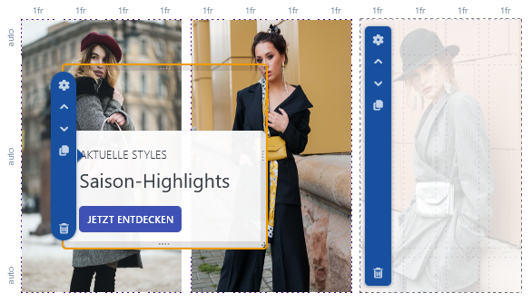
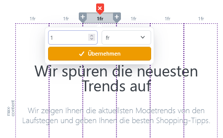

# Mit dem Raster arbeiten

Das Raster bildet die Grundlage einer Story. Es unterteilt die Arbeitsfläche in Zeilen und Spalten, in denen Sie Blöcke platzieren und ausrichten.

## Raster aufbauen

Eine neue Story kann bereits ein Raster aus der gewählten Vorlage enthalten. Bei einer leeren Story beginnen Sie mit einem einfachen Grundraster und erweitern es nach Bedarf.

Wenn Sie eine Zeile oder Spalte auswählen, erscheinen die zugehörigen Rasterwerkzeuge. Damit können Sie:

- eine Spalte links oder rechts einfügen,
- eine Spalte löschen,
- eine Zeile oberhalb oder unterhalb einfügen,
- eine Zeile löschen.


Prüfen Sie vor dem Löschen einer Zeile oder Spalte, welche Blöcke darin liegen. Eine Strukturänderung kann die Position oder Größe vorhandener Blöcke beeinflussen.


## Block platzieren

Ziehen Sie einen Block aus dem Bereich **Blöcke** in eine freie Rasterzelle. Ein vorhandener Block kann per Drag-and-drop an eine andere Position verschoben werden.

Um mehrere Zellen zu belegen, wählen Sie den Block aus und ziehen Sie an seinen Rändern oder Eckpunkten. Das Raster zeigt währenddessen, welche Zeilen und Spalten der Block beansprucht.

Weitere Informationen zum Einfügen und Konfigurieren von Inhalten finden Sie unter [Blöcke verwenden](blocks.md).

## Zeilen und Spalten dimensionieren

Die Größe einer Zeile oder Spalte kann mit unterschiedlichen Einheiten festgelegt werden.

| Einheit | Geeignet für |
| --- | --- |
| **px** | Eine feste Größe, die sich nicht an die verfügbare Fläche anpasst. |
| **%** | Einen prozentualen Anteil an der Größe des Containers. |
| **fr** | Einen flexiblen Anteil am verfügbaren Platz des Rasters. |
| **auto** | Eine Größe, die sich am enthaltenen Inhalt orientiert. |
| **min-content** | Die kleinstmögliche Größe, die der Inhalt benötigt. |
| **max-content** | Die Größe, die der Inhalt ohne Umbruch benötigt. |
| **minmax()** | Einen flexiblen Bereich zwischen einer Mindest- und einer Maximalgröße. |

Für gleichmäßige, flexible Spalten eignen sich Bruchteile besonders gut. Zwei gleich breite Spalten können beispielsweise jeweils **1fr** verwenden.


Verwenden Sie feste Pixelwerte nur gezielt. Flexible Einheiten passen sich in der Regel besser an unterschiedliche Bildschirmgrößen an.


## Rastereinstellungen

Die Einstellungen für das gesamte Raster finden Sie in der Seitenleiste unter **Layout > Raster**. Falls dort stattdessen Block-Einstellungen angezeigt werden, heben Sie zunächst die Auswahl des aktuellen Blocks auf.

Über diese Einstellungen steuern Sie die Abstände, Containerbreiten und Verteilung der Rasterzellen. Die direkte Eingabe von Spalten, Zeilen und dem automatischen Platzierungsverhalten richtet sich vor allem an erfahrene Anwender.

### Abstand zwischen Rasterzellen festlegen

Mit **Zellenabstand** bestimmen Sie den horizontalen und vertikalen Abstand zwischen den Rasterzellen. Ein einheitlicher Abstand sorgt für eine ruhige Darstellung und verhindert, dass Inhalte optisch zusammenlaufen.

Abstände innerhalb eines einzelnen Blocks konfigurieren Sie dagegen in den Block-Einstellungen.

### Containerbreite bestimmen

Das Raster unterscheidet zwischen dem äußeren Container und dem Inhaltscontainer:

- **Container:** Bestimmt die Breite der Hintergrundebene der Story.
- **Inhalt Container:** Bestimmt die Breite der eigentlichen Rasterebene.

Dadurch kann sich beispielsweise ein Hintergrund über die gesamte Seitenbreite erstrecken, während die Inhalte innerhalb der normalen Shopbreite bleiben.

### Inhalte im Raster verteilen

Ist der Container größer als die darin angelegten Zeilen oder Spalten, können Sie den freien Platz verteilen.

Mit der horizontalen Verteilung legen Sie fest, ob die Rasterzellen beispielsweise am Anfang, in der Mitte, am Ende oder mit Abstand dazwischen angeordnet werden.

Die vertikale Verteilung steuert die entsprechende Anordnung von oben nach unten.

Die Einstellung **Auto flow** sowie die direkte Eingabe von Rasterzeilen und Rasterspalten sind für erfahrene Anwender vorgesehen. Verwenden Sie nach Möglichkeit zuerst die visuellen Rasterwerkzeuge.

## Story responsiv gestalten

Die Struktur aus Zeilen und Spalten gilt für die gesamte Story. Position, Größe, Ausrichtung und Sichtbarkeit der Blöcke können Sie dagegen für die verfügbaren Bildschirmgrößen anpassen:

1. **Mobile**
2. **Mobile Landscape**
3. **Tablet**
4. **Tablet Landscape**
5. **Desktop**
6. **Desktop&plus;**

Beginnen Sie mit der mobilen Darstellung. Wechseln Sie danach schrittweise zu den größeren Bildschirmgrößen und nehmen Sie nur die jeweils notwendigen Anpassungen vor.

Einstellungen werden von einer kleineren Bildschirmgröße an die nächstgrößere weitergegeben, solange dort keine eigene Einstellung hinterlegt wurde. Eine spätere Änderung an der mobilen Ansicht überschreibt deshalb nicht automatisch Werte, die für Desktop bereits ausdrücklich gesetzt wurden.

Zusätzlich können Sie einzelne Blöcke je Bildschirmgröße ein- oder ausblenden. Wie Sie zwischen den Bildschirmgrößen wechseln und die Sichtbarkeit der Blöcke steuern, erfahren Sie unter [Benutzeroberfläche](editor.md).

## Raster prüfen

Kontrollieren Sie jede Bildschirmgröße im Vorschaumodus. Achten Sie besonders auf:

- ungewollte Leerräume,
- abgeschnittene Texte oder Bilder,
- zu kleine Schaltflächen,
- überlagerte Inhalte,
- ungleichmäßige Abstände,
- horizontales Scrollen auf Mobilgeräten.

Prüfen Sie die veröffentlichte Story abschließend auf ihrer tatsächlichen Zielseite. Dort wirken auch das aktive Theme und die umgebenden Seiteninhalte auf die verfügbare Breite.
